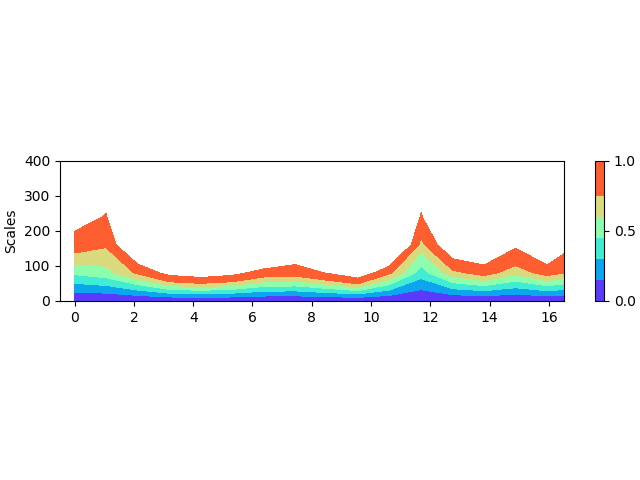
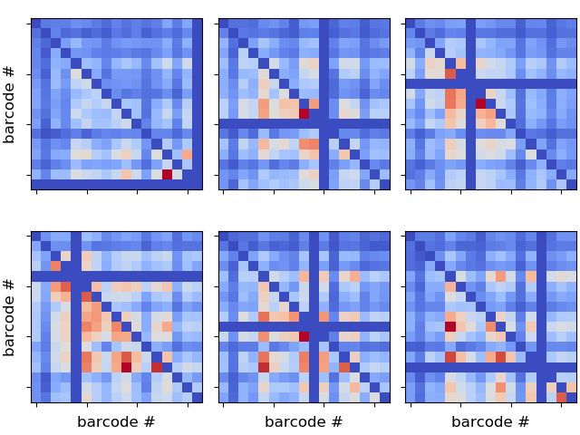
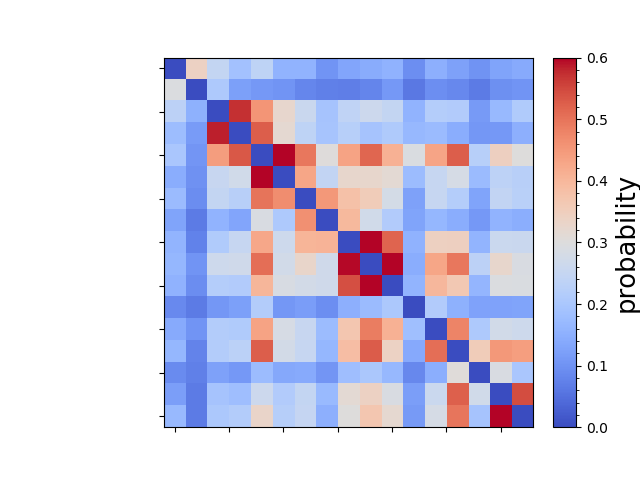
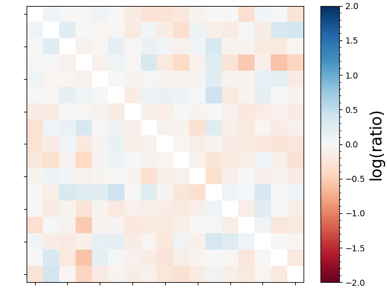
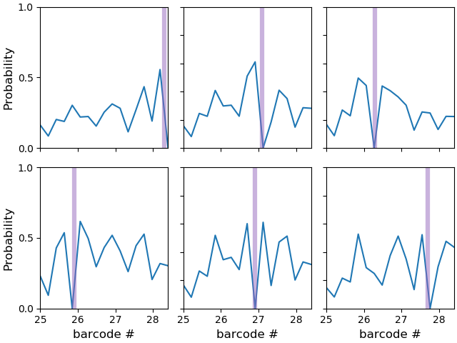
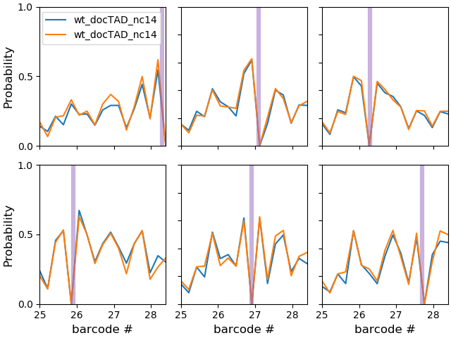

# Running pyHiM

### Run pyHiM

Ensure you followed the steps described previously during installation when you did the test run:

1. Identify a ```destination_directory``` where your data are stored. The raw deconvolved files can be in your ```destination_directory``` or within a sub-folder.
2. Be aware of not putting more than ONE sub-folder with TIFF files in the ```destination_directory```. If your ```destination_directory``` already has the raw deconvolved TIFFs then remvove any other directory with TIFFs from ```destination_directory```
3. copy files to your ```destination_directory```  (names are self-explanatory)
   1. infoList_DAPI.json
   2. infoList_RNA.json
   3. infoList_fiducial.json
   4. infoList_barcode.json
4. Change the fiducial RT by running ```changeRT_infoList.py``` at the command line in the ```destination_directory```. The input arguments are the RT currently present in the infoList files and the RT that you want to change it for. For instance: ```changeRT_infoList.py RT33 RT95```changes RT33 to RT95 in all the infoList files.
5. Run pyHiM by the following command at the command line:

```bash
processingPipeline.py
```

This assumes that you are running it from the ```destination_directory```. If it is not the case, use the ``-F`` flag with the directory with your data.

#### infoList parameters files

a typical file (DAPI example) looks like:

```bash
{
    "acquisition": {
        "label": "DAPI",
        "positionROIinformation": 3
    },
    "alignImages": {
        "folder": "alignImages",
        "operation": "overwrite",
        "outputFile": "alignImages.bed",
        "referenceFiducial": "RT41"
    },
    "image": {
        "claheGridH": 8,
        "claheGridW": 8,
        "currentPlane": 1
    },
    "projectsBarcodes": {
        "folder": "projectsBarcodes",
        "operation": "overwrite",
        "outputFile": "projectsBarcodes"
    },
    "segmentedObjects": {
        "area_max": 1500,
        "area_min": 200,
        "background_method": "stardist",
        "stardist_network": "stardist_nc14_nrays:64_epochs:20_grid:2",
        "stardist_basename": "/mnt/grey/DATA/users/marcnol/models",
        "background_sigma": 3.0,
        "folder": "segmentedObjects",
        "fwhm": 3.0,
        "brightest": 1100, 
        "intensity_max": 59,
        "intensity_min": 0,
        "operation": "overwrite",
        "outputFile": "segmentedObjects",
        "threshold_over_std": 1.0
    },
    "zProject": {
        "display": true,
        "folder": "zProject",
        "mode": "full",
        "operation": "skip",
        "saveImage": true,
        "windowSecurity": 2,
        "zProjectOption": "sum",
        "zmax": 59,
        "zmin": 1,
        "zwindows": 10
    }
}
```


Here are some options for the different parameters and a brief description

- "image" - *not really used* 
            - "currentPlane": 1,
            - 'contrastMin': 0.1,
            - 'contrastMax': 0.9,
            - "claheGridH": 8,
            -  "claheGridW": 8,
        
- "acquisition"
            - "label": "DAPI"
                - "positionROIinformation": 3 
        
- "zProject"
            - "folder": "zProject",  *Description:* output folder
                - "operation": "skip",  *Options:* overwrite | skip
                - "mode": "full",  *Options:* full | manual | automatic
                - "display": True,
                - "saveImage": True,
                - "zmin": 1,
                - "zmax": 59,
                - "zwindows": 10,
                - "windowSecurity": 2,
                - "zProjectOption": "sum",  *Options:* **sum** | **MIP**
        
- "alignImages"
                "folder": "alignImages",  *Description:* output folder
                "operation": "overwrite",  *Options:* overwrite | skip
                "outputFile": "alignImages",
                "referenceFiducial": "RT18"
            
- "projectsBarcodes"
                "folder": "projectsBarcodes",  *Description:* output folder
                "operation": "overwrite",  *Options:* overwrite | skip
                "outputFile": "projectsBarcodes",
            
- "segmentedObjects": {
                "folder": "segmentedObjects",  *Description:* output folder
                "operation": "overwrite",  *Options:* overwrite | skip
                "outputFile": "segmentedObjects",
                "background_method": "inhomogeneous",  *Options:* **flat** |**inhomogeneous** | **stardist** (AI) 
                "stardist_network": "stardist_nc14_nrays:64_epochs:20_grid:2", *Description*: name of network
                "stardist_basename": "/mnt/grey/DATA/users/marcnol/models", *Description*: location of AI models
            ​    "background_sigma": 3.0,  *Description:* used to remove inhomogenous background
            ​    "threshold_over_std": 1.0,  *Description:* threshold used to detect sources
            ​    "fwhm": 3.0,  *Description:* source size in pixels
            ​    "brightest": 1100,  *Description:* max number of objects segmented per FOV (only for barcodes!)
            ​    "intensity_min": 0,  *Description:* min intensity to keep object
            ​    "intensity_max": 59,  *Description:* max intensity to keep object
            ​    "area_min": 50,  *Description:* min area to keep object
            ​    "area_max": 500,  *Description:* max area to keep object


### Process second channel (i.e RNA, segments, etc)

```processingPipeline.py``` will project all TIFFS, and align them together using the fiducial. This will include the second channel of DAPI containing RNA intensities. Now, we need to mask these files so that we can tell which cell was expressing or not a specific RNA. For this, you will run ```processSNDchannel.py```

Go to the ```destination_directory``` and run  ```processSNDchannel.py --addMask sna``` for manually segmenting all the ROIs in the destination_directory and label them with the ```sna``` tag. You can repeat this process as many times as you want using different tags. For instance, if you also want to label ```doc``` then you can run   ```processSNDchannel.py --addMask doc```. This second command will not overwrite what you did with the first command but rather accumulate different tags.

After you run this command for all the tags you want to identify, you now need to assign these tags to the cells that were previously identified during the run of ```processingPipeline.py```.

For this, just run ```processSNDchannel.py``` on the command line.

#### Folder

If you don't want run ```processSNDchannel.py``` in the current directory, just choose another folder by using the ```--rootFolder``` argument.

#### erasing segmentations

If you want to start all over again and erase all manual segmentations, run with the ```--cleanAllMasks``` argument.

#### output

The output of ```processSNDchannel.py``` will be stored in ```./segmentedObjects/SNDassignedCells.ecsv``` Astrpy Table. Example: 

```bash
# %ECSV 0.9
# ---
# datatype:
# - {name: 'ROI #', datatype: int64}
# - {name: 'CellID #', datatype: int64}
# - {name: 'MaskID #', datatype: string}
# schema: astropy-2.0
"ROI #" "CellID #" "MaskID #"
1 0 sna
1 12 sna
1 13 sna
1 14 sna
1 15 sna
1 16 sna
1 18 sna
1 20 sna
1 21 sna
...
```

where the first column contains the ROI number, the second the number of the cell mask, the third the tag assigned.

This file can then be loaded within ```replotHiMmatrix.py``` to identify which cells of the matrix have which tag. More on this will be added to the section below LATER. 

### zipping and erasing run

#### zip and retrieve results

Other utilities have been written to retrieve data from a run to a remote server. For this, go to the directory with the data an run ```zipHiM_run.py```. This will archive all the png, ecsv, and dat files with the results in addition to the MD file with the output of the run. The name of the archive will be HiMrun.tar.gz.

#### clean run

If you want to erase a run, for instance to make sure you can run it again without any leftover, you can run ```cleanHiM_run.py` in the directory with the data. 

### Analysis of several samples at once

You can now use a new script to call several samples in one go:

```python
#!/usr/bin/env python3
# -*- coding: utf-8 -*-
import os
import sys
import argparse

nArgs=len(sys.argv)
print("Total arguments passed: {}".format(nArgs))
EmbryoTag='Embryo_'
if nArgs > 2: 
    rootDir=sys.argv[1]
    print("parameters> rootFolder: {}".format(rootDir))
    
    for i in range(2,nArgs): 
        print("Processing Embryo #{}".format(sys.argv[i]))
        command2Run1='nice -19 processingPipeline.py -F '+rootDir+EmbryoTag+sys.argv[i]
        os.system(command2Run1)
        command2Run2='zipHuMrun.py -F '+rootDir+EmbryoTag+str(i)
        os.system(command2Run2)
        print('Commands: {}\n{}'.format(command2Run1,command2Run2))
else:
    print('not enough arguments.')
```


To run just do:

```bash
processingMultipleDatasets.py -F rootFolder 0 1 33 
```

to run Emrbyo_0, Embryo_1 and Embryo_33 from rootFolder


## Combining results from different experiments

Once you run a bunch of datasets, you will want to combine the PWD matrices together. For this:

1. Retrieve the matrices and barcodes files by scp:

```bash
scp rata@lopevi:/mnt/tronador/Sergio/RAMM_experiments/Experiment_3/deconvolved_DAPI/Embryo_000/buildsPWDmatrix/*ecsv /home/marcnol/data/Experiment_3/000_Embryo/buildsPWDmatrix/

scp rata@lopevi:/mnt/tronador/Sergio/RAMM_experiments/Experiment_3/deconvolved_DAPI/Embryo_000/buildsPWDmatrix/*npy /home/marcnol/data/Experiment_3/000_Embryo/buildsPWDmatrix/
```

Now, you can run ```processHiMmatrix.py``` locally. You should setup your files in a directory. For instance the directory ```/mnt/disk2/marcnol/data/Experiment_19``` contains three folders:

```bash
006_Embryo  009_Embryo  026_Embryo
```

containing each of the analysis from different embryos of the same experiment. Now, in this directory, you should create a file called ```folders2Load.json``` with the following:

```python
{
    "wt_docTAD": {
        "Folders": [
            "/mnt/disk2/marcnol/data/Experiment_19/026_Embryo/buildsPWDmatrix",
            "/mnt/disk2/marcnol/data/Experiment_19/009_Embryo/buildsPWDmatrix",
            "/mnt/disk2/marcnol/data/Experiment_19/006_Embryo/buildsPWDmatrix"
        ],
        "PWD_clim": 1.4,
        "PWD_mode": "median",
        "PWD_cm": "terrain",
        "iPWD_clim": 6,
        "iPWD_mode": "median",
        "iPWD_cm": "terrain",
        "ContactProbability_scale": 12,
        "ContactProbability_cmin": 0.0,
        "ContactProbability_distanceThreshold": 0.35,
		"ContactProbability_cm": "coolwarm",
		"BarcodeColormap": [4, 4, 4, 4, 8, 4, 3, 4, 4, 8, 3, 4, 4, 8, 4, 8, 3],
		"3wayContacts_anchors": [7, 11, 17, 5, 10, 14]
    }
}
```

This file contains the directories with the data to be analyzed and some parameters for the analysis (more on this later).

Go to the root folder (```/mnt/disk2/marcnol/data/Experiment_19```) and run 

```bash
 processHiMmatrix.py 
```

If you use a parameter file with another name (e.g. ```myparameters.json```) then run:

```bash
 processHiMmatrix.py --parameters myparameters.json
```

This will produce an MD file (e.g. ```processHiMmatrixAnalysis__wt_docTAD_27052020_140943.md```) with the following output:

- PWD matrix for each dataset
- Inverse distance matrices for each dataset
- Contact probability matrices for each dataset
- Combined contact probability matrix

This last matrix will be outputed in the ```scHiMmatrices``` directory as two files. Examples:

- ```CombinedMatrixwt_docTAD.dat```: plain text ensemble HiM contact probability matrix (can be opened in MATLAB). Each row in the matrix is separated by a ```\n``` .
-  ```UniqueBarcodeswt_docTAD.dat```: plain text file with the barcodes used.

### Analyzing labeled datasets

If you run ```processSNDchannel.py``` before, you may want now to look at cells with different labels (ON, OFF, etc). For this, you need to run ```processHiMmatrix.py``` with two more parameters:
- ```--label```: indicates the name used when you run processSNDchannel.py with the option ```--addMask```. Typical names: doc, sna.Running
- ```--action```: three options are available:
  - ```all```: selects all cells for analysis irrespective of whether they are labeled
  - ```labeled``` only runs analysis on labeled cells
  - ```unlabeled```: only runs analysis on unlabeled cells

### options in parameter file

Options:

- ```PWD_clim```: 1.4. Maximum of colormap for PWD matrices.
- ```PWD_mode```: Mode used to calculate value for each mean from many measurements. ```median``` is the median excluding NaNs, ```KDE``` uses kernel density estimator and peaks up the maximum (uses 0.2 as size of kernel as this works for most situations).
- ```iPWD_clim```: 6. Same as for ```PWD_clim.```
- ```iPWD_mode```: Same as for ```PWD_mode```.
- ```ContactProbability_scale```:  normalization factor for the contact probability. Plotted contact probability is calculated as the ratio of the calculated contact probability and ```ContactProbability_scale```.
- ```ContactProbability_cmin```: Minimum of colormap in the the contact probability map.
- ```ContactProbability_distanceThreshold```: distance used for the calculation of the contact probabilities in pixel units.


### Analyzing MATLAB datasets

One can use this same pipeline to analyze data that was segmented using MATLAB routines (i.e merfish_main.m). For this, a few steps need to be taken.

#### Make directory structure

Make a directory structure where you will load your data to be read by processHiMmatrix.py. Follow this example closely:

```bash
.
├── 000_Embryo
│   └── buildsPWDmatrix
│       ├── buildsPWDmatrix_uniqueBarcodes.ecsv
│       └── HiMscMatrix.mat
```

place a MAT file with the name ```HiMscMatrix.mat``` in the ```buildsPWDmatrix``` directory. This file should contain the ```distanceMatrixCumulative``` variable, a 3-D matrix with the format barcode x barcode x nCells. Make sure you remove empty barcode rows by saving ```distanceMatrixCumulative(p.listofRTsusedGenomicallySorted,p.listofRTsusedGenomicallySorted,:)```

Then, you need to have a file called ```buildsPWDmatrix_uniqueBarcodes.ecsv``` with the barcodes in a line separated list, for example:

```bash
3
4
5
6
7
13
23
25
29
37
43
48
60
62
66
67
68
89
90
91
92
```

#### Create folders2Load.json file

Now you create the parameters file. An example follows:

```bash
{
    "wt_Pc_Chr3R": {
        "Folders": [
            "/home/marcnol/data/Experiment_Julian/000_Embryo/buildsPWDmatrix"
        ],
        "PWD_clim": 1.4,
        "PWD_mode": "median",
        "PWD_cm": "terrain",
        "iPWD_clim": 6,
        "iPWD_mode": "median",
        "iPWD_cm": "terrain",
        "ContactProbability_scale": 12,
        "ContactProbability_cmin": 0.0,
        "ContactProbability_distanceThreshold": 0.35,
	"ContactProbability_cm": "coolwarm",
	"BarcodeColormap": [4, 4, 4, 4, 8, 4, 3, 4, 4, 8, 3, 4, 4, 8, 4, 8, 3],
	"3wayContacts_anchors": [7, 11, 17, 5, 10, 14]
    }
}
```

Make sure you edit the name of the dataset (here ```wt_Pc_Chr3R```) and add a folder for each dataset you want to analyze.

#### Run processHiMmatrix.py

You can now run the script. For instance, do

```bash
processHiMmatrix.py  --matlab
```

to run with default options. The important thing is to add the ```--matlab``` flag.

You should be now set.

### Plotting publication-quality figures

The processing with ```processHiMmatrix.py``` produces plots but this routing is primarily concerned with the collection of different datasets, thus it does not have options for customization.

This is performed in a series of ***py*** routines  that plot publication-quality figures with many options.

#### Plotting single HiM matrices

```figureHiMmatrix.py``` will plot a single matrix. It has many options, described when you run it with the --help parameter:

```bash
usage: figureHiMmatrix.py [-h] [-F ROOTFOLDER] [-O OUTPUTFOLDER]
                          [-P PARAMETERS] [-A LABEL] [-W ACTION]
                          [--fontsize FONTSIZE] [--axisLabel] [--axisTicks]
                          [--barcodes] [--scalingParameter SCALINGPARAMETER]
                          [--plottingFileExtension PLOTTINGFILEEXTENSION]

optional arguments:
  -h, --help            show this help message and exit
  -F ROOTFOLDER, --rootFolder ROOTFOLDER
                        Folder with dataset
  -O OUTPUTFOLDER, --outputFolder OUTPUTFOLDER
                        Folder for outputs
  -P PARAMETERS, --parameters PARAMETERS
                        Provide name of parameter files. folders2Load.json
                        assumed as default
  -A LABEL, --label LABEL
                        Add name of label (e.g. doc)
  -W ACTION, --action ACTION
                        Select: [all], [labeled] or [unlabeled] cells plotted
  --fontsize FONTSIZE   Size of fonts to be used in matrix
  --axisLabel           Use if you want a label in x and y
  --axisTicks           Use if you want axes ticks
  --barcodes            Use if you want barcode images to be displayed
  --scalingParameter SCALINGPARAMETER
                        Scaling parameter of colormap
  --plottingFileExtension PLOTTINGFILEEXTENSION
                        By default: svg. Other options: pdf, png
  --shuffle SHUFFLE     Provide shuffle vector: 0,1,2,3... of the same size or
                        smaller than the original matrix. No spaces! comma-
                        separated!    
  --scalogram           Use if you want scalogram image to be displayed
                        
```


Most of these options are self-explanatory. Here is the command to run to get Figure 1F made:

```bash
figureHiMmatrix.py -F "$DATA1" --fontsize 22 --label doc --action labeled --scalingParameter 1 --barcodes --outputFolder "$FIGS"/Figure1  --plottingFileExtension png
```

And here is the output:


##### Altering order or number of barcodes in displayed matrix

If you want to remove some of the barcodes or change their order, then you need to use the --shuffle option. For this, you need to provide with the order of the new barcodes. For instance if you want to plot only the first 9 barcodes then run:

```bash
figureHiMmatrix.py -F "$DATA1" --fontsize 22 --label doc --action labeled --scalingParameter 1 --barcodes --outputFolder "$FIGS"/Figure1  --plottingFileExtension png --shuffle 0,1,2,3,4,5,6,7,8
```

If you want to change the order, for instance, put the last bin (bin 16) first. The run:

```bash
figureHiMmatrix.py -F "$DATA1" --fontsize 22 --label doc --action labeled --scalingParameter 1 --barcodes --outputFolder "$FIGS"/Figure1  --plottingFileExtension png --shuffle 16,0,1,2,3,4,5,6,7,8,9,10,11,12,13,14,15
```

Be careful with the format of the ```--shuffle``` parameter. It should contain **no spaces**, and the indexes should be **comma-separated integers**. If the number of integers in the vector exceeds the number of dimensions of the matrix, the output plot will appear blue (matrix will contain zeros). If any given index exceeds the matrix dimensions, then it will be ignored but the matrix substitution will be wrong!

##### Scalograms

You can now produce a scalogram from the matrix. For this, use the --scalogram option, which will output a separate output image with the scalogram. As example:



#### Plotting 3-way contact matrices

figure3wayInteractions.py``` will plot 6 3-way contact matrices matrix. The anchors used are those provided in the folders2Load.json file of the analysis. This function has many options, described when you run it with the --help parameter:

```bash
usage: figure3wayInteractions.py [-h] [-F1 ROOTFOLDER1] [-F2 ROOTFOLDER2]
                                 [-O OUTPUTFOLDER] [-P PARAMETERS]
                                 [-A1 LABEL1] [-W1 ACTION1] [-A2 LABEL2]
                                 [-W2 ACTION2] [--fontsize FONTSIZE]
                                 [--scalingParameter SCALINGPARAMETER]
                                 [--colorbar]
                                 [--plottingFileExtension PLOTTINGFILEEXTENSION]

optional arguments:
  -h, --help            show this help message and exit
  -F1 ROOTFOLDER1, --rootFolder1 ROOTFOLDER1
                        Folder with dataset 1
  -F2 ROOTFOLDER2, --rootFolder2 ROOTFOLDER2
                        Folder with dataset 2
  -O OUTPUTFOLDER, --outputFolder OUTPUTFOLDER
                        Folder for outputs
  -P PARAMETERS, --parameters PARAMETERS
                        Provide name of parameter files. folders2Load.json
                        assumed as default
  -A1 LABEL1, --label1 LABEL1
                        Add name of label for dataset 1 (e.g. doc)
  -W1 ACTION1, --action1 ACTION1
                        Select: [all], [labeled] or [unlabeled] cells plotted
                        for dataset 1
  -A2 LABEL2, --label2 LABEL2
                        Add name of label for dataset 1 (e.g. doc)
  -W2 ACTION2, --action2 ACTION2
                        Select: [all], [labeled] or [unlabeled] cells plotted
                        for dataset 1
  --fontsize FONTSIZE   Size of fonts to be used in matrix
  --scalingParameter SCALINGPARAMETER
                        Scaling parameter of colormap
  --colorbar            Use if you want a colorbar
  --plottingFileExtension PLOTTINGFILEEXTENSION
                        By default: svg. Other options: pdf, png

```


Run to produce Figure 1G:

```bash
figure3wayInteractions.py -F1 "$DATA1" --label1 doc --action1 labeled --fontsize 12 --scalingParameter 1.0 --outputFolder "$FIGS"/Figure1  --plottingFileExtension png
```


which produces:


It is possible also to compare the 3-way matrices of two datasets, for this, run:

```bash
figure3wayInteractions.py -F1 "$DATA2" --label1 doc --action1 labeled -F2 "$DATA2" --label2 NE --action2 labeled --fontsize 22 --scalingParameter 1.0  --outputFolder "$FIGS"/Figure2 --plottingFileExtension png
```

to obtain:



The first quadrant (top right) will represent the first dataset.


#### Compare two HiM matrices

```figureCompare2Matrices.py``` will make two panels to compare datasets. One will contain the HiM contact matrices of each datasets in different quadrants. The first dataset will be plotted on top right. The second plot will produce either a difference matrix (default) or the log(ratio) (see --ratio option). The options are described when you run it with the --help parameter:

```bash
usage: figureCompare2Matrices.py [-h] [-F1 ROOTFOLDER1] [-F2 ROOTFOLDER2]
                                 [-O OUTPUTFOLDER] [-P PARAMETERS]
                                 [-A1 LABEL1] [-W1 ACTION1] [-A2 LABEL2]
                                 [-W2 ACTION2] [--fontsize FONTSIZE]
                                 [--axisLabel] [--axisTicks] [--ratio]
                                 [--cAxis CAXIS]
                                 [--plottingFileExtension PLOTTINGFILEEXTENSION]

optional arguments:
  -h, --help            show this help message and exit
  -F1 ROOTFOLDER1, --rootFolder1 ROOTFOLDER1
                        Folder with dataset 1
  -F2 ROOTFOLDER2, --rootFolder2 ROOTFOLDER2
                        Folder with dataset 2
  -O OUTPUTFOLDER, --outputFolder OUTPUTFOLDER
                        Folder for outputs
  -P PARAMETERS, --parameters PARAMETERS
                        Provide name of parameter files. folders2Load.json
                        assumed as default
  -A1 LABEL1, --label1 LABEL1
                        Add name of label for dataset 1 (e.g. doc)
  -W1 ACTION1, --action1 ACTION1
                        Select: [all], [labeled] or [unlabeled] cells plotted
                        for dataset 1
  -A2 LABEL2, --label2 LABEL2
                        Add name of label for dataset 1 (e.g. doc)
  -W2 ACTION2, --action2 ACTION2
                        Select: [all], [labeled] or [unlabeled] cells plotted
                        for dataset 1
  --fontsize FONTSIZE   Size of fonts to be used in matrix
  --axisLabel           Use if you want a label in x and y
  --axisTicks           Use if you want axes ticks
  --ratio               Does ratio between matrices. Default: difference
  --cAxis CAXIS         absolute cAxis value for colormap
  --plottingFileExtension PLOTTINGFILEEXTENSION
                        By default: svg. Other options: pdf, png

```

To produce Figure 2B you run

```bash
figureCompare2Matrices.py -F1 "$DATA2" -F2 "$DATA2" --label1 doc --label2 M --action1 labeled --action2 labeled --cAxis 2 --fontsize 22 --outputFolder "$FIGS"/Figure2 --plottingFileExtension png --ratio
```

and will obtain:



and:




#### Plot 4M profiles

```figure4Mmatrix.py``` will plot 4M profiles using the anchors defined in folders2Load.json parameters file. The options are described when you run it with the --help parameter:

```bash
usage: figure4Mmatrix.py [-h] [-F1 ROOTFOLDER1] [-F2 ROOTFOLDER2]
                         [-O OUTPUTFOLDER] [-P PARAMETERS] [-A1 LABEL1]
                         [-W1 ACTION1] [-A2 LABEL2] [-W2 ACTION2]
                         [--fontsize FONTSIZE] [--axisLabel] [--axisTicks]
                         [--splines] [--cAxis CAXIS]
                         [--plottingFileExtension PLOTTINGFILEEXTENSION]

optional arguments:
  -h, --help            show this help message and exit
  -F1 ROOTFOLDER1, --rootFolder1 ROOTFOLDER1
                        Folder with dataset 1
  -F2 ROOTFOLDER2, --rootFolder2 ROOTFOLDER2
                        Folder with dataset 2
  -O OUTPUTFOLDER, --outputFolder OUTPUTFOLDER
                        Folder for outputs
  -P PARAMETERS, --parameters PARAMETERS
                        Provide name of parameter files. folders2Load.json
                        assumed as default
  -A1 LABEL1, --label1 LABEL1
                        Add name of label for dataset 1 (e.g. doc)
  -W1 ACTION1, --action1 ACTION1
                        Select: [all], [labeled] or [unlabeled] cells plotted
                        for dataset 1
  -A2 LABEL2, --label2 LABEL2
                        Add name of label for dataset 1 (e.g. doc)
  -W2 ACTION2, --action2 ACTION2
                        Select: [all], [labeled] or [unlabeled] cells plotted
                        for dataset 1
  --fontsize FONTSIZE   Size of fonts to be used in matrix
  --axisLabel           Use if you want a label in x and y
  --axisTicks           Use if you want axes ticks
  --splines             Use if you want plot data using spline interpolations
  --cAxis CAXIS         absolute cAxis value for colormap
  --plottingFileExtension PLOTTINGFILEEXTENSION
                        By default: svg. Other options: pdf, png
```


To produce Figure S1H, one would run:

```bash
figure4Mmatrix.py  --rootFolder1 "$DATA1" --label1 doc --action1 all --cAxis 1 --outputFolder "$FIGS"/Figure1  --plottingFileExtension png
```

to obtain:



One can also plot multiple datasets, for example:

```bash
figure4Mmatrix.py --rootFolder1 "$DATA2" --rootFolder2 "$DATA2" --label1 doc --label2 M --action1 labeled --action2 labeled --cAxis 1 --outputFolder "$FIGS"/Figure2 --plottingFileExtension png
```

produces

