# Running pyHiM

[TOC]

## 1- Basic run

### Run pyHiM

Ensure you followed the steps described previously during installation when you did the test run:

1. Identify a ```destination_directory``` where your data are stored. The raw deconvolved files can be in your ```destination_directory``` or within a sub-folder.
2. Be aware of not putting more than ONE sub-folder with TIFF files in the ```destination_directory```. If your ```destination_directory``` already has the raw deconvolved TIFFs then remvove any other directory with TIFFs from ```destination_directory```
3. copy ```infoList.json``` to your ```destination_directory``` . For a description of ```infoList.json```, see section below.
4. Change the fiducial RT by running ```changeRT_infoList.py``` at the command line in the ```destination_directory```. The input arguments are the RT currently present in the infoList files and the RT that you want to change it for. For instance: ```changeRT_infoList.py RT33 RT95```changes RT33 to RT95 in all the infoList files.
5. Run pyHiM by the following command at the command line:

```bash
pyHiM.py
```

This assumes that you are running it from the ```destination_directory```. If it is not the case, use the ``-F`` flag with the directory with your data.

**Invoke pyHiM**

The arguments are

```sh
usage: pyHiM.py [-h] [-F ROOTFOLDER] [-C CMD] [--threads THREADS]

optional arguments:
  -h, --help            show this help message and exit
  -F ROOTFOLDER, --rootFolder ROOTFOLDER
                        Folder with images
  -C CMD, --cmd CMD     Comma-separated list of routines to run (order matters!): 
  						makeProjections, appliesRegistrations,
                        alignImages,alignImages3D, segmentMasks,
                        segmentSources3D,refitBarcodes3D,
                        localDriftCorrection,projectBarcodes,buildHiMmatrix
  --threads THREADS     Number of threads to run in parallel mode. If none,
                        then it will run with one thread.
```


```-F ``` or ```--rootFolder``` indicates the rootFolder where pyHiM expects to find the dataset.

```--threads``` argument will make it run in parallel mode. Be ready to open your browser in ```http://localhost:8787``` and make sure you connect by ```ssh -L 8787:localhost:8787 marcnol@lopevi```. Change your username and server of course...

```-C or --cmd``` is an optional argument that can be used to run a specific set of functions detailed as a comma separated list. If you don't provide this argument, the full list of functions will be run and the mode of action will be determined from the ```infoList.json``` file (see below)


#### Pipeline diagram

This summarizes the simplest possibilities for running the **pyHiM** pipeline:

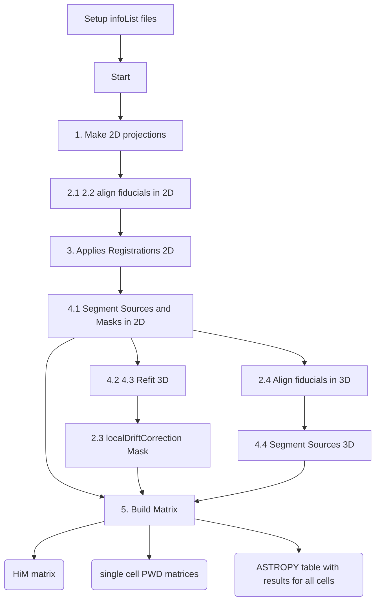
```mermaid
graph TD
	Z[Setup infoList files] -->A[Start]
	A[Start] --> B[1. Make 2D projections]
	B --> C1[2.1 2.2 align fiducials in 2D] --> D1[3. Applies Registrations 2D]
	D1 --> E1[4.1 Segment Sources and Masks in 2D] --> F[5. Build Matrix]
	
	E1 --> G1[4.2 4.3 Refit 3D] --> H1[2.3 localDriftCorrection Mask] --> F
        
	E1 --> D2[2.4 Align fiducials in 3D]
	D2 --> E[4.4 Segment Sources 3D] --> F
	F --> G(HiM matrix) 
	F --> G2(single cell PWD matrices) 
	F --> G3(ASTROPY table with results for all cells)
```


More complex scenarios also exist, of course, but this provides three alternative pathways to get a Hi-M matrix 

**Strict dependencies.** This lists the strict dependencies between modules. [*: optional]

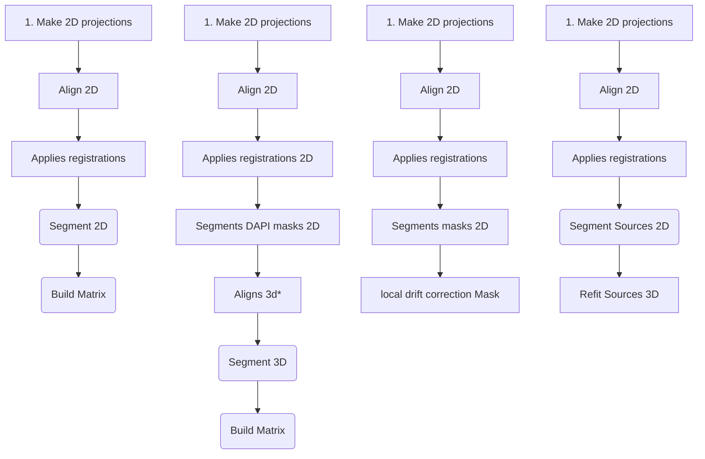
```mermaid
graph TD
	B[1. Make 2D projections] --> C[Align 2D]--> D[Applies registrations] --> E(Segment 2D) --> F(Build Matrix)
	
	B1[1. Make 2D projections] --> C1[Align 2D]--> D1[Applies registrations 2D] --> E1[Segments DAPI masks 2D] --> C2[Aligns 3d*] --> E12(Segment 3D) --> F1(Build Matrix)
	
	B3[1. Make 2D projections] --> C3[Align 2D]--> D3[Applies registrations] --> E3[Segments masks 2D]--> C32[local drift correction Mask] 
	
	B4[1. Make 2D projections] --> C4[Align 2D]--> D4[Applies registrations] --> E4(Segment Sources 2D) --> E41[Refit Sources 3D] 
	

```


#### infoList parameter file

The ```infoList.json``` file contains all the parameters that will be used to executing the pipeline. Parameters are encoded into a dictionary in JSON format. The first key ```labels``` contains the names of labels to be used and their order of processing:

1. *fiducial*: fiducial marks used for aligning the different cycles.
2. *DAPI*: nuclear masks.
3. *barcode*: DNA-FISH spot labeling a specific locus in each cycle.
4. *RNA*: pattern of the same that displays a specific activation state.

The order in which these labels are processed is very important, please do not change if you don't know what you are doing!


The model ```infoList.json``` file can be found [here](../modelParameterFiles_JSON/infoList.json).


The second key ```common``` contains the common parameters for each of the modules that ```pyHiM``` can run:

1. ```acquisition```: common to all labels. The parameters defined here are used by most functions.
2. ```alignImages```: common to all labels. Parameters specific to the ```alignImages```, ```alignImages3D``` and ```appliesRegistrations``` functions.
3. ```projectsBarcodes```: only for *barcode*. 
4. ```segmentedObjects```: only for *barcode* and *DAPI*. Parameters specific to the ```segmentMasks``` and ```segmentSources3D``` functions.
5. ```zProject```: common to all labels. Parameters specific to the ```makeProjections``` function.
6. ```buildsPWDMatrix```: only for *DAPI*. Parameters specific to the ```buildHiMmatrix``` function.

The description of parameters encoded in these dictionaries will be described with each function below.


Parameters specific to a label can be added to the ```labels``` key by adding a dictionary with the module name and the parameter to be changed for each label that you want to modify. In the example  below we will replace ```zProjectionOption``` in ```zProject```:

```sh
    "labels": {
        "DAPI": {
            "order": 3,
		    "zProject": {
		        "zProjectOption": "sum",
		    }            
```


##### ```Acquisition``` Parameters

This ```key``` provides information common to all routines.

"acquisition"

| Parameters | Default | Description |
| --- | --- | --- |
|"DAPI_channel": |"ch00",|Label of DAPI channel|
|"RNA_channel": |"ch01",|Label of RNA channel|
|"fileNameRegExp":| "scan_(?P<runNumber>[0-9]+)_(?P<cycle>[\\w|-]+)_(?P<roi>[0-9]+)_ROI_converted_decon_(?P<channel>[\\>. This regular expression encodes our filename format|
|"barcode_channel": | "ch01",|Label of barcode channel|
|"fiducialBarcode_channel":| "ch00",|Label of fiducial channel for barcode cycles|
|"fiducialDAPI_channel": |"ch02",|Label of fiducial  channel for the DAPI/RNA cycles|
|"pixelSizeXY": |0.1,| lateral pixel size in nm |
|"pixelSizeZ": |0.25, |axial pixel size in nm|
|"zBinning": |2, |binning in z-axis. A z-binning of 2 will skip every other plane. A z-binning of 1 will keep all planes.|
|"positionROIinformation": |3 |position for the ROI in the filename: will be removed in future versions!|
|"parallelizePlanes": |false |if True it will parallelize inner loops (plane by plane). Otherwise outer loops (e.g. file by file). Use of parallelization is activated by an argument to ```pyHiM``` (see below).|


####  1. MakeProjections

**Operation**

This function will take 3D stacks and project them into 2D.

There are many choices of how to do this:

- ```manual```: indicate the planes in zmin and zmax and set <mode> to <u>manual</u>.

- ```automatic```:  the function estimates focal plane using the maximum of the std deviation from plane to plane, then projects around ```zwindows``` of the focal plane. Set <mode> to <u>automatic</u>.

- ```full```: projects all planes into a 2D image.  Set <mode> to <u>full</u>.

  There are some additional options that can be provided to indicate how projections are made:

- ```laplacian```: breaks the image into blocks of size ```blockSize```. Then calculates the laplacian variance in each block, and estimates the focal position per block by maximizing the laplacian variance. The overall focal plane for the image will be outputed to the terminal and to the block image (see title in image below). The 2D image is reconstructed block by block by using the optimal focal plane for each block. If the parameter ```zwindows``` is set to zero, then only the image at the focal point will be used. Otherwise we will do an MIP in the subvolume: ``` focalPlane-zwindows/2:focalPlane+zwindows/2```.Set <mode> to <u>laplacian</u>.

  There are some additional options that can be provided to indicate how projections are made:

- ```windowSecurity```: during automatic focal plane search, it will discard maxima located this number of planes away from the border.

- ```zProjectOption```: how it converts a 3D stack into a 2D projection:
  - sum: sums all planes
  - MIP: maximum intensity projection

**Invoke**

To run this function exclusively, run *pyHiM* using the ```-C makeProjections``` argument.

```sh
usage: pyHiM.py [-h] [-F ROOTFOLDER] [-C CMD] [--threads THREADS]

optional arguments:
  -h, --help            show this help message and exit
  -F ROOTFOLDER, --rootFolder ROOTFOLDER
                        Folder with images
  -C CMD, --cmd CMD     Comma-separated list of routines to run (order matters!): 
  						makeProjections, appliesRegistrations,
                        alignImages,alignImages3D, segmentMasks,
                        segmentSources3D,refitBarcodes3D,
                        localDriftCorrection,projectBarcodes,buildHiMmatrix
  --threads THREADS     Number of threads to run in parallel mode. If none,
                        then it will run with one thread.
```

```-F ``` or ```--rootFolder``` indicates the rootFolder where pyHiM expects to find the dataset.

```--threads``` argument will make it run in parallel mode. Be ready to open your browser in ```http://localhost:8787``` and make sure you connect by ```ssh -L 8787:localhost:8787 marcnol@lopevi```. Change your username and server of course...

**Options**

"zProject"

```
"folder": "zProject",  *Description:* output folder
"operation": "overwrite",  *Options:* overwrite | skip
"mode": "full",  *Options:* full | manual | automatic | laplacian
"display": True,
"blockSize": 128,
"saveImage": True,
"zmin": 1,
"zmax": 59,
"zwindows": 10,
"windowSecurity": 2,
"zProjectOption": "sum",  *Options:* **sum** | **MIP**
```


#### 2. Drift Correction

**Operation overview** of available drift correction methods.

There are several ways of correcting for drift within pyHiM:

2.1 **Global drift correction by cross-correlation.** This option just runs a x-correlation between the 2D projected images for the reference and cycle <i>  fiducials. It is the fastest, but will ignore local deformations in the sample and, sometimes, can get fooled by bright dirt in the image that will drive the x-correlation to the wrong place. If your sample is clean and does not show much deformation, this is the way to go. The method will output overlap images that should be used whether the method worked as expected, and to what extent a local correction is needed.

2.2 **Block drift correlation.** This option will also use the 2D projection  images of reference and cycle <i> fiducials, but it will first break them up into blocks and will perform a block-by-block optimization of XY drift. This means that this method is very robust and is not easily fooled by dirt in the sample. However, the method will find a consensus global drift that will be applied and therefore local drift issues are not solved. An additional advantage to method 1 is that it can estimate how much local drift is present in each block and will use this to discard blocks where the local drift is higher than a user-provided tolerance (see below). After you run this method, you will get the uncorrected and corrected images so you can evaluate whether it worked properly and whether local drift correction methods need to be applied.
2.3 **2D Local drift correction.** This method will be applied after methods 1 and 2. It will iterate over the DAPI masks detected in the segmentation function (see below), extract a 2D region around each mask, and x-correlate the reference and cycle <i> fiducials in this 2D sub-region. Thus, this method is slower than methods 1 and 2, but provides for local corrections that account for deformations of the sample. The method will output images with the uncorrected and corrected overlaps for each DAPI mask sub-region so you can evaluate its performance. 
2.4 **3D local drift correction.** None of the methods above takes into account the drift of the sample in the z-plane. While this is typically very small given the good performance of autofocus, it could be an issue in some instances. This method will first apply the 2D drift obtained using methods 1 or 2 to the 3D stack of cycle <i>. Then it will background-substract and level-normalize the reference and cycle <i> fiducial images and will break them into 3D blocks (somewhat similar to method 2, which was breaking images into 2D blocks). Next, it will x-correlate every single 3D block in the reference image to the corresponding, pre-aligned block in the cycle <i> image to obtain a local 3D drift correction. The results are outputted as 3 matrices that indicate the correction applied to each block in z, x and y. In addition, a reassembled image made of XY, XZ and YZ projections is outputted to evaluate performance. Needless to say, this is the slowest but most performant method in the stack. 

##### 2.1 Global drift correction by cross-correlation

**Operation**

Global drift correction will be run by default if ```"alignByBlock": false```.

The method first finds the optimal x-y translation from fiducial images and and applies them to DAPI, barcodes and RNA images. The reference fiducial to be used needs to be indicated in ```infoList.json``` (see above)

**Invoke**

Parameters to run this script will be read from the ```alignImages``` field of ```infoList.json```.

```sh
usage: pyHiM.py [-h] [-F ROOTFOLDER] [-C CMD] [--threads THREADS]

optional arguments:
  -h, --help            show this help message and exit
  -F ROOTFOLDER, --rootFolder ROOTFOLDER
                        Folder with images
  -C CMD, --cmd CMD     Comma-separated list of routines to run (order matters!): 
  						makeProjections, appliesRegistrations,
                        alignImages,alignImages3D, segmentMasks,
                        segmentSources3D,refitBarcodes3D,
                        localDriftCorrection,projectBarcodes,buildHiMmatrix
  --threads THREADS     Number of threads to run in parallel mode. If none,
                        then it will run with one thread.
```

```-F ``` or ```--rootFolder``` indicates the rootFolder where pyHiM expects to find the dataset.

```--threads``` argument will make it run in parallel mode. Be ready to open your browser in ```http://localhost:8787``` and make sure you connect by ```ssh -L 8787:localhost:8787 marcnol@lopevi```. Change your username and server of course...

**Options**

"alignImages". These options are shared by all alignment routines.

```
"folder": "alignImages",  *Description:* output folder
"operation": "overwrite",  *Options:* overwrite | skip
"outputFile": "alignImages",
"referenceFiducial": "RT18"
"alignByBlock": True, # alignByBlock True will perform block alignment
"tolerance": 0.1, #Used in blockAlignment to determine the % of error tolerated
"lower_threshold": 0.999, # lower threshold to adjust image intensity levels before xcorrelation
"higher_threshold": 0.9999999, # higher threshold to adjust image intensity levels before xcorrelation
"background_sigma": 3.0,  # used to remove inhom background
"localShiftTolerance": 1,
"bezel": 20,
```


In most cases, this works very well. A good example is:

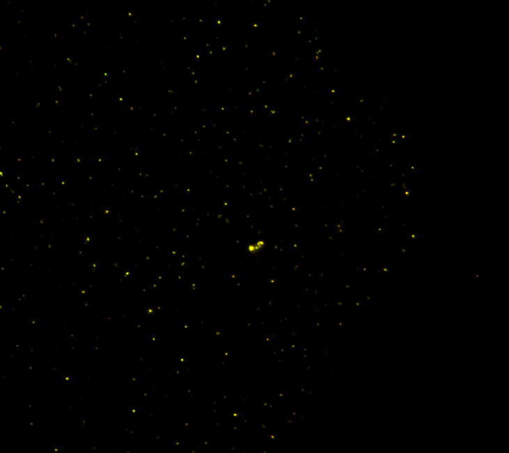


##### Problems with drift correction

Exceptions are:

1. there is a bit of crap in one cycle that distorts the cross correlation. This is addressed with blockAlignment.
2. The cross correlation is biased towards a bright spot in the image that is shifted with respect to the others. This can be addressed by adapting thresholds.
3. There is a deformation in the sample that cannot be corrected by a global translation. See solution in LocalDriftCorrection (below)

##### Adapting thresholds
The function will first take the pixels whose intensities reside within the ```lower_threshold``` and the ```higher_threshold``` highest pixel intensities. This reduces problems with intense backgrounds skewing the cross-correlation.
By default, the values are ```lower_threshold=0.999``` and the ```higher_threshold=0.9999999```.

In the example below a bright spot is affecting the alignment. 

In this case this can be solved by using lower thresholds, for instance ```lower_threshold=0.99``` and the ```higher_threshold=0.999```.


##### 2.2 Block drift correlation

To properly run this method use ```"alignByBlock": true```

Inspired by the use of blocks to restore large images, I implemented a new registration routine that:

1. breaks the image into non-overlapping blocks of 256x256

2. calculates the optimal translational shift between fiducial and reference in each block

3. estimates the root mean square error (RMS) between the reference and the shifted image for each block (using the optimal shift for that block). This is performed for the entire image, not the block.

4. finds the blocks with RMS within ```tolerance``` of the minimum RMS. For instance, if ```tolerance=0.1``` then a block with RMS 10% higher than that of the minimum is tolerated. 

5. Mean and standard deviation of the XY shifts are calculated from the blocks selected in step 4. Mean shifts are used for shifting the image and getting the final RMS error (reported now in the output alignment Table).

6. We re-calculate the global shift by using the entire image, and the associated RMS error. We estimate the shift errors from the polled blocks.

   1.  If the global RMS error is lower than the polled RMS error (see 4) 
   2. or if the number of blocks within the ```tolerance``` is lower than ```minNumberPollsters``` (this is not yet provided as a parameter in infoList.json, but should in future)
   3. or if the shift errors are higher than 5 pixels (this could be added as a parameter in infoList.json if needed)

   then we fall back to global alignment.

To turn the routing on, just set ```alignByBlock``` to True.

**Important note**: When you use blockAlignment, pyHiM will produce 8x8 output matrices with the abs(shift-global_shift) maps. These will be stored in ```alignImages``` folder with names such as ```scan_006_DAPI_003_ROI_converted_decon_ch02_errorAlignmentBlockMap.npy```.

When alignBarcodesMasks() runs, it will search for this files. If it finds them it will filter out barcode localizations that displayed an absolute drift larger than the ```toleranceDrift``` parameter in the ```segmentedObjects``` segment of the ```infoList.json``` file.

So if you see a large drop in the barcodes that are used (this can be seen by matrices with empty rows/columns) it may be that your inaccurate barcode localizations are being dropped. Check for this the ```Assigned: 266 | discarded: 285``` outputted by alignBarcodesMasks(), and change ```toleranceDrift``` if needed.


###### Examples

<u>Nice ROI</u>

The right plot shows the RMS between the whole reference fiducial image and the fiducial of cycle <i> for each block. In each block, the optimal drift for that block was used for the calculation. Regions with extended blue mean that the optimal drift encountered was equally good for the whole image. Regions with high RMS indicate local block drifts not optimal for the whole image. The program will automatically select the regions with lowest RMS and use them to derive a consensus global drift.

The left plots shows the relative change between the consensus global drift and the local drift. Values are in px. White region indicates blocks where the global consensus drift is very similar to the optimal local block drift.

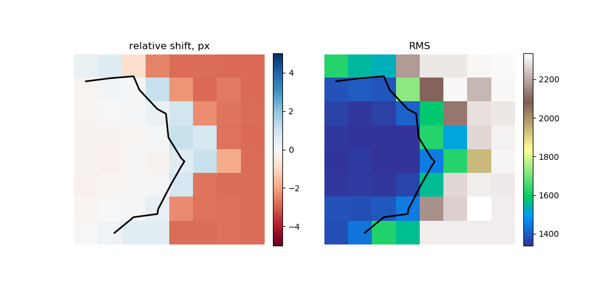

This image shows the reference fiducial and the drift-corrected cycle <i> fiducial images overlapping. Regions in yellow mean good overlap.

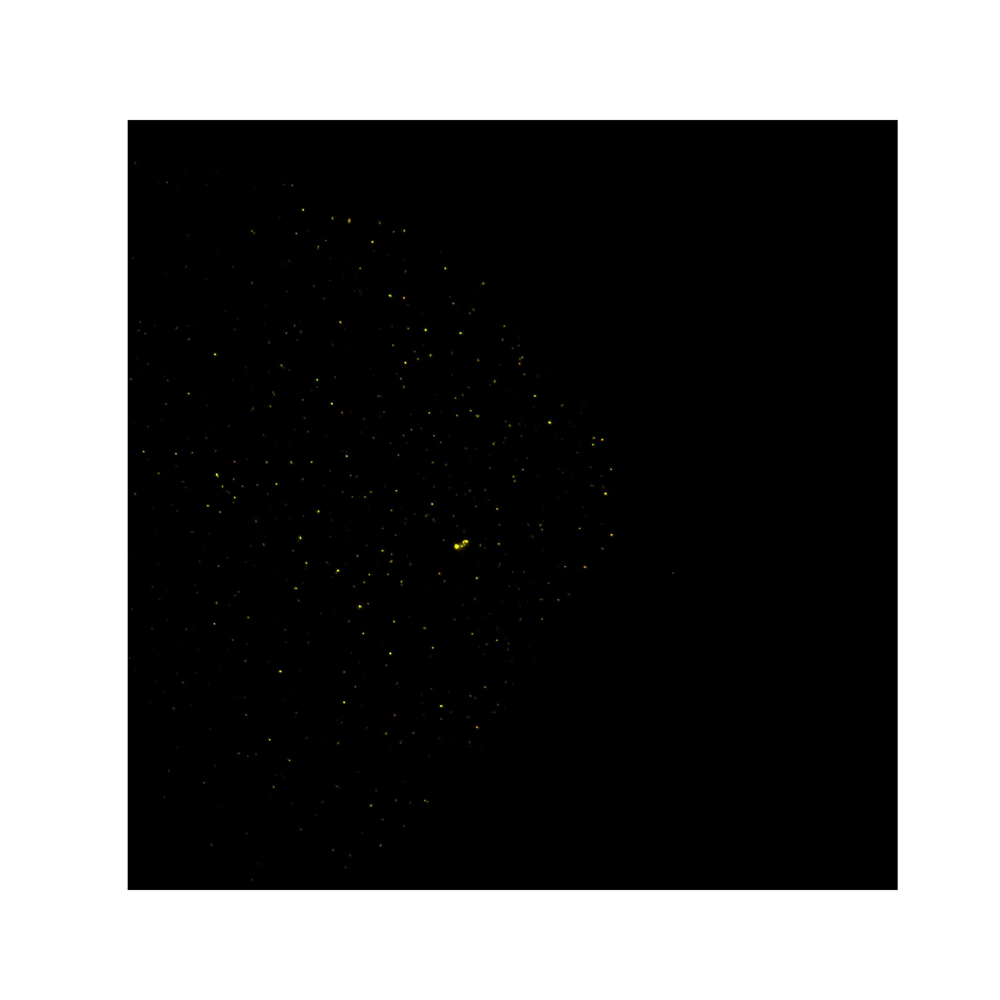

Left image shows the reference minus the <u>uncorrected</u> cycle <i>  fiducial images (red and blue). Blue and red regions represent places where the two images do not overlap. White regions represent regions with the same pixel values in both images. The right panel shows the reference and <u>corrected</u> cycle <i>  fiducial images (red and blue). Same colormap. So, the right image should be mostly white with almost no spot (in either blue or red) if the correction worked well. 

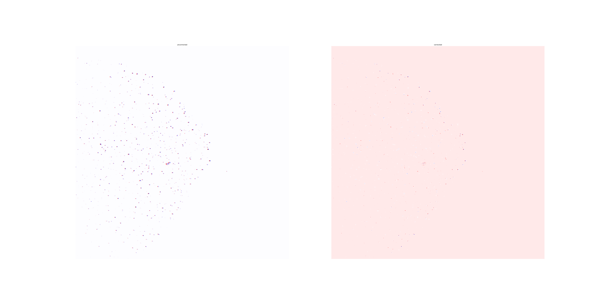


<u>Challenging ROI</u>

These are typical results in a challenging ROI with a bit of 'dirt' on the edge that typically skews the global cross correlation:

Example: left image is a 2D projection of a fiducial without contamination. The right panel a fiducial with a contamination in the top right.

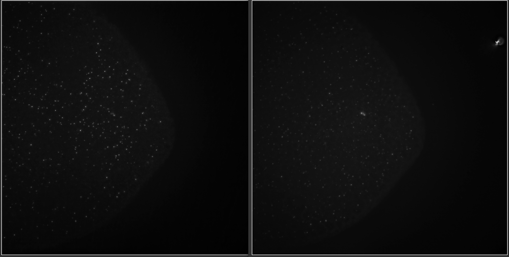


Alignment using global alignment:

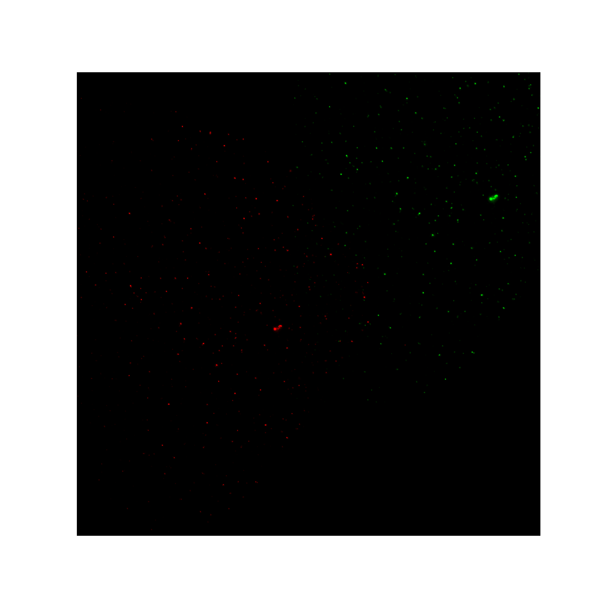

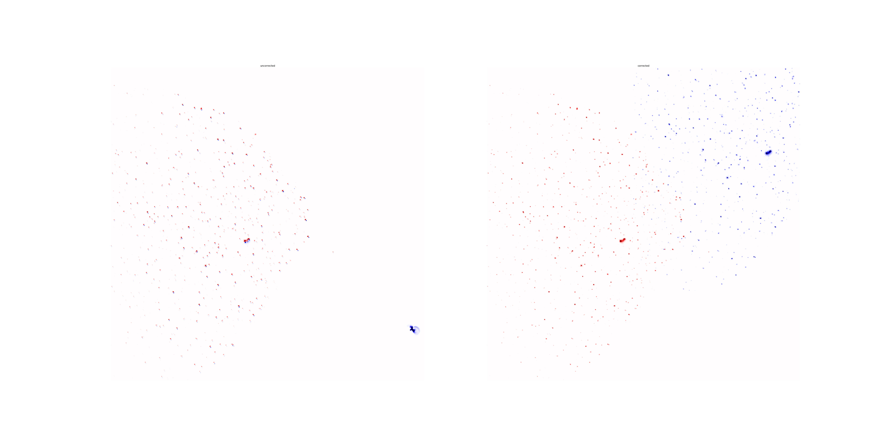

Alignment using blockAlignment:


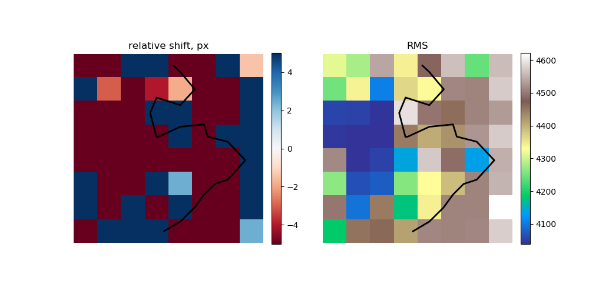


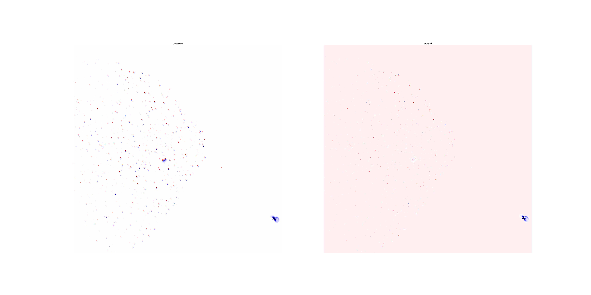


#####  2.3 LocalDriftCorrection in 2D

**Operation**

The ```localDriftCorrection``` function will iterate over the DAPI masks, retrieve a bounding box that is ```bezel``` pixels larger than the mask for both the reference fiducial and the fiducial of each cycle. It will then apply the same cross-correlation algorithm to find an additional local shift.  If this shift is larger than ```localShiftTolerance``` in any direction, then it will not apply it.

Deformation of samples means a simple translation will not be enough to correct drift. Typical example where most fiducial spots are corrected apart from one on the top right, very likely due to the embryo getting deformed in this cycle:

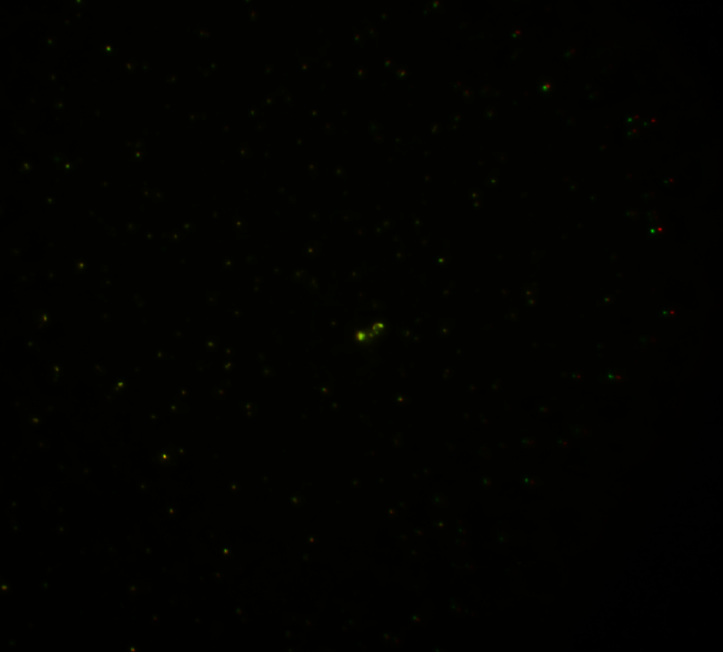


**Invoke**

Parameters to run this script will be read from the ```alignImages``` field of ```infoList.json```.

To activate this method use ```"localAlignment": "mask2D"``` in the ```infoList.json``` file when you run *pyHiM*.

2D Local drift correction will be run after you run a global drift correction method either using methods 1 (global) or 2 (block alignment).  To select between these, use the ```alignByBlock``` flag.

Otherwise, if you just want to call this method, call *pyHiM* with the ```-C localDriftCorrection``` argument.

```sh
usage: pyHiM.py [-h] [-F ROOTFOLDER] [-C CMD] [--threads THREADS]

optional arguments:
  -h, --help            show this help message and exit
  -F ROOTFOLDER, --rootFolder ROOTFOLDER
                        Folder with images
  -C CMD, --cmd CMD     Comma-separated list of routines to run (order matters!): 
  						makeProjections, appliesRegistrations,
                        alignImages,alignImages3D, segmentMasks,
                        segmentSources3D,refitBarcodes3D,
                        localDriftCorrection,projectBarcodes,buildHiMmatrix
  --threads THREADS     Number of threads to run in parallel mode. If none,
                        then it will run with one thread.
```


#####  2.4 Local Drift Correction in 3D

**Operation**

The following steps were implemented:

- iterate over reference fiducials available for each ROI
  - Iterate over all cycles for a given ROI
    - load 3D reference fiducial image the current imaging cycle
    - re-align 3D fiducial image using XY alignment resulting from the XY alignment produced while running ```alignImages```. If this is not available, it will XY project the 3D stack of reference and cycle <i> fiducial to get an XY realignment. Beware, this will be global and will not use blockAlignment.
    - Breaks 3D images for both reference and cycle <i> fiducials in blocks (defined by ```blockSizeXY```) 
    - Cross-correlates each block to get an XYZ shift. This provides a 3D local drift correction for each block
    - store shifts in output Table that contains values for each block (columns *shift_z, shift_x and shift_y*).
    - store quality of image superposition based on the normalized root mean square matrix for each block in output Table (columns *quality_xy, quality_zy, quality_zx*).
  - displayed results:
      - shift block maps for X, Y and Z.
      - corrected blocks in XY, ZX, ZY
      - quality matrices.

In **buildMatrix**, if available, the Table of local alignments is loaded, and is used to correct the xyz-coordinates of the barcode provided the correction is found in the Table and is lower than the tolerance indicated in the ```buildPWDMatrix``` key within ```infoList.json```.

**Invoke**

Parameters to run this script will be read from the ```alignImages``` field of ```infoList.json```.

To activate this method use ```"localAlignment": "block3D"``` in the ``` alignImages``` key of the ```infoList.json``` file when you run *pyHiM*.

This method requires that you first run global drift correction either using methods 1 (global) or 2 (block alignment).  To select between these, use the ```alignByBlock``` flag in the  ``` alignImages``` key of the ```infoList.json``` file.

Otherwise, if you just want to call this method, call *pyHiM* with the ```-C alignImages3D``` argument.

```sh
usage: pyHiM.py [-h] [-F ROOTFOLDER] [-C CMD] [--threads THREADS]

optional arguments:
  -h, --help            show this help message and exit
  -F ROOTFOLDER, --rootFolder ROOTFOLDER
                        Folder with images
  -C CMD, --cmd CMD     Comma-separated list of routines to run (order matters!): 
  						makeProjections, appliesRegistrations,
                        alignImages,alignImages3D, segmentMasks,
                        segmentSources3D,refitBarcodes3D,
                        localDriftCorrection,projectBarcodes,buildHiMmatrix
  --threads THREADS     Number of threads to run in parallel mode. If none,
                        then it will run with one thread.
```

#####  

**Options**

Need to take special care in selecting the following parameters in "**acquisition**":

| Parameters           | Default | Description                                                  |
| -------------------- | ------- | ------------------------------------------------------------ |
| "zBinning":          | 2       | *binning in z-axis. A z-binning of 2 will skip every other plane. A z-binning of 1 will keep all planes.* |
| "parallelizePlanes": | false   | *if True it will parallelize inner loops (plane by plane). Otherwise outer loops (e.g. file by file)* |


These options are shared by all alignment routines: "**alignImages**". 
| Parameters           | Default | Description                                                  |
| -------------------- | ------- | ------------------------------------------------------------ |
|"folder" |"alignImages"| Name of output folder |
|"operation"| "overwrite"| *to be removed in future release* |
|"outputFile"| "alignImages"|Name of output file|
|"referenceFiducial"| "RT18"|Name of the reference fiducial cycle|
|"alignByBlock"| True| True will perform block alignment. False will do global alignement. |
|"tolerance"| 0.1| Used in blockAlignment to determine the % of error tolerated |
|"lower_threshold"| 0.999| lower threshold to adjust image intensity levels before xcorrelation |
|"higher_threshold"| 0.9999999| higher threshold to adjust image intensity levels before xcorrelation |
|"background_sigma"| 3.0 |used to remove inhomogeneous background|
|"localShiftTolerance"| 1|Number of pixels tolerated to apply local drift correction|
|"bezel"|20|number of pixels to use around a box made around each DAPI mask. Used for localDriftCorrection|

**Output of method**

The first diagnostic image shows 2D projections of the 3D reference and  cycle <i> fiducial images. Uncorrected in the top row and 3D background-subtracted and level-renormalized images. These latter will be used for the x-correlations.

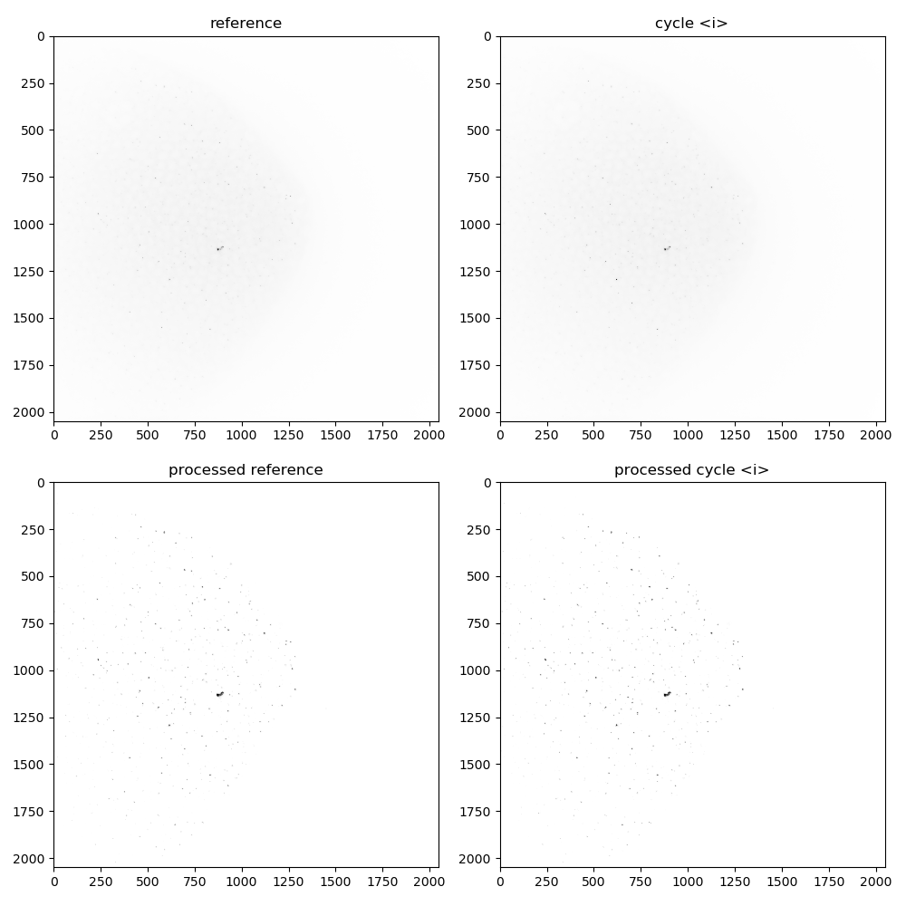

Matrices indicating the correction applied to each block in z, x and y. Values are in pixel units. You should look for roughly homogeneous corrections within embryos. Typically small local corrections are found in X and Y after if the global correction was successful. If the autofocus run fine, then the Z shifts should be ~ 1 px.


Reassembled image made of XY, XZ and YZ projections is outputted to evaluate performance. Reference fiducial is in red, cycle <i> fiducial is in green.

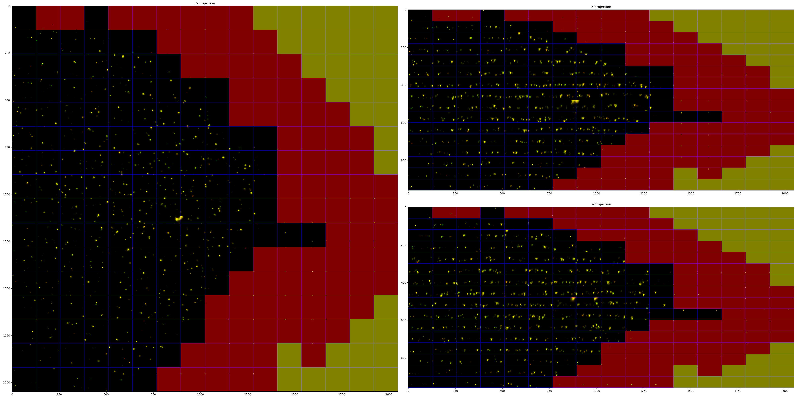

**Validation**

- I used the fiducials for 3D alignement. 
- Segmented barcodes in fiducial files for reference (RT27) and a cycle (RT31)
- Plotted the barcode localizations of barcode RT31 on top of the image of RT27 (reference): yellow crosses. They most agree which mean global shift correction is correct, but there are small relative shifts far from the center of the FOV. This reflects the inability of global shift correction to correct deformations.
- Then plotted also the barcode localizations of barcode RT31 corrected by 3D alignment on top of the image of RT27: **red circles**. In this case, the localizations overlap even better. This confirms that the relative local corrections improved the local deformations.

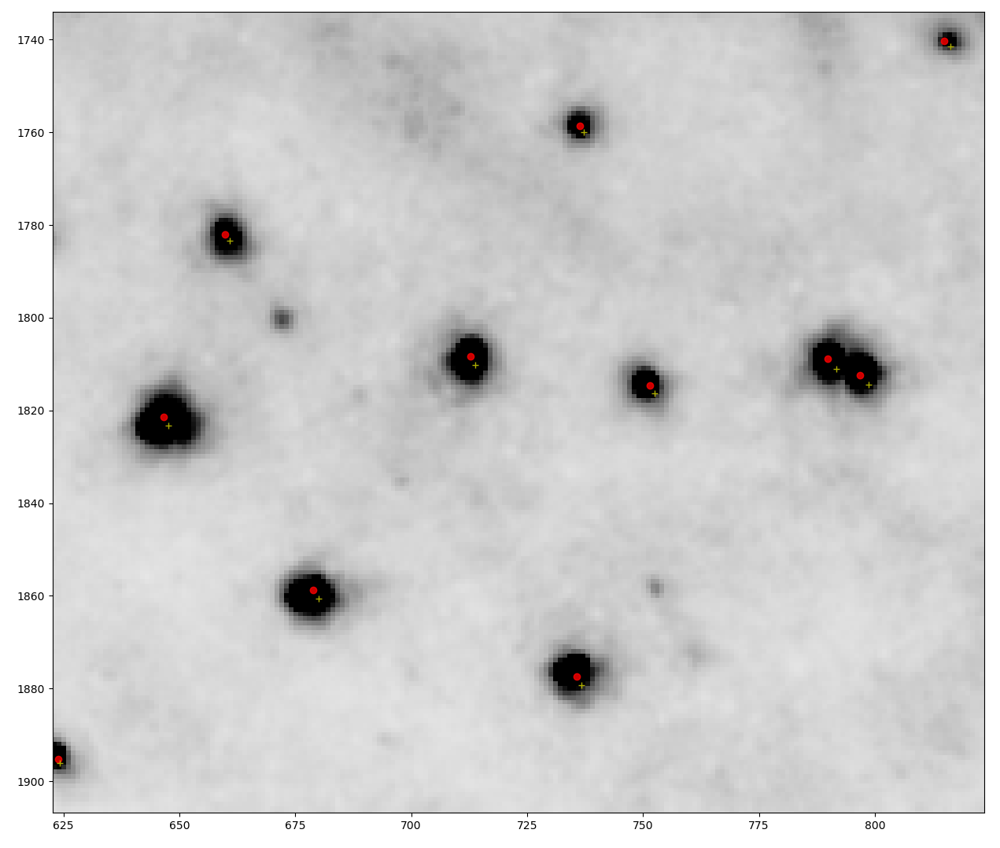

This is now the comparison of the min distances between localizations in the reference and cycle <i> fiducials. Top plot is for global shift corrected, bottom for global + align3D


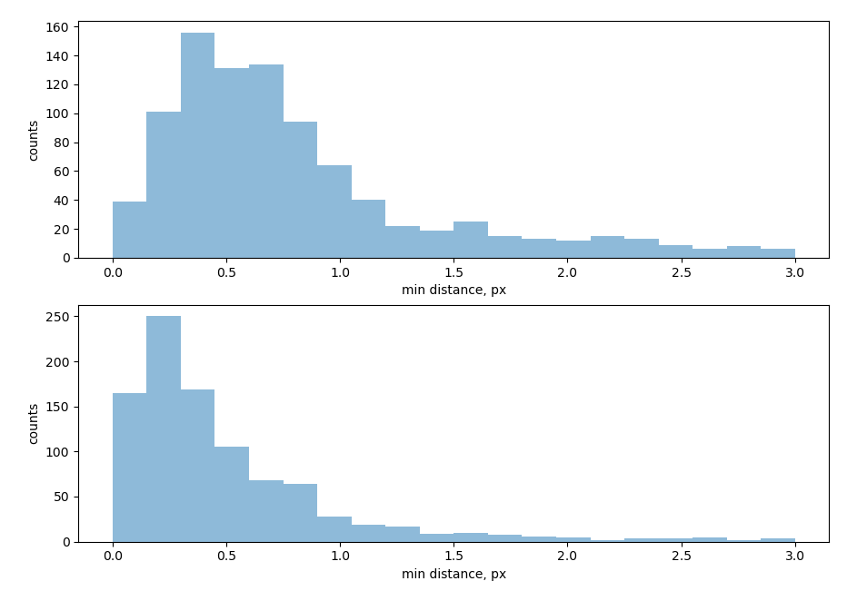

#### 3. Applies registrations

**Operation**


**Invoke**

Parameters to run this script will be read from the ```alignImages``` field of ```infoList.json```.

This function will automatically be applied when you run *pyHiM*.

If you want to run this function exclusively, run *pyHiM* using the ```-C appliesRegistrations``` argument.

```sh
usage: pyHiM.py [-h] [-F ROOTFOLDER] [-C CMD] [--threads THREADS]

optional arguments:
  -h, --help            show this help message and exit
  -F ROOTFOLDER, --rootFolder ROOTFOLDER
                        Folder with images
  -C CMD, --cmd CMD     Comma-separated list of routines to run (order matters!): 
  						makeProjections, appliesRegistrations,
                        alignImages,alignImages3D, segmentMasks,
                        segmentSources3D,refitBarcodes3D,
                        localDriftCorrection,projectBarcodes,buildHiMmatrix
  --threads THREADS     Number of threads to run in parallel mode. If none,
                        then it will run with one thread.
```


#### 4. Segmentation of masks and sources

**Overall options** for source segmentation

- 4.1 Segmentation of masks in 2D

- 4.2 Segmentation of masks in 3D

- 4.3 Segmentation of sources 2D

- 4.4 Estimation of z-position post 2D segmentation using z-profile

- 4.5 Estimation of z-position post 2D segmentation using ASTROPY

- 4.6 Direct segmentation in 3D

  

##### 4.1 Segmentation of masks in 2D

**Operation**

**Invoke**

This function will be applied when you run *pyHiM* using the parameter ```"operation": "2D"``` in section ```segmentedObjects``` of ```infoList.json```. 

If you want to run this function exclusively, run *pyHiM* using the ```-C segmentMasks``` argument.

```sh
usage: pyHiM.py [-h] [-F ROOTFOLDER] [-C CMD] [--threads THREADS]

optional arguments:
  -h, --help            show this help message and exit
  -F ROOTFOLDER, --rootFolder ROOTFOLDER
                        Folder with images
  -C CMD, --cmd CMD     Comma-separated list of routines to run (order matters
                        !): makeProjections alignImages appliesRegistrations
                        alignImages3D segmentMasks segmentMasks3D
                        segmentSources3D refitBarcodes3D localDriftCorrection
                        projectBarcodes buildHiMmatrix
  --threads THREADS     Number of threads to run in parallel mode. If none,
                        then it will run with one thread.
```

**Options**

"segmentedObjects" relevant settings:

```
"folder": "segmentedObjects",  *Description:* output folder
"operation": "overwrite",  *Options:* overwrite | skip
"outputFile": "segmentedObjects",
"operation": "2D,3D",
"background_method": "inhomogeneous",  *Options:* **flat** |**inhomogeneous** | **stardist** (AI)
"stardist_network": "stardist_nc14_nrays:64_epochs:20_grid:2", *Description*: name of network
"stardist_basename": "/mnt/grey/DATA/users/marcnol/models", *Description*: location of AI models
"background_sigma": 3.0,  *Description:* used to remove inhomogenous background
"threshold_over_std": 1.0,  *Description:* threshold used to detect sources
"area_min": 50,  *Description:* min area to keep object
"area_max": 500,  *Description:* max area to keep object
"residual_max": 2.5, *Description:*  maximum difference between axial spot intensity and gaussian fit.
```


**Output**

A 3D mask segmentation produces two outputs saved in the `segmentedObjects` folder:

```
scan_002_mask0_002_ROI_converted_decon_ch01_segmentedMasks.png
scan_002_mask0_002_ROI_converted_decon_ch01_Masks.npy
```

The PNG file is a representation of the raw image and the segmented objects. 

The NPY file is a 2D labeled numpy array  containing the segmented objects with a size identical to the original image. Background has the value *0* and then each mask contains a different integer. The maximum value in this matrix is identical to the number of masks detected. The file name is constructed using the original root filename with the tag `_Masks`.

*Warning*:  This mode operates in 2D, therefore the Startdist network provided **must be** in 2D.


**AI networks** 

See networks for DAPI 2D segmentation [here](./AI_networks.md).


##### 4.2 Segmentation of masks in 3D

**Operation**

**Invoke**

This function will be applied when you run *pyHiM* using the parameter ```"operation": "3D"``` in section ```segmentedObjects``` of ```infoList.json```. 

If you want to run this function exclusively, run *pyHiM* using the `-C segmentMasks3D` argument. This is currently not in the default list of commands of *pyHiM*.


**Options**

"segmentedObjects" relevant settings:

```
"operation": "2D,3D",
"stardist_basename3D":"/mnt/grey/DATA/users/marcnol/models/StarDist3D/mask_DAPI/models/",
"stardist_network3D":"stardist_20210625_deconvolved",
```


**Output**

A 3D mask segmentation produces two outputs saved in the `segmentedObjects` folder:

```
scan_002_mask0_002_ROI_converted_decon_ch01.tif_3Dmasks.png
scan_002_mask0_002_ROI_converted_decon_ch01._3Dmasks.npy
```

The PNG file is a representation of the raw image and the segmented objects. 

The NPY file is a 3D labeled numpy array  containing the segmented objects. The file name is constructed using the original root filename with the tag `_3DMasks`.

*Warning*:  This mode operates in 3D, therefore the Startdist network provided **must be** in 3D.


**AI networks** 

See networks for DAPI 3D segmentation [here](./AI_networks.md).


**Postprocessing**

`segmentMasks3D` will produce 3D Numpy labeled arrays that will not be used by `buildPWDmatrix` as this latter will load 2D projected masks.

Thus, we need to take the output of `segmentMasks3D` and produce 2D Numpy labeled arrays with the appropriate names.

This is accomplished by `process_segmentMasks3D.py`, a python script that you can find in `src/postProcessing`.

The only input argument is the rootFolder.

```sh
usage: process_segmentMasks3D.py [-h] [-F ROOTFOLDER]

optional arguments:
  -h, --help            show this help message and exit
  -F ROOTFOLDER, --rootFolder ROOTFOLDER
                        Folder with images
```

You can run this script in the root folder of an analysis and it should work fine (it assumes `./` to be the default folder).

##### 4.3 Segmentation of sources in 2D

**Operation**

**Invoke**

This function will be applied when you run *pyHiM* using the parameter ```"operation": "2D"``` in section ```segmentedObjects``` of ```infoList.json```. If you want to run both 2D and 3D in one go, use:  ```"operation": "2D,3D"```..

If you want to run this function exclusively, run *pyHiM* using the ```-C segmentMasks``` argument.

```sh
usage: pyHiM.py [-h] [-F ROOTFOLDER] [-C CMD] [--threads THREADS]

optional arguments:
  -h, --help            show this help message and exit
  -F ROOTFOLDER, --rootFolder ROOTFOLDER
                        Folder with images
  -C CMD, --cmd CMD     Comma-separated list of routines to run (order matters!): 
  						makeProjections, appliesRegistrations,
                        alignImages,alignImages3D, segmentMasks,
                        segmentSources3D,refitBarcodes3D,
                        localDriftCorrection,projectBarcodes,buildHiMmatrix
  --threads THREADS     Number of threads to run in parallel mode. If none,
                        then it will run with one thread.
```


**Options**

"segmentedObjects" contain options for all segmentation functions: 2D and 3D.

```
"folder": "segmentedObjects",  *Description:* output folder
"operation": "overwrite",  *Options:* overwrite | skip
"outputFile": "segmentedObjects",
"background_method": "inhomogeneous",  *Options:* **flat** |**inhomogeneous** | **stardist** (AI)
"stardist_network": "stardist_nc14_nrays:64_epochs:20_grid:2", *Description*: name of network
"stardist_basename": "/mnt/grey/DATA/users/marcnol/models", *Description*: location of AI models
"background_sigma": 3.0,  *Description:* used to remove inhomogenous background
"threshold_over_std": 1.0,  *Description:* threshold used to detect sources
"fwhm": 3.0,  *Description:* source size in pixels
"brightest": 1100,  *Description:* max number of objects segmented per FOV (only for barcodes!)
"intensity_min": 0,  *Description:* min intensity to keep object
"intensity_max": 59,  *Description:* max intensity to keep object
"area_min": 50,  *Description:* min area to keep object
"area_max": 500,  *Description:* max area to keep object
"residual_max": 2.5, *Description:*  maximum difference between axial spot intensity and gaussian fit.
"3Dmethod":"zASTROPY", # options: zASTROPY, zProfile
"sigma_max": 5,*Description:* maximum gaussian fit sigma allowed (axial spot intensity)
"centroidDifference_max": 5,  *Description:* max difference between z centroid position determined by moment and by gaussian fitting       
"3DGaussianfitWindow": 3,*Description:* size of window in xy to extract 3D subVolume, in px. 3 means subvolume will be 7x7.
"3dAP_window": 5, # constructs a YZ image by summing from xPlane-window:xPlane+window
"3dAP_flux_min": 2, # # threshold to keep a source detected in YZ
"3dAP_brightest": 100, # number of sources sought in each YZ plane
"3dAP_distTolerance": 1, # px dist to attribute a source localized in YZ to one localized in XY
```


**Output**

*segmentedObjects_barcode.dat*

ASTROPY Table() with the following headers:

```sh
# - {name: Buid, datatype: string}
# - {name: 'ROI #', datatype: int64}
# - {name: 'CellID #', datatype: int64}
# - {name: 'Barcode #', datatype: int64}
# - {name: id, datatype: int64}
# - {name: zcentroid, datatype: float64}
# - {name: xcentroid, datatype: float64}
# - {name: ycentroid, datatype: float64}
# - {name: sharpness, datatype: float64}
# - {name: roundness1, datatype: float64}
# - {name: roundness2, datatype: float64}
# - {name: npix, datatype: int64}
# - {name: sky, datatype: float64}
# - {name: peak, datatype: float64}
# - {name: flux, datatype: float64}
# - {name: mag, datatype: float64}
d95b375c-5f4e-4adf-962e-66744e2b3110 1 0 31 1 nan 15.746314184707545 100.98211033024285 0.4351748388279322 0.3402780083269775 0.13715948731052757 25 0.0 130.33237090495697 6.02785952022439 -1.9504078062273058
5faccf0d-7aaa-4255-924f-7195c85a30d2 1 0 31 2 nan 19.979799590668215 111.59998507797428 0.46747747995327016 0.8238481578473384 0.26674082653832065 25 0.0 545.7168493780091 23.02179555390307 -3.405347982068227
```


**AI networks** 

See networks for barcode 2D segmentation [here](./AI_networks.md).


**Examples**

An example of a segmentation of a nice barcode (color indicates flux, with red being high:2000 and blue low:0, *jet colormap*):

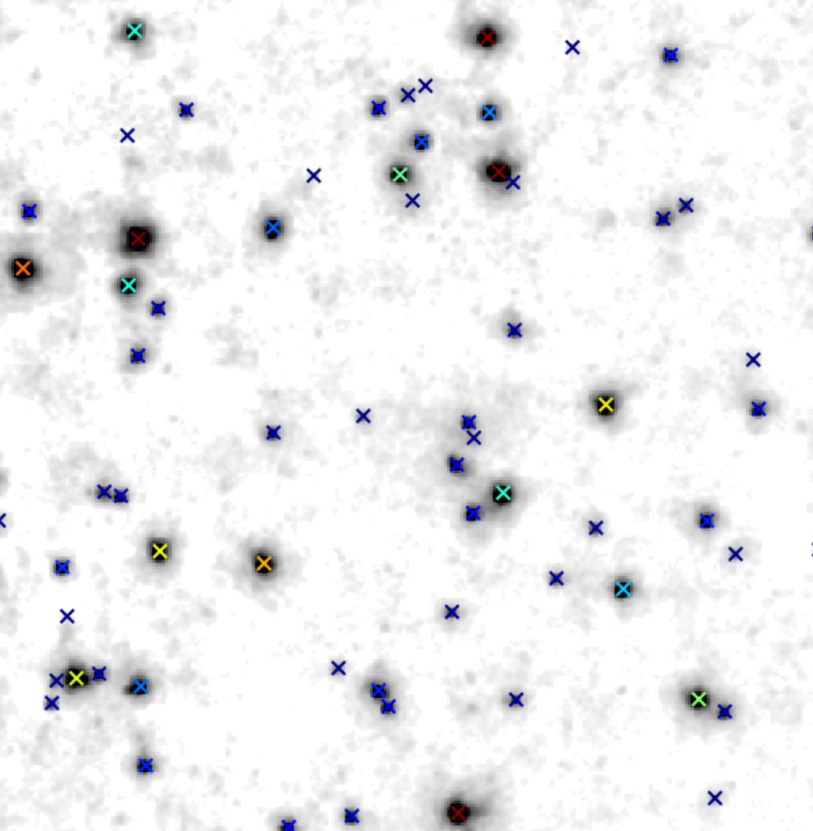


An example of a barcode where localization signals are far from optimal: note that crosses are now all blue (low fluxes)

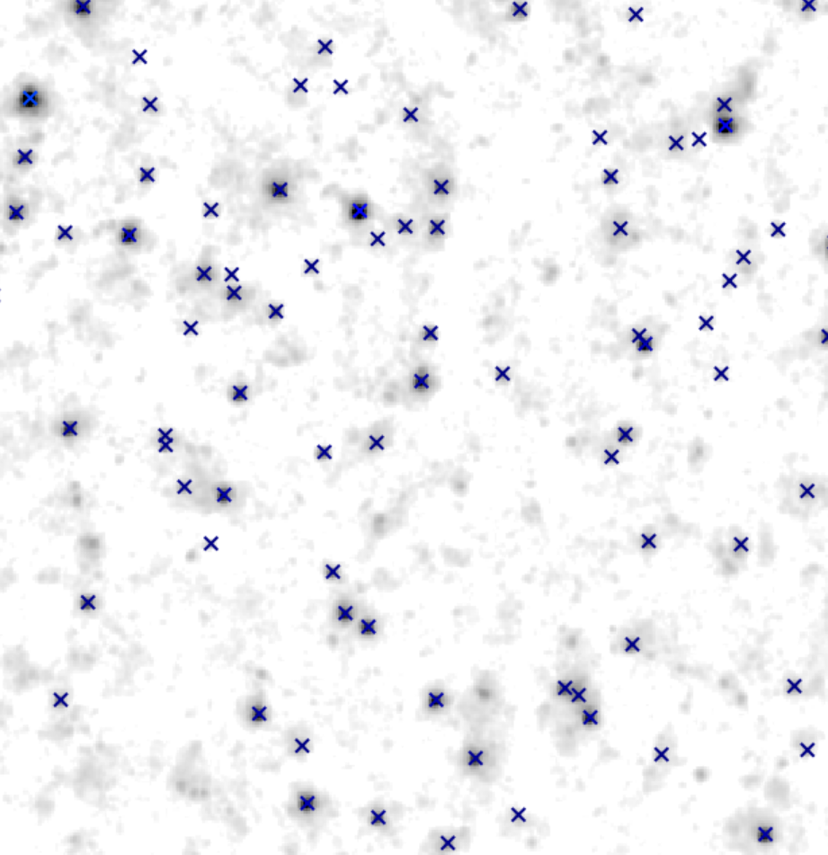


##### 4.4 3D fits of barcode positions using zProfiling

**Operation**

Barcode 3D positions are now calculated as follows.

First ASTROPY calculates the 2D positions using 2D projected images.

Then the ```fittingSession.refitFolders``` class function draws a subVolume around each localized barcode (default: 7x7 window), estimates the axial intensity profile, substracts background, calculates the z position by calculating the weighted moment, then uses it as a seed to Gaussian fit the axial intensity distribution and find a better estimate of the z-position based on Gaussian fitting.
Finally, the localizations are filtered by following various criteria

- the residual of the fit has to be small (see parameter in infoList)
- the difference between Moment and Gaussian positions has to me small (see parameter in infoList)
- the sigma of the Gaussian fit has to be smaller than a threshold (see parameter in infoList)

The results for any given ROI and barcode appear as a figure with two subplots where these values are shown. The dots in black represent the spots that will be kept for further analysis.

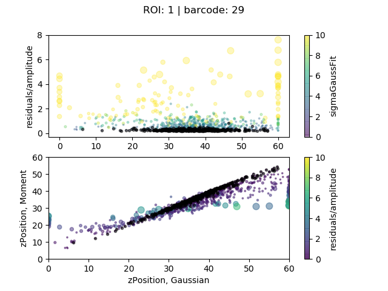


**Invoke**

Use ```"3Dmethod":"zProfile"``` in the ```segmentObjects``` key of *infoList.json* file when you run *pyHiM*.

If you want to run this function exclusively, run *pyHiM* using the ```-C refitBarcodes3D``` argument using```"3Dmethod":"zProfile"``` in the ```segmentObjects``` key of *infoList.json* file

```sh
usage: pyHiM.py [-h] [-F ROOTFOLDER] [-C CMD] [--threads THREADS]

optional arguments:
  -h, --help            show this help message and exit
  -F ROOTFOLDER, --rootFolder ROOTFOLDER
                        Folder with images
  -C CMD, --cmd CMD     Comma-separated list of routines to run (order matters!): 
  						makeProjections, appliesRegistrations,
                        alignImages,alignImages3D, segmentMasks,
                        segmentSources3D,refitBarcodes3D,
                        localDriftCorrection,projectBarcodes,buildHiMmatrix
  --threads THREADS     Number of threads to run in parallel mode. If none,
                        then it will run with one thread.
```


##### 4.5 3D fits of barcode positions using ASTROPY

**Operation**

In this case, the 2D XY source positions calculated using projected images are loaded from disk.

Then the ```fittingSession.refitFolders``` will 

- reinterpolate the 3D stack to correct for XY drift
- Make a YZ plane projection at a specific xPlane position. For this it will sum the YZ images from ```xPlane-3dAP_window:xPlane+3dAP_window``` . From this YZ projection, it will call ASTROPY and localize new sources using the parameters: 
  - ```3dAP_flux_min``` it will discard sources that have a flux smaller than this value
  - ```3dAP_brightest```: it will recover this number of sources per YZ plane
- Then, it will iterate over the sources in that YZ plane and match them to a source in the original 2D XY source list. For this, it will find the sources within a Y-distance of  ```3dAP_distTolerance```, and match to the closest source found. If no source is found closer than this threshold, it will not match it to anything. *There is an experimental setting ```addSources``` that can be used to add the sources as new sources if no match was found in the original 2D XY list of sources. By default this is set to ```False```.* 
- If the flux of the 2D XY source is smaller than that of the ZY source, the flux will be updated accordingly.
- This process is repeated for all xPlanes using ```range(3dAP_window, imageSizeX,3dAP_window)``` (i.e. the x-range of the image will be split into ```imageSizeX/3dAP_window``` equally-spaced planes). Typically ```3dAP_window=5``` works fine.

**Invoke**

Use ```"3Dmethod":"zASTROPY"``` in the ```segmentObjects``` key of *infoList.json* file when you run *pyHiM*.

To run this function exclusively, run *pyHiM* using the ```-C refitBarcodes3D``` argument using ```"3Dmethod":"zASTROPY"``` in the ```segmentObjects``` key of *infoList.json* file

```sh
usage: pyHiM.py [-h] [-F ROOTFOLDER] [-C CMD] [--threads THREADS]

optional arguments:
  -h, --help            show this help message and exit
  -F ROOTFOLDER, --rootFolder ROOTFOLDER
                        Folder with images
  -C CMD, --cmd CMD     Comma-separated list of routines to run (order matters!): 
  						makeProjections, appliesRegistrations,
                        alignImages,alignImages3D, segmentMasks,
                        segmentSources3D,refitBarcodes3D,
                        localDriftCorrection,projectBarcodes,buildHiMmatrix
  --threads THREADS     Number of threads to run in parallel mode. If none,
                        then it will run with one thread.
```


**Outputs**

The results for any given ROI and barcode appear with three figures representing:

- a typical YZ profile in the middle of the x-range. Sources will be represented as crosses.
- the 2D-projected image with sources represented as crosses. Color-code represents z-position. Colormap is from ```0``` to the max number of z-planes in the image.
- Finally, a scatter plot displaying the z-position and the flux of every source detected is displayed. 

Important: Sources are not flux-filtered at this stage. The original or updated flux values will be outputted in the Table, and used in the ```alignBarcodesMasks``` module to filter the localization using the value of ```flux_min``` provided in the ```infoList.json``` file.

Output examples:

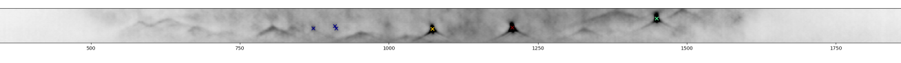


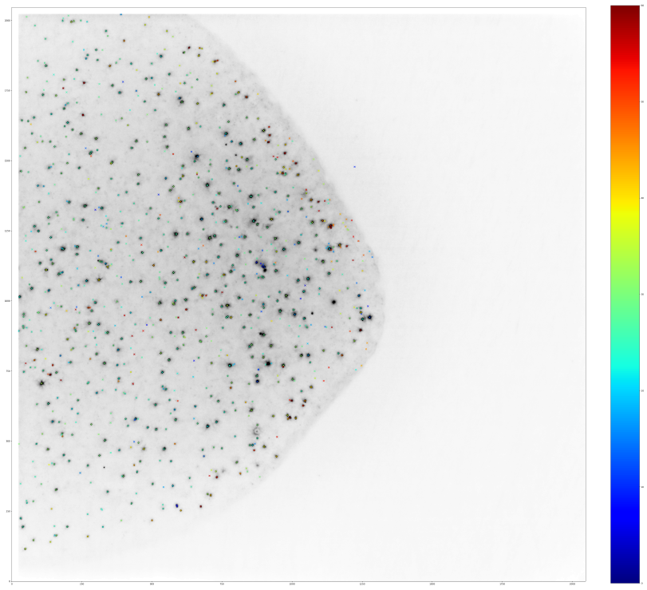


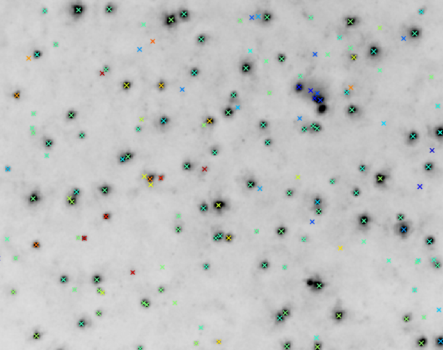


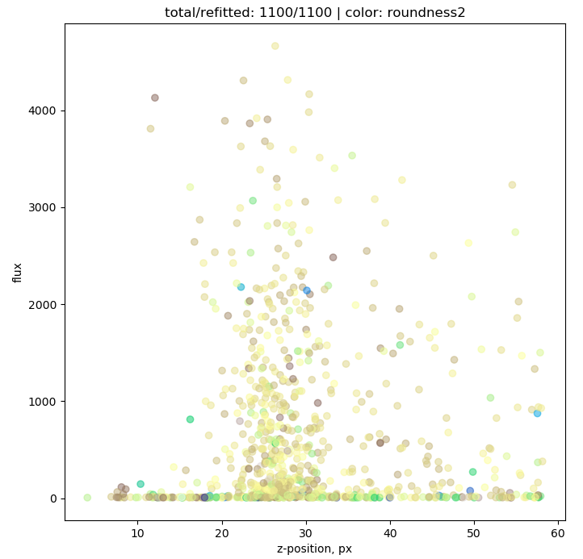


#### 4.6 Direct segmentation of sources in 3D

**Operation**

This routine performs a direct 3D gaussian fit of sources, instead of segmenting sources in 2D and then reinterpolating their 3D position.

The function does the following:

1. Reads dictionary of 2D alignments
2. Loads 3D image for cycle <i> and realigns in 2D using the dictionary
3. Pre-processes 3D volume by:
   1. rescales exposures
   2. removes non-uniform background in 3D
   3. readjusts levels to top pixel intensities
4. The pre-processed 3D volume is then used to segment sources in 2D for each plane using DAOfind()
5. Deblends masks for each plane
6. Merges 2D masks into 3D masks
7. Re-labels and reblends 3D masks
8. Calls regionprops() to get properties for each segmented object, including weighted centroids
9. Calls bigfish to perform 3D gaussian fits using the pre-processed 3D image and the centroids of segmented objects
10. Displays results. A typical example is shown below.


**Output Localization Table**

*segmentedObjects_3D_barcode.dat*

ASTROPY Table() with the following headers:

```sh
# - {name: Buid, datatype: string}
# - {name: 'ROI #', datatype: int64}
# - {name: 'CellID #', datatype: int64}
# - {name: 'Barcode #', datatype: int64}
# - {name: id, datatype: int64}
# - {name: zcentroid, datatype: float32}
# - {name: xcentroid, datatype: float32}
# - {name: ycentroid, datatype: float32}
# - {name: sharpness, datatype: float32}
# - {name: roundness1, datatype: float32}
# - {name: roundness2, datatype: float32}
# - {name: npix, datatype: int64}
# - {name: sky, datatype: float32}
# - {name: peak, datatype: float32}
# - {name: flux, datatype: float32}
# - {name: mag, datatype: float32}
1802fd10-ae0e-46a7-8fd7-36b0d48f0e85 1 0 31 0 7.0566196 422.5931 604.47565 0.5555556 6.4423327 0.5555556 140 0.0 0.14779617 0.14779617 2.0758421
cfb668f7-6ead-4ac1-a4a6-88896eca7f04 1 0 31 1 9.506243 1242.8794 216.33797 0.27649653 16.121767 0.27649653 2194 0.0 0.13838167 0.13838167 2.1473036
```


**Invoke**

Parameters to run this script will be read from the ```segmentedObjects``` field of ```infoList.json```.

Use  ```"operation": "3D"``` to activate. To run both 2D and 3D barcode segmentations, then just use: ```"operation": "2D,3D"```.

To run using **image analysis processing**, set ```3Dmethod``` to ```thresholding```. Then make sure to revise parameters starting with ```3D_``` to fine tune detection. 

To run using **stardist-3D**, set ```3Dmethod``` to ```stardist```. Remember to make sure the name of the neural network and its location are correct. The defaults are: 

```sh
"stardist_basename": "/mnt/grey/DATA/users/marcnol/models/StarDist3D/training3Dbarcodes/models",
"stardist_network": "stardist_18032021_single_loci"
```

If you want to exclusively run this function, run *pyHiM* using the ```-C segmentSources3D``` argument. The ```operation``` key has to be set as described above.

```sh
usage: pyHiM.py [-h] [-F ROOTFOLDER] [-C CMD] [--threads THREADS]

optional arguments:
  -h, --help            show this help message and exit
  -F ROOTFOLDER, --rootFolder ROOTFOLDER
                        Folder with images
  -C CMD, --cmd CMD     Comma-separated list of routines to run (order matters!): 
  						makeProjections, appliesRegistrations,
                        alignImages,alignImages3D, segmentMasks,
                        segmentSources3D,refitBarcodes3D,
                        localDriftCorrection,projectBarcodes,buildHiMmatrix
  --threads THREADS     Number of threads to run in parallel mode. If none,
                        then it will run with one thread.
```

**Options**

"segmentedObjects" contain options for all segmentation functions: 2D and 3D.

```
"folder": "segmentedObjects",  *Description:* output folder
"operation": "overwrite",  *Options:* overwrite | skip
"outputFile": "segmentedObjects",
"background_method": "inhomogeneous",  *Options:* **flat** |**inhomogeneous** | **stardist** (AI)
"background_sigma": 3.0,  *Description:* used to remove inhomogenous background
"threshold_over_std": 1.0,  *Description:* threshold used to detect sources
"fwhm": 3.0,  *Description:* source size in pixels
"brightest": 1100,  *Description:* max number of objects segmented per FOV (only for barcodes!)
"intensity_min": 0,  *Description:* min intensity to keep object
"intensity_max": 59,  *Description:* max intensity to keep object
"area_min": 50,  *Description:* min area to keep object
"area_max": 500,  *Description:* max area to keep object
"residual_max": 2.5, *Description:*  maximum difference between axial spot intensity and gaussian fit.
"3Dmethod":"zASTROPY", # options: zASTROPY, zProfile
"sigma_max": 5,*Description:* maximum gaussian fit sigma allowed (axial spot intensity)
"centroidDifference_max": 5,  *Description:* max difference between z centroid position determined by moment and by gaussian fitting       
"3DGaussianfitWindow": 3,*Description:* size of window in xy to extract 3D subVolume, in px. 3 means subvolume will be 7x7.
"3dAP_window": 5, # constructs a YZ image by summing from xPlane-window:xPlane+window
"3dAP_flux_min": 2, # # threshold to keep a source detected in YZ
"3dAP_brightest": 100, # number of sources sought in each YZ plane
"3dAP_distTolerance": 1, # px dist to attribute a source localized in YZ to one localized in XY
"3D_threshold_over_std":5,
"3D_sigma":3,
"3D_boxSize":32,
"3D_filter_size":3,
"3D_area_min":10,
"3D_area_max":250,
"3D_nlevels":64,
"3D_contrast":0.001,
"3D_psf_z":500,
"3D_psf_yx":200,
"3D_lower_threshold":0.99,
"3D_higher_threshold":0.9999,
"stardist_basename": "/mnt/grey/DATA/users/marcnol/models/StarDist3D/training3Dbarcodes/models",
"stardist_network": "stardist_18032021_single_loci"

```


**AI networks** 

See networks for barcode 3D segmentation [here](./AI_networks.md).


**Examples**

**Graphical outputs**

Typical example of XY-XZ-YZ projections. Localizations: weighted centroids (green); 3D gaussian fits (red).


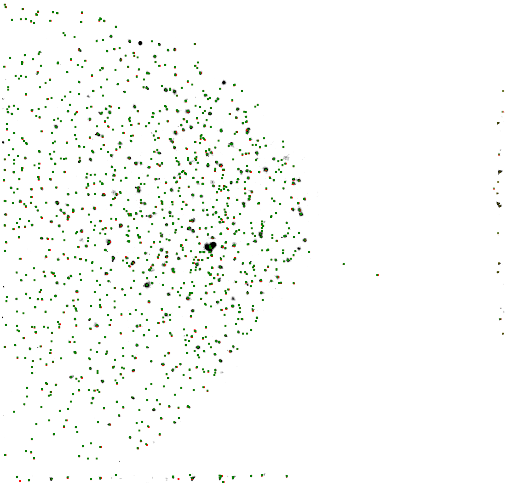


**Zoom in of previous image in XY**.  Localizations: weighted centroids (green); 3D gaussian fits (red).

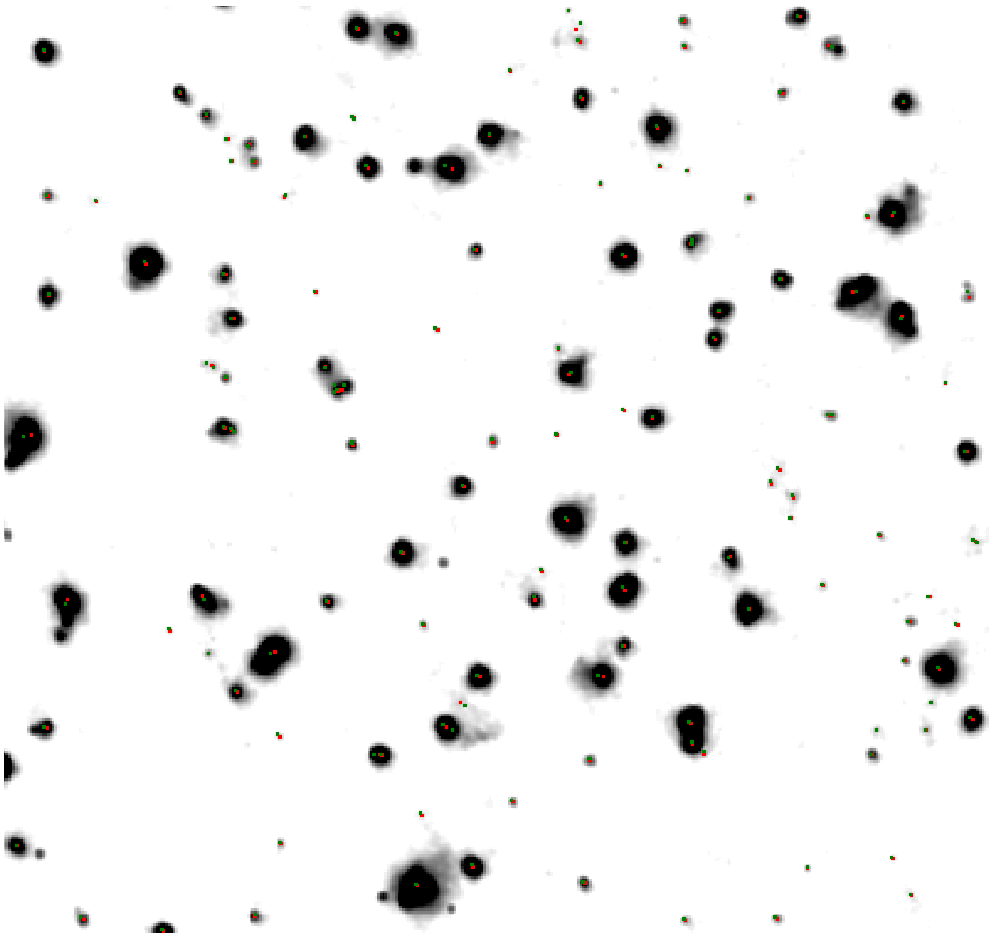


**Zoom in of previous image in ZX**.  Localizations: weighted centroids (green); 3D gaussian fits (red).

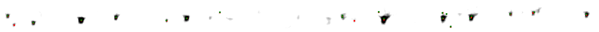


Even more magnified:

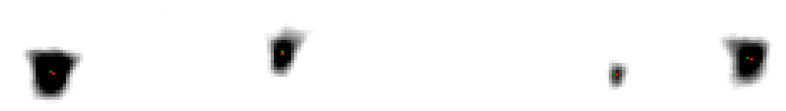


Typical XY projection of the central plane with weighted centroids color coded by **flux** (jet colormap). 

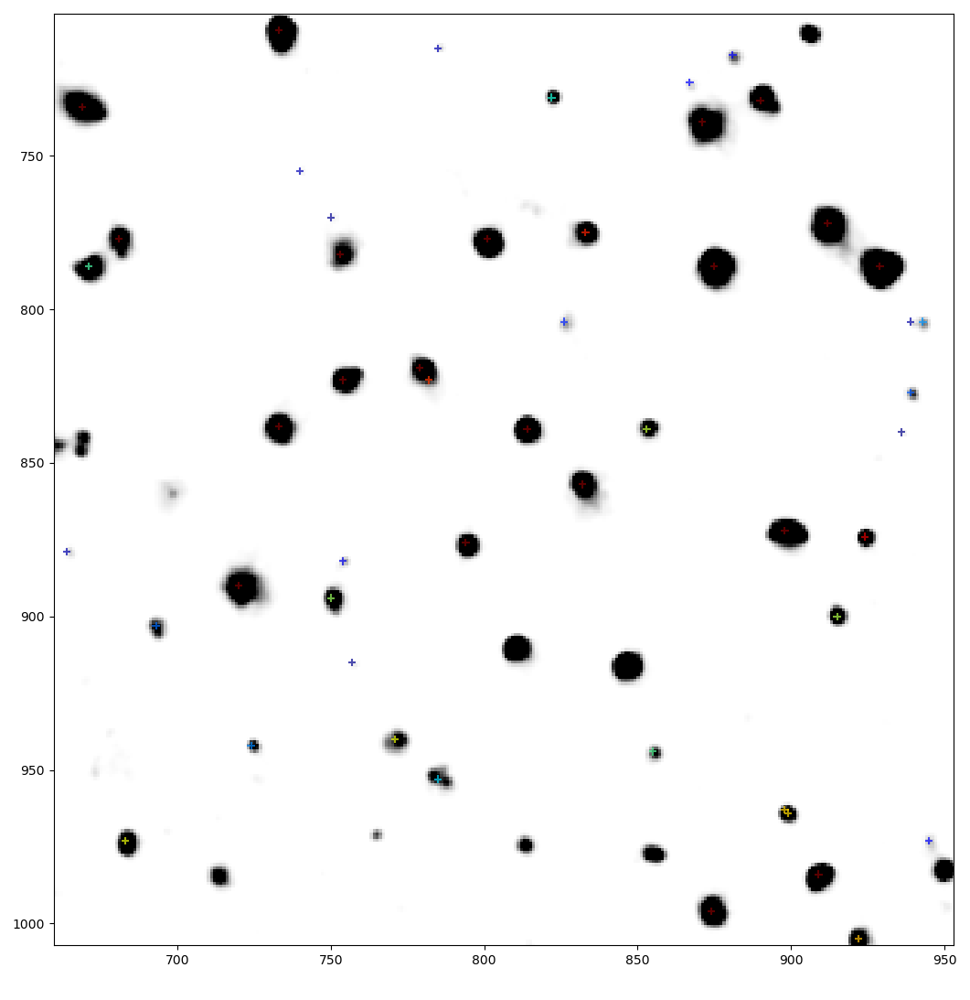

**Examples using stardist-3D**

Segmentations

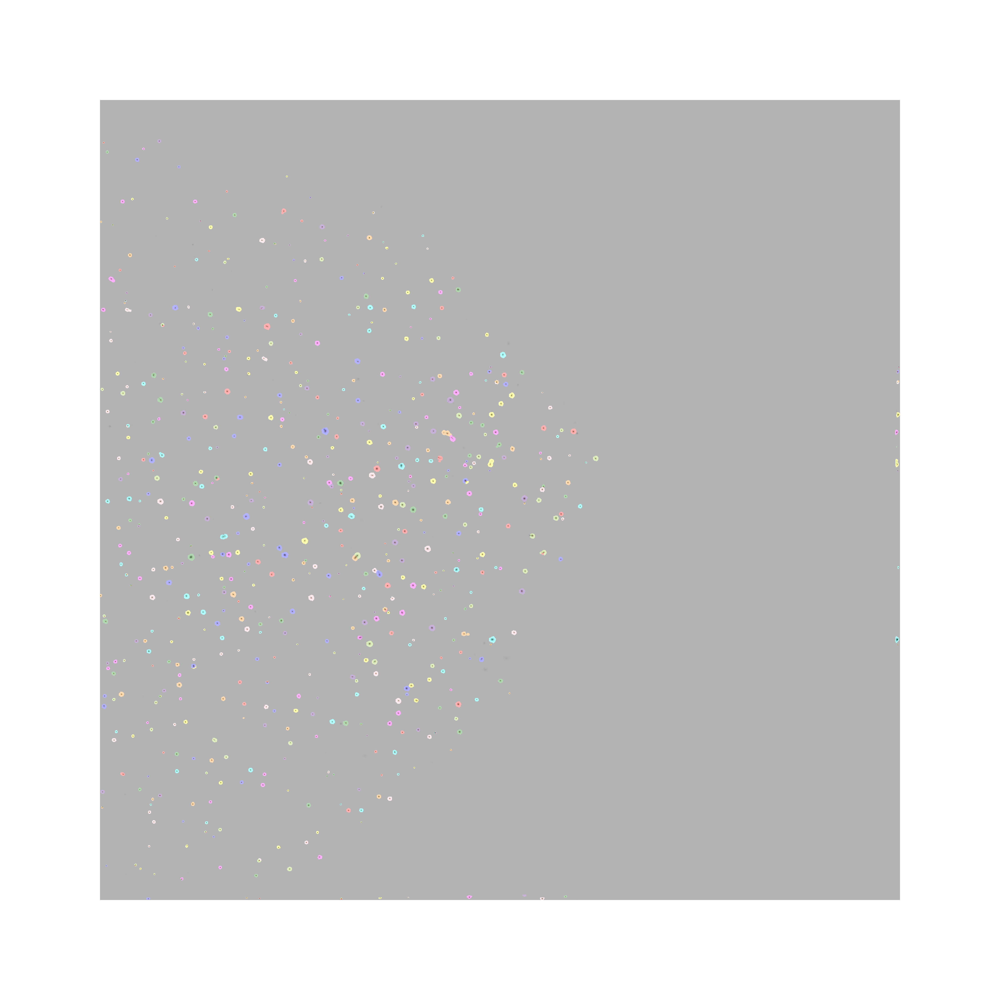

zoom: xy

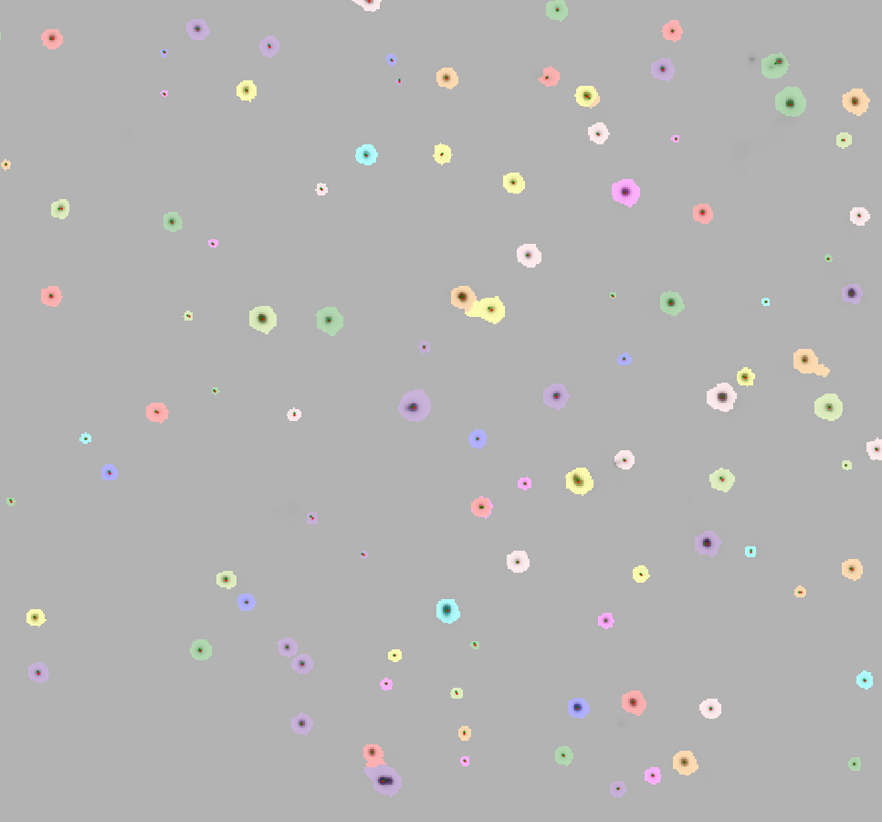

zoom: zx


**Final matrix**

| image analysis 3D                                            | stardist 3D                                                  |
| ------------------------------------------------------------ | ------------------------------------------------------------ |
| 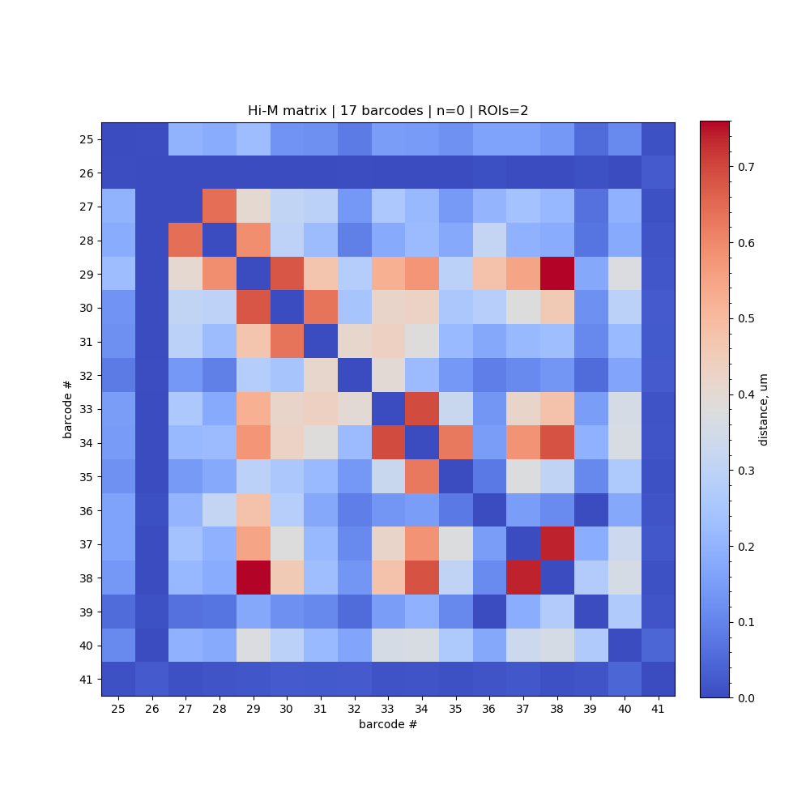 | 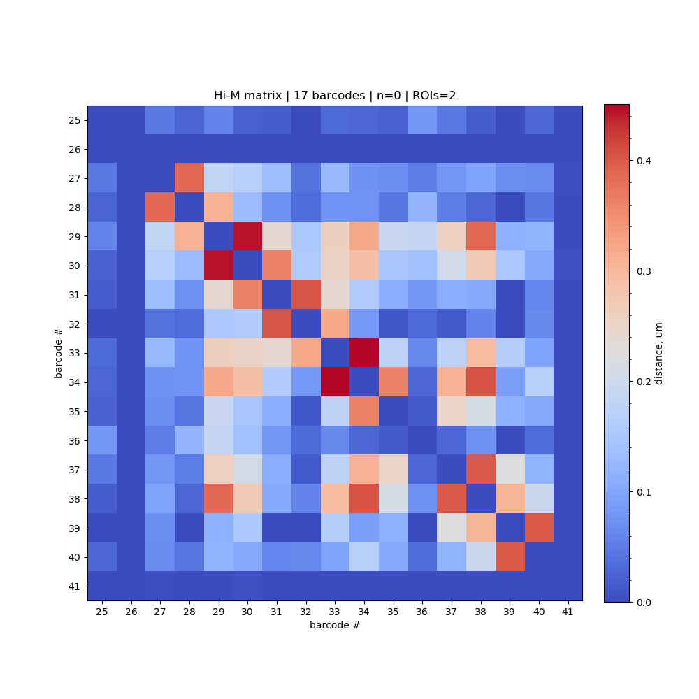 |


#### 5. Building chromatin traces

##### 5.1 Build traces: new method

The new method requires executing several modules:

- `filter_localizations`
- `register_localizations`
- `build_traces`
- `build_matrices`


###### 5.1.1 `filter_localizations`


**Invoke**

To run this function exclusively, run *pyHiM* using the ```-C filter_localizations``` argument. This function will find and process all the localization files in the `segmentedObjects` folder. To avoid overwriting data, existing files will be renamed with the extension `_version_n` where `n`will be incremented from run to run. The output of `filter_localizations` will be saved with the original localizations filename. A comment in the header will be added to indicate that a *filtering* operation was run on this file.


**Relevant options**

Parameters to run this script will be read from the ```buildsPWDmatrix``` field of ```infoList.json```.

```
"flux_min": 10, # maximum flux allowed for 2D
"flux_min_3D": 4000,# maximum flux allowed for 3D
```


**Output images**

- `_filtered_barcode_localizations_ROI*.png`


###### 5.1.2 `register_localizations`


**Invoke**

To run this function exclusively, run *pyHiM* using the ```-C register_localizations``` argument. This function will find and process all the localization files in the `segmentedObjects` folder. To avoid overwriting data, existing files will be renamed with the extension `_version_n` where `n`will be incremented from run to run. The output of `register_localizations` will be saved with the original localizations filename. A comment in the header will be added to indicate that a *registration* operation was run on this file. `register_localizations` **will not be run on files that were previously registered.**


**Relevant options**

Parameters to run this script will be read from the ```buildsPWDmatrix``` field of ```infoList.json```.

```
"toleranceDrift": 1 # tolerance drift in pixels. Above this value localizations will not be locally registered
```


outputs images:

- `_registered_barcode_stats.png`
- `_registered_barcode_localizations_ROI*.png`

| statistics of registration                                   | localization map                                             |
| ------------------------------------------------------------ | ------------------------------------------------------------ |
|  |  |
|  |  |


###### 5.1.3 `build_traces`


**Invoke**

To run this function exclusively, run *pyHiM* using the ```-C build_traces``` argument. This function will find and process all the localization files in the `segmentedObjects` folder. The output of `register_localizations` will be saved in the `buildsPWDmatrix` folder with the name starting with `Trace_`. The reminder of the name will contain the kind of operation run (mask/KDtree) the identity of the mask (e.g. mask0, DAPI), and whether localizations used were from a *2D* or a *3D* analysis. 


**Relevant options**

Parameters to run this script will be read from the ```buildsPWDmatrix``` field of ```infoList.json```.

```
"tracing_method": ["masking","clustering"], # list of methods it will use
"mask_expansion": 8,# number of pixels masks will be expanded to assign localizations
"masks2process":{"nuclei":"DAPI","mask1":"mask0"}, # masks identities to process
"KDtree_distance_threshold_mum": 1,# threshold distance used for KDtree clustering
```


Output images:

- `_XYZ_ROI*.png`

|  | full image | zoomed images |
| --- |   ---- | --- |
| 3D **mask** | 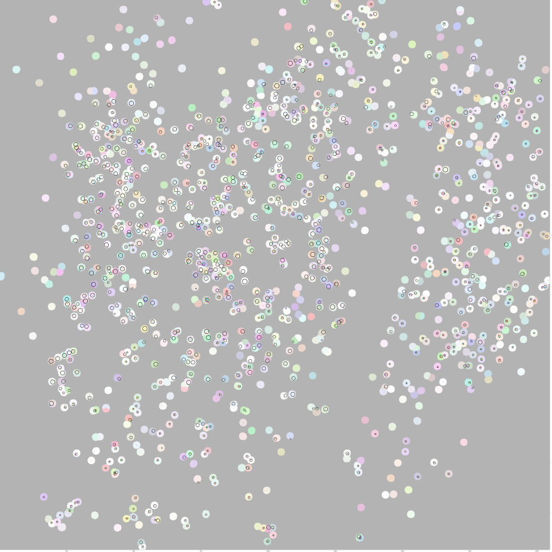 ||
| 3D **mask** |  ||
| 3D **KDtree** |  ||


###### 5.1.4 `build_matrices`


**Invoke**

To run this function exclusively, run *pyHiM* using the ```-C build_matrix``` argument. This function will find and process all the `Trace_` files in the `buildsPWDmatrix` folder. The outputs of `build_matrix` will be saved in the `buildsPWDmatrix` folder. Output files will be created with the root filename of `Trace_`files. They will contain Numpy arrays with single cell PWD matrices  (`_PWDscMatrix.npy`) and N-matrices (`_Nmatrix.npy`), and an `.ecsv` list of barcode names (`_unique_barcodes.ecsv`).


**Relevant options**

Parameters to run this script will be read from the ```buildsPWDmatrix``` field of ```infoList.json```.

```
"colormaps":{"PWD_KDE":"terrain","PWD_median":"terrain","contact":"coolwarm","Nmatrix":"Blues"},    
```


Output images:

- `_PWDhistograms.png`
- `_Nmatrix.png`
- `HiMmatrix.png`
- `_PWDmatrixMedian.png`
- `_PWDmatrixKDE.png`

*example uses fiducial mask*

| method    | contact matrices                                             | **PWD matrix**                                               |
| --------- | ------------------------------------------------------------ | ------------------------------------------------------------ |
| 2D - mask |  |  |
| 3D - mask |  |  |
| KDtree 3D |  |  |
| Nmatrices | Masking | KDTREE |


##### 5.2 build traces: old method

The old module `buildPWDmatrix `  does all operations at once: filtering, local registration, tracing by masking, and construction of PWD matrix.

**Operation**

The ```processesPWDmatrices``` script:

- iterates over ROIs
  - assigns barcode localizations to DAPI masks
  - applies local drift correction, if available
  - removes localizations using flux and driftTolerance
  - calculates the pair-wise distances for each single-cell mask
  - outputs are:
    - Table with #cell #PWD #coordinates (e.g. ```buildsPWDmatrix_3D_order:0_ROI:1.ecsv```)
    - NPY array with single cell PWD single cell matrices (e.g. ```buildsPWDmatrix_3D_HiMscMatrix.npy```)
    - NPY array with barcode identities (e.g. ```buildsPWDmatrix_3D_uniqueBarcodes.ecsv```)
    - the files with no ```3D``` tag contain data analyzed using 2D localizations.
- Single-cell results are combined together to calculate:
     - Distribution of pairwise distance for each barcode combination
     - Ensemble mean pairwise distance matrix using mean of distribution
     - Ensemble mean pairwise distance matrix using Kernel density estimation
     - Ensemble Hi-M matrix using a predefined threshold
          - For each of these files, there is an image in ```PNG``` format saved. Images containing ```3D``` are for 3D other are for 2D.


**Invoke**

Parameters to run this script will be read from the ```buildsPWDmatrix``` field of ```infoList.json```.

If you want to run this function exclusively, run *pyHiM* using the ```-C buildHiMmatrix``` argument.

```sh
usage: pyHiM.py [-h] [-F ROOTFOLDER] [-C CMD] [--threads THREADS]

optional arguments:
  -h, --help            show this help message and exit
  -F ROOTFOLDER, --rootFolder ROOTFOLDER
                        Folder with images
  -C CMD, --cmd CMD     Comma-separated list of routines to run (order matters!): 
  						makeProjections, appliesRegistrations,
                        alignImages,alignImages3D, segmentMasks,
                        segmentSources3D,refitBarcodes3D,
                        localDriftCorrection,projectBarcodes,buildHiMmatrix
  --threads THREADS     Number of threads to run in parallel mode. If none,
                        then it will run with one thread.
```


**Options**

"buildsPWDmatrix"

```
"folder": "buildsPWDmatrix",  # output folder
"flux_min": 1000, *Description:* minimum flux per spot. If flux is smaller, localization will be discarded
"flux_min_3D": 0.1, *Description:* minimum flux per spot for 3D localizations. If flux is smaller, localization will be discarded
"toleranceDrift":1, *Description*: tolerance used for block drift correction, in px
```


**Outputs**

Mean pairwise distance matrix. By default means are calculated using Kernel Density Estimators of the PWD distributions.

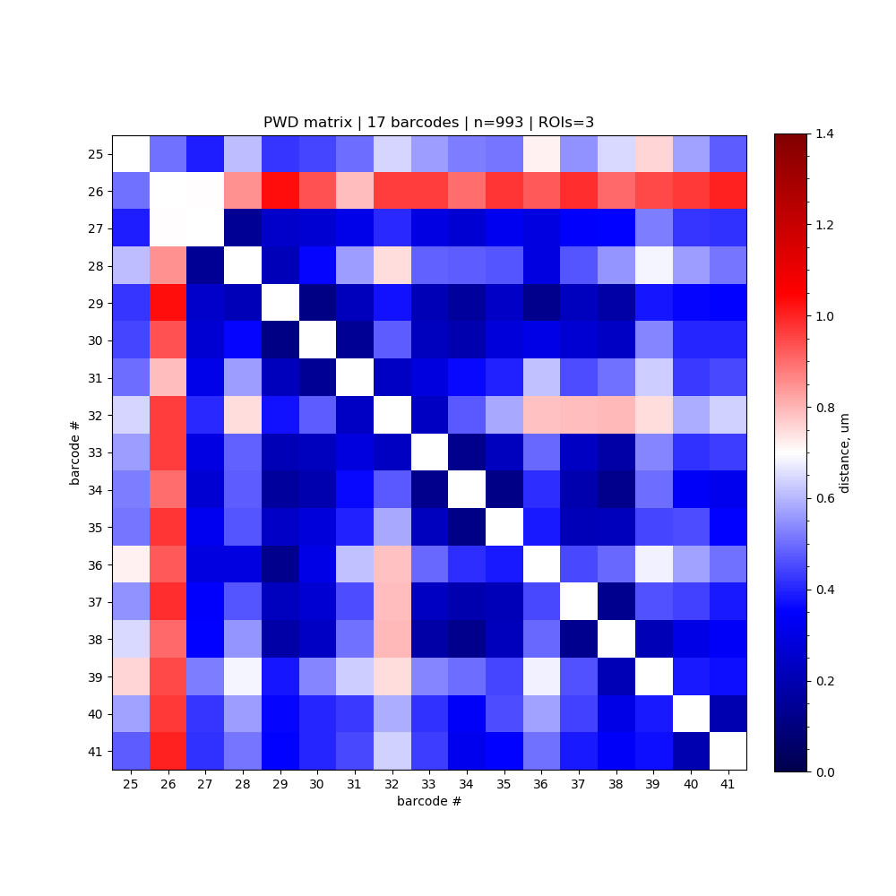

In addition, the function outputs the distribution of distances for each combination of barcodes:

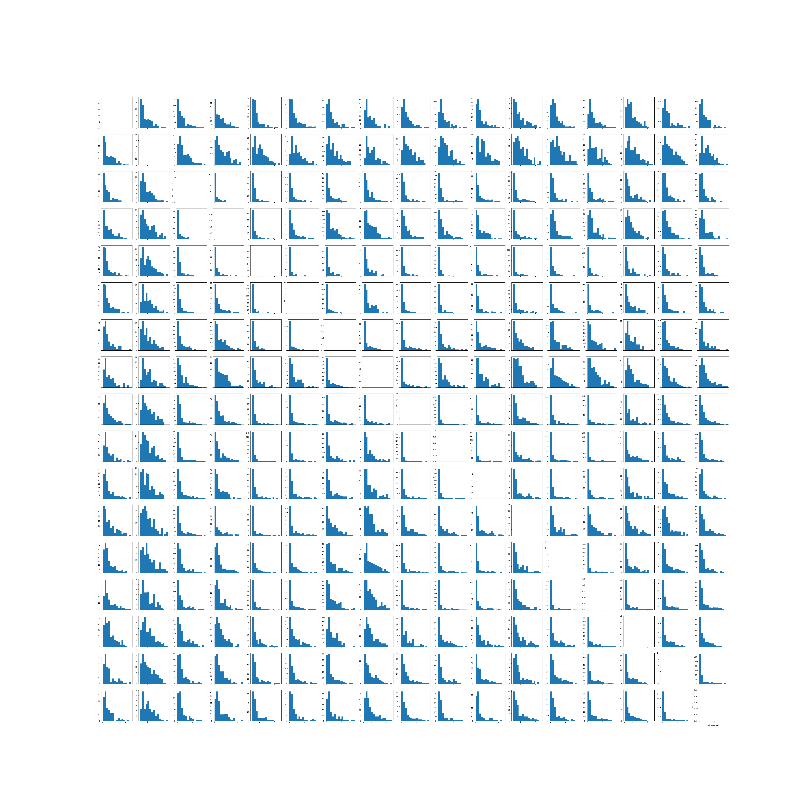


##### Filtering barcode localizations

There are several filters:
1. Properties of 2D localization algorithm (e.g. brightness)

2. Accuracy of 3D localization: sigma of fit, correlation between z-position from weighted moment and from gaussian fit, etc

3. Accuracy of drift correction in the region where the barcode was localized. 

   This is only applied if LocalDrift correction was **not** run. 

   

*Examples.*

| Filtering | Matrix |
| --- |  ---- |
| Unfiltered matrix. Total barcode localizations: 18700 | 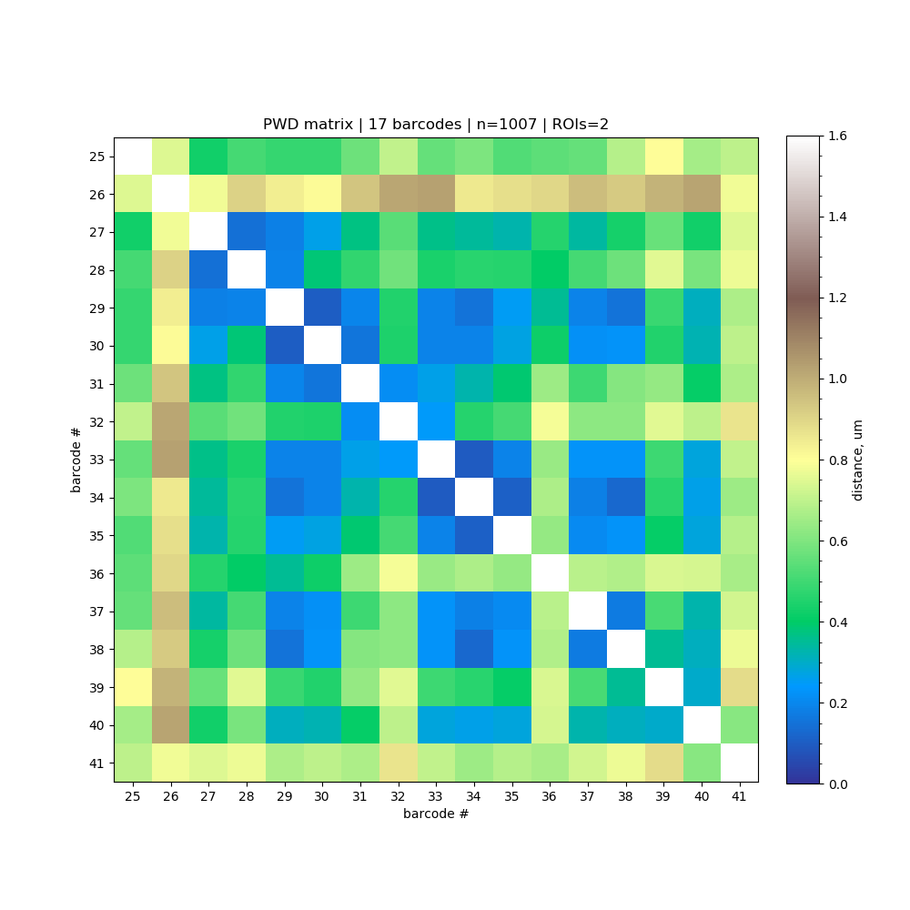 |
|```toleranceDrift = 1px```. Barcode localizations kept: 12377 of a total: 18700.| 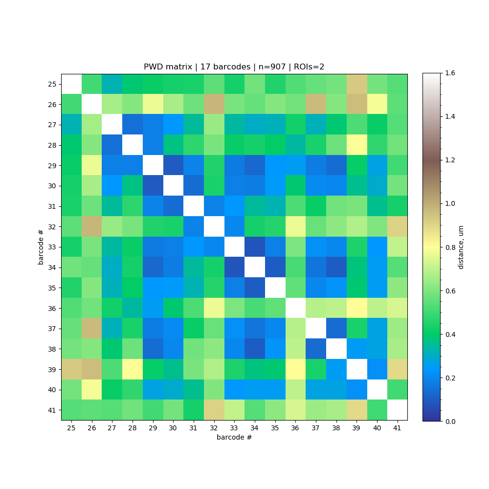|
| ```toleranceDrift = 1px```  ```Flux = 100```. Barcode localizations kept: 5562 of a total: 18700. | 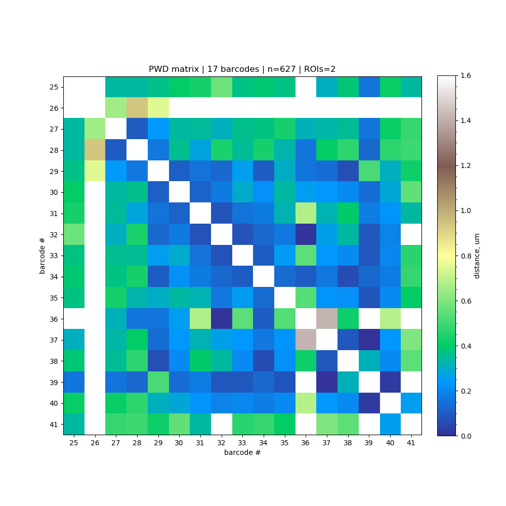 |
|```toleranceDrift = 1px```  ```Flux = 200```. Barcode localizations kept: 4528 of a total: 18700. | 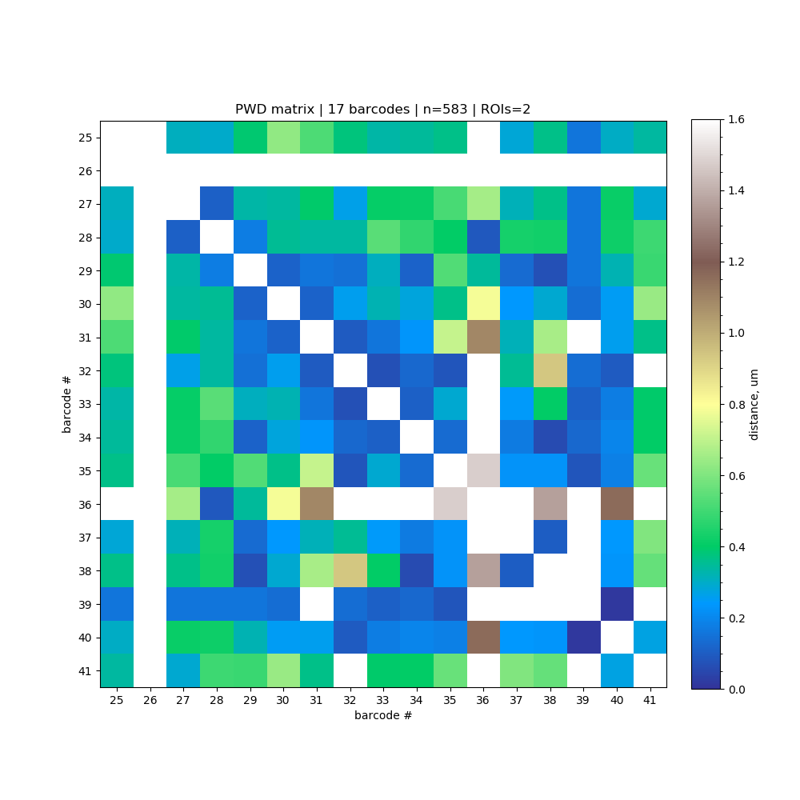|
|```toleranceDrift = 1px``` ```Flux = 1000```. Barcode localizations kept: 1923 of a total: 18700.| 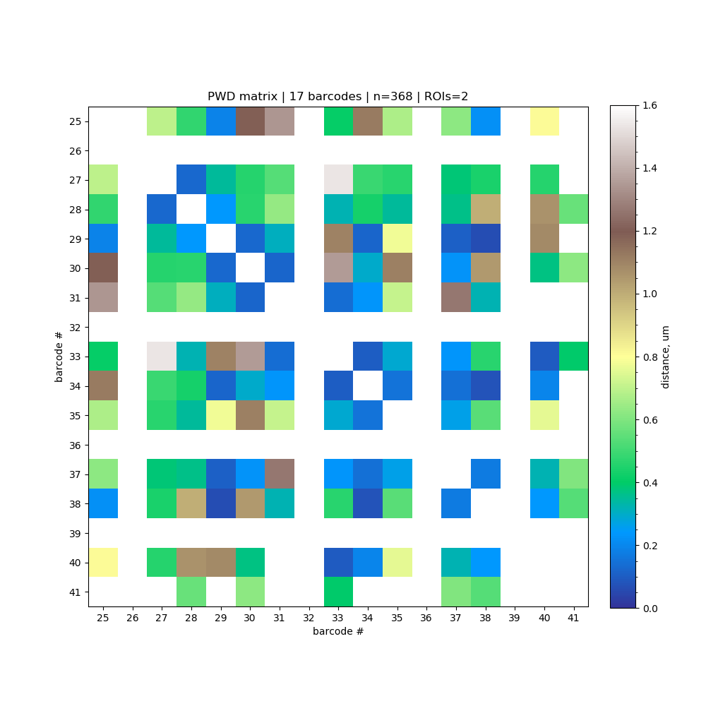|


##### Other outputs

In addition to the PWD matrix, we now also have a map of the alignment accuracy  and scatter plots showing the flux of each barcode, its sharpness, magnitude and roundness. These are used in order to validate the segmentation process and help with the selection of the ```flux``` threshold used in this filtering step.

*Alignment accuracy*

This provides a map of all barcode localizations in an ROI, colorcoded by the accuracy of localization. Colorbar scale is in pixels.

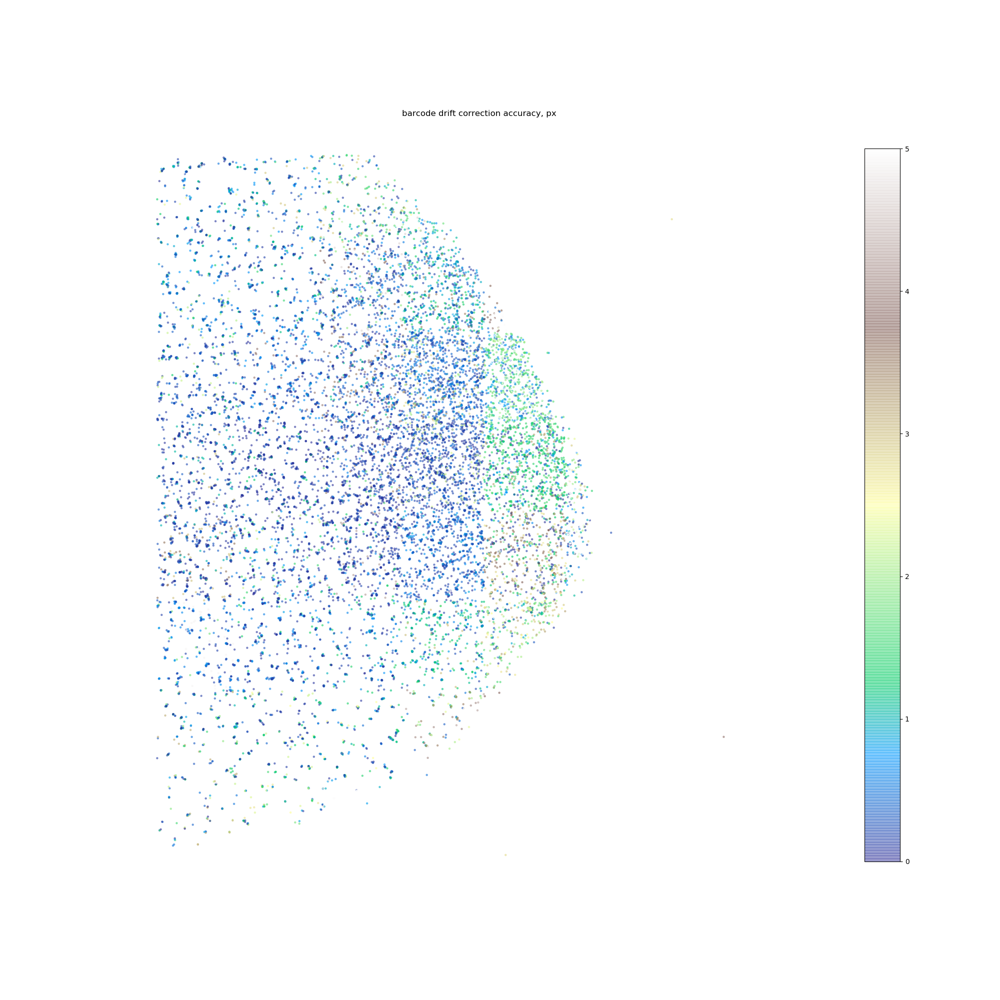

*Barcode localization statistics*

This provides the localization statistics from ASTROPY. The main use of these plots is to determine if the threshold ```flux``` used is correct. Default is *200*.

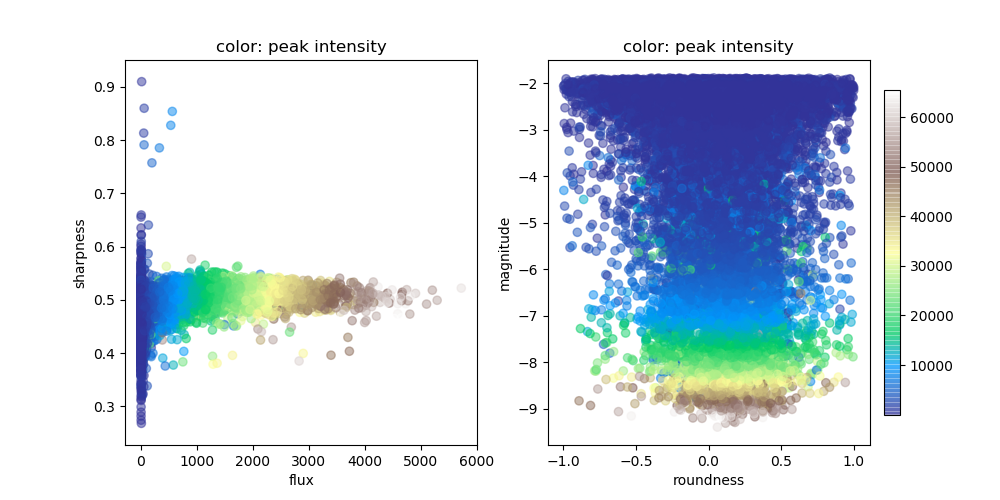

### 6. Projects barcodes


**Options**

"projectsBarcodes"

```
"folder": "projectsBarcodes",  *Description:* output folder
"operation": "overwrite",  *Options:* overwrite | skip
"outputFile": "projectsBarcodes",
```


### 7. Process second channel (i.e RNA, segments, etc)

```pyHiM.py``` will project all TIFFS, and align them together using the fiducial. This will include the second channel of DAPI containing RNA intensities. Now, we need to mask these files so that we can tell which cell was expressing or not a specific RNA. For this, you will run ```processSNDchannel.py```

- Go to the ```destination_directory``` and run  ```processSNDchannel.py --addMask sna``` for manually segmenting all the ROIs in the destination_directory and label them with the ```sna``` tag. This will produce a numpy array in the `segmentedObjects` folder containing the mask.
- You can repeat this process as many times as you want using different tags. For instance, if you also want to label ```doc``` then you can run   ```processSNDchannel.py --addMask doc```. This second command will not overwrite what you did with the first command but rather accumulate different tags.
- After you run this command for all the tags you want to identify, you now need to assign these tags to the cells that were previously identified during the run of ```pyHiM.py```.
- For this, just run ```processSNDchannel.py``` on the command line without any argument. This last execution will produce the `ecsv` table (see below) that you need to run `processHiMmatrix`.

#### Folder

If you don't want run ```processSNDchannel.py``` in the current directory, just choose another folder by using the ```--rootFolder``` argument.

#### erasing segmentations

If you want to start all over again and erase all manual segmentations, run with the ```--cleanAllMasks``` argument.

#### output

The output of ```processSNDchannel.py``` will be stored in ```./segmentedObjects/SNDassignedCells.ecsv``` Astrpy Table. Example:

```bash
# %ECSV 0.9
# ---
# datatype:
# - {name: 'ROI #', datatype: int64}
# - {name: 'CellID #', datatype: int64}
# - {name: 'MaskID #', datatype: string}
# schema: astropy-2.0
"ROI #" "CellID #" "MaskID #"
1 0 sna
1 12 sna
1 13 sna
1 14 sna
1 15 sna
1 16 sna
1 18 sna
1 20 sna
1 21 sna
...
```

where the first column contains the ROI number, the second the number of the cell mask, the third the tag assigned.

This file can then be loaded within ```replotHiMmatrix.py``` to identify which cells of the matrix have which tag. More on this will be added to the section below LATER.


### 8.1 Analysis of several samples at once

You can now use a new script to call several samples in one go:

```python
#!/usr/bin/env python3
# -*- coding: utf-8 -*-
import os
import sys
import argparse

nArgs=len(sys.argv)
print("Total arguments passed: {}".format(nArgs))
EmbryoTag='Embryo_'
if nArgs > 2:
    rootDir=sys.argv[1]
    print("parameters> rootFolder: {}".format(rootDir))

    for i in range(2,nArgs):
        print("Processing Embryo #{}".format(sys.argv[i]))
        command2Run1='nice -19 pyHiM.py -F '+rootDir+EmbryoTag+sys.argv[i]
        os.system(command2Run1)
        command2Run2='zipHuMrun.py -F '+rootDir+EmbryoTag+str(i)
        os.system(command2Run2)
        print('Commands: {}\n{}'.format(command2Run1,command2Run2))
else:
    print('not enough arguments.')
```


To run just do:

```bash
pyHiM.py -F rootFolder 0 1 33
```

to run Emrbyo_0, Embryo_1 and Embryo_33 from rootFolder


***I will change this in the future to replace it by either Dask or snakeMake...***


### 8.2 Parallel Computations

Several routines are now fitted with the possibility of performing parallel computations using the Dask package.

The use of parallel computations can be invoked using the ```--threads``` argument in the command line or for any individual functions (e.g. ```runMakeProjections```) or for ```pyHiM.py```. You need to provide the number of threads that you want to use. If the argument is not called, the program will run using a single processor and will not invoke dask. If you call the routine with ```--threads n```, dask will be invoked and ```n``` threads will be requested (note: ```n``` can be 1).

The gain is roughly 2-5 fold currently, but it can be up to 10 fold for some functions.

To monitor parralel computations, SSH into the cluster using

```sh
ssh -L 8787:localhost:8787 marcnol@lopevi
```

Go to your browser and open ```http://localhost:8787``` to see the progress.

To redirect the port to another port on your local machine (e.g. 8789), connect using:

```sh
ssh -L 8789:localhost:8787 marcnol@lopevi
```


### 9. zipping and erasing run

#### zip and retrieve results

Other utilities have been written to retrieve data from a run to a remote server. For this, go to the directory with the data an run ```zipHiM_run.py```. This will archive all the png, ecsv, and dat files with the results in addition to the MD file with the output of the run. The name of the archive will be HiMrun.tar.gz.

#### clean run

If you want to erase a run, for instance to make sure you can run it again without any leftover, you can run ```cleanHiM_run.py` in the directory with the data.

#### Link folder

If you want to link many files in a folder without having to copy very large  files (e.g. TIFF) then you can run  ```lndir```.

This script  links of files in a directory to a second directory. it selects the files in the first folder by following rules provided by the user where wildcards are possible.

For instance, In the command line, 

```sh
$ lndir.py "/home/marcnol/Repositories/pyHiM/*py" ~/Downloads/test
```
to **link** all files with extension ```py``` from ```/home/marcnol/Repositories/pyHiM/``` to ```~/Downloads/test```.

Make sure that the first argument has quotation marks if you use wildcards!


## 2- Combining results from different experiments

Once you run a bunch of datasets, you will want to combine the PWD matrices together. For this:

1. Retrieve the matrices and barcodes files by scp:

```bash
scp rata@lopevi:/mnt/tronador/Sergio/RAMM_experiments/Experiment_3/deconvolved_DAPI/Embryo_000/buildsPWDmatrix/*ecsv /home/marcnol/data/Experiment_3/000_Embryo/buildsPWDmatrix/

scp rata@lopevi:/mnt/tronador/Sergio/RAMM_experiments/Experiment_3/deconvolved_DAPI/Embryo_000/buildsPWDmatrix/*npy /home/marcnol/data/Experiment_3/000_Embryo/buildsPWDmatrix/
```


**Input arguments**

```sh
usage: processHiMmatrix.py [-h] [-F ROOTFOLDER] [-P PARAMETERS] [-A LABEL]
                           [-W ACTION] [--matlab] [--saveMatrix]
                           [--getStructure] [--pixelSize PIXELSIZE]
                           [--HiMnormalization HIMNORMALIZATION] [--d3]

optional arguments:
  -h, --help            show this help message and exit
  -F ROOTFOLDER, --rootFolder ROOTFOLDER
                        Folder with images
  -P PARAMETERS, --parameters PARAMETERS
                        Provide name of parameter files. folders2Load.json
                        assumed as default
  -A LABEL, --label LABEL
                        Add name of label (e.g. doc)
  -W ACTION, --action ACTION
                        Select: [all], [labeled] or [unlabeled] cells plotted
  --matlab              Use to load matlab formatted data
  --saveMatrix          Use to load matlab formatted data
  --getStructure        Use to save ShEc3D PDB structure
  --pixelSize PIXELSIZE
                        pixelSize in um
  --HiMnormalization HIMNORMALIZATION
                        Normalization of contact matrix: nonNANs (default) or
                        nCells
  --d3                  Use to load 3D maps
```


**Collecting data from several experiments**

Now, you can run ```processHiMmatrix.py``` locally. You should setup your files in a directory. For instance the directory ```/mnt/disk2/marcnol/data/Experiment_19``` contains three folders:

```bash
006_Embryo  009_Embryo  026_Embryo
```

containing each of the analysis from different embryos of the same experiment. Now, in this directory, you should create a file called ```folders2Load.json``` with the following:

```python
{
    "wt_docTAD": {
        "Folders": [
            "/mnt/disk2/marcnol/data/Experiment_19/026_Embryo/buildsPWDmatrix",
            "/mnt/disk2/marcnol/data/Experiment_19/009_Embryo/buildsPWDmatrix",
            "/mnt/disk2/marcnol/data/Experiment_19/006_Embryo/buildsPWDmatrix"
        ],
        "PWD_clim": 1.4,
        "PWD_mode": "median",
        "PWD_cm": "terrain",
        "iPWD_clim": 6,
        "iPWD_mode": "median",
        "iPWD_cm": "terrain",
        "ContactProbability_scale": 12,
        "ContactProbability_cmin": 0.0,
        "ContactProbability_distanceThreshold": 0.35,
		"ContactProbability_cm": "coolwarm",
		"BarcodeColormap": [4, 4, 4, 4, 8, 4, 3, 4, 4, 8, 3, 4, 4, 8, 4, 8, 3],
		"3wayContacts_anchors": [7, 11, 17, 5, 10, 14]
    }
}
```

```

This file contains the directories with the data to be analyzed and some parameters for the analysis (more on this later).

Go to the root folder (```/mnt/disk2/marcnol/data/Experiment_19```) and run

​```bash
 processHiMmatrix.py
```

If you use a parameter file with another name (e.g. ```myparameters.json```) then run:

```bash
 processHiMmatrix.py --parameters myparameters.json
```

This will produce an MD file (e.g. ```processHiMmatrixAnalysis__wt_docTAD_27052020_140943.md```) with the following output:

- PWD matrix for each dataset
- Inverse distance matrices for each dataset
- Contact probability matrices for each dataset
- Combined contact probability matrix

This last matrix will be outputed in the ```scHiMmatrices``` directory as two files. Examples:

- ```CombinedMatrixwt_docTAD.dat```: plain text ensemble HiM contact probability matrix (can be opened in MATLAB). Each row in the matrix is separated by a ```\n``` .
-  ```UniqueBarcodeswt_docTAD.dat```: plain text file with the barcodes used.

### Analyzing labeled datasets

If you run ```processSNDchannel.py``` before, you may want now to look at cells with different labels (ON, OFF, etc). For this, you need to run ```processHiMmatrix.py``` with two more parameters:
- ```--label```: indicates the name used when you run processSNDchannel.py with the option ```--addMask```. Typical names: doc, sna.Running
- ```--action```: three options are available:
  - ```all```: selects all cells for analysis irrespective of whether they are labeled
  - ```labeled``` only runs analysis on labeled cells
  - ```unlabeled```: only runs analysis on unlabeled cells

### options in parameter file

Options:

- ```PWD_clim```: 1.4. Maximum of colormap for PWD matrices.
- ```PWD_mode```: Mode used to calculate value for each mean from many measurements. ```median``` is the median excluding NaNs, ```KDE``` uses kernel density estimator and peaks up the maximum (uses 0.2 as size of kernel as this works for most situations).
- ```iPWD_clim```: 6. Same as for ```PWD_clim.```
- ```iPWD_mode```: Same as for ```PWD_mode```.
- ```ContactProbability_scale```:  normalization factor for the contact probability. Plotted contact probability is calculated as the ratio of the calculated contact probability and ```ContactProbability_scale```.
- ```ContactProbability_cmin```: Minimum of colormap in the the contact probability map.
- ```ContactProbability_distanceThreshold```: distance used for the calculation of the contact probabilities in pixel units.


### Analyzing MATLAB datasets

One can use this same pipeline to analyze data that was segmented using MATLAB routines (i.e merfish_main.m). For this, a few steps need to be taken.

#### Make directory structure

Make a directory structure where you will load your data to be read by processHiMmatrix.py. Follow this example closely:

```bash
.
├── 000_Embryo
│   └── buildsPWDmatrix
│       ├── buildsPWDmatrix_uniqueBarcodes.ecsv
│       └── HiMscMatrix.mat
```

place a MAT file with the name ```HiMscMatrix.mat``` in the ```buildsPWDmatrix``` directory. This file should contain the ```distanceMatrixCumulative``` variable, a 3-D matrix with the format barcode x barcode x nCells. Make sure you remove empty barcode rows by saving ```distanceMatrixCumulative(p.listofRTsusedGenomicallySorted,p.listofRTsusedGenomicallySorted,:)```

Then, you need to have a file called ```buildsPWDmatrix_uniqueBarcodes.ecsv``` with the barcodes in a line separated list, for example:

```bash
3
4
5
6
7
13
23
25
29
37
43
48
60
62
66
67
68
89
90
91
92
```

#### Create folders2Load.json file

Now you create the parameters file. An example follows:

```bash
{
    "wt_Pc_Chr3R": {
        "Folders": [
            "/home/marcnol/data/Experiment_Julian/000_Embryo/buildsPWDmatrix"
        ],
        "PWD_clim": 1.4,
        "PWD_mode": "median",
        "PWD_cm": "terrain",
        "iPWD_clim": 6,
        "iPWD_mode": "median",
        "iPWD_cm": "terrain",
        "ContactProbability_scale": 12,
        "ContactProbability_cmin": 0.0,
        "ContactProbability_distanceThreshold": 0.35,
	"ContactProbability_cm": "coolwarm",
	"BarcodeColormap": [4, 4, 4, 4, 8, 4, 3, 4, 4, 8, 3, 4, 4, 8, 4, 8, 3],
	"3wayContacts_anchors": [7, 11, 17, 5, 10, 14]
    }
}
```

Make sure you edit the name of the dataset (here ```wt_Pc_Chr3R```) and add a folder for each dataset you want to analyze.

#### Run processHiMmatrix.py

You can now run the script. For instance, do

```bash
processHiMmatrix.py  --matlab
```

to run with default options. The important thing is to add the ```--matlab``` flag.

You should be now set.

## 3- Plotting publication-quality figures

The processing with ```processHiMmatrix.py``` produces plots but this routing is primarily concerned with the collection of different datasets, thus it does not have options for customization.

This is performed in a series of ***py*** routines  that plot publication-quality figures with many options.

#### Plotting single HiM matrices

```figureHiMmatrix.py``` will plot a single matrix. It has many options, described when you run it with the --help parameter:

```bash
usage: figureHiMmatrix.py [-h] [-F ROOTFOLDER] [-O OUTPUTFOLDER]
                          [-P PARAMETERS] [-A LABEL] [-W ACTION]
                          [--fontsize FONTSIZE] [--axisLabel] [--axisTicks]
                          [--barcodes] [--scalingParameter SCALINGPARAMETER]
                          [--plottingFileExtension PLOTTINGFILEEXTENSION]

optional arguments:
  -h, --help            show this help message and exit
  -F ROOTFOLDER, --rootFolder ROOTFOLDER
                        Folder with dataset
  -O OUTPUTFOLDER, --outputFolder OUTPUTFOLDER
                        Folder for outputs
  -P PARAMETERS, --parameters PARAMETERS
                        Provide name of parameter files. folders2Load.json
                        assumed as default
  -A LABEL, --label LABEL
                        Add name of label (e.g. doc)
  -W ACTION, --action ACTION
                        Select: [all], [labeled] or [unlabeled] cells plotted
  --fontsize FONTSIZE   Size of fonts to be used in matrix
  --axisLabel           Use if you want a label in x and y
  --axisTicks           Use if you want axes ticks
  --barcodes            Use if you want barcode images to be displayed
  --scalingParameter SCALINGPARAMETER
                        Scaling parameter of colormap
  --plottingFileExtension PLOTTINGFILEEXTENSION
                        By default: svg. Other options: pdf, png
  --shuffle SHUFFLE     Provide shuffle vector: 0,1,2,3... of the same size or
                        smaller than the original matrix. No spaces! comma-
                        separated!    
  --scalogram           Use if you want scalogram image to be displayed

```


Most of these options are self-explanatory. Here is the command to run to get Figure 1F made:

```bash
figureHiMmatrix.py -F "$DATA1" --fontsize 22 --label doc --action labeled --scalingParameter 1 --barcodes --outputFolder "$FIGS"/Figure1  --plottingFileExtension png
```

And here is the output:

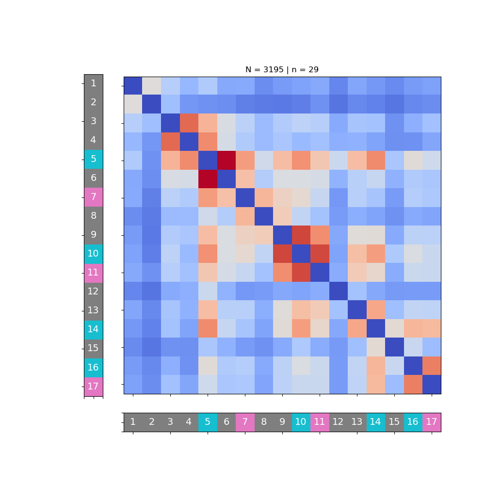

##### Altering order or number of barcodes in displayed matrix

If you want to remove some of the barcodes or change their order, then you need to use the --shuffle option. For this, you need to provide with the order of the new barcodes. For instance if you want to plot only the first 9 barcodes then run:

```bash
figureHiMmatrix.py -F "$DATA1" --fontsize 22 --label doc --action labeled --scalingParameter 1 --barcodes --outputFolder "$FIGS"/Figure1  --plottingFileExtension png --shuffle 0,1,2,3,4,5,6,7,8
```

If you want to change the order, for instance, put the last bin (bin 16) first. The run:

```bash
figureHiMmatrix.py -F "$DATA1" --fontsize 22 --label doc --action labeled --scalingParameter 1 --barcodes --outputFolder "$FIGS"/Figure1  --plottingFileExtension png --shuffle 16,0,1,2,3,4,5,6,7,8,9,10,11,12,13,14,15
```

Be careful with the format of the ```--shuffle``` parameter. It should contain **no spaces**, and the indexes should be **comma-separated integers**. If the number of integers in the vector exceeds the number of dimensions of the matrix, the output plot will appear blue (matrix will contain zeros). If any given index exceeds the matrix dimensions, then it will be ignored but the matrix substitution will be wrong!

##### Scalograms

You can now produce a scalogram from the matrix. For this, use the --scalogram option, which will output a separate output image with the scalogram. As example:


#### Plotting 3-way contact matrices

figure3wayInteractions.py``` will plot 6 3-way contact matrices matrix. The anchors used are those provided in the folders2Load.json file of the analysis. This function has many options, described when you run it with the --help parameter:

```bash
usage: figure3wayInteractions.py [-h] [-F1 ROOTFOLDER1] [-F2 ROOTFOLDER2]
                                 [-O OUTPUTFOLDER] [-P PARAMETERS]
                                 [-A1 LABEL1] [-W1 ACTION1] [-A2 LABEL2]
                                 [-W2 ACTION2] [--fontsize FONTSIZE]
                                 [--scalingParameter SCALINGPARAMETER]
                                 [--colorbar]
                                 [--plottingFileExtension PLOTTINGFILEEXTENSION]

optional arguments:
  -h, --help            show this help message and exit
  -F1 ROOTFOLDER1, --rootFolder1 ROOTFOLDER1
                        Folder with dataset 1
  -F2 ROOTFOLDER2, --rootFolder2 ROOTFOLDER2
                        Folder with dataset 2
  -O OUTPUTFOLDER, --outputFolder OUTPUTFOLDER
                        Folder for outputs
  -P PARAMETERS, --parameters PARAMETERS
                        Provide name of parameter files. folders2Load.json
                        assumed as default
  -A1 LABEL1, --label1 LABEL1
                        Add name of label for dataset 1 (e.g. doc)
  -W1 ACTION1, --action1 ACTION1
                        Select: [all], [labeled] or [unlabeled] cells plotted
                        for dataset 1
  -A2 LABEL2, --label2 LABEL2
                        Add name of label for dataset 1 (e.g. doc)
  -W2 ACTION2, --action2 ACTION2
                        Select: [all], [labeled] or [unlabeled] cells plotted
                        for dataset 1
  --fontsize FONTSIZE   Size of fonts to be used in matrix
  --scalingParameter SCALINGPARAMETER
                        Scaling parameter of colormap
  --colorbar            Use if you want a colorbar
  --plottingFileExtension PLOTTINGFILEEXTENSION
                        By default: svg. Other options: pdf, png

```


Run to produce Figure 1G:

```bash
figure3wayInteractions.py -F1 "$DATA1" --label1 doc --action1 labeled --fontsize 12 --scalingParameter 1.0 --outputFolder "$FIGS"/Figure1  --plottingFileExtension png
```


which produces:

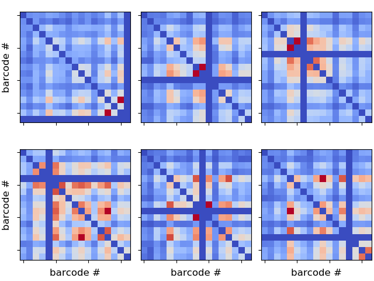


It is possible also to compare the 3-way matrices of two datasets, for this, run:

```bash
figure3wayInteractions.py -F1 "$DATA2" --label1 doc --action1 labeled -F2 "$DATA2" --label2 NE --action2 labeled --fontsize 22 --scalingParameter 1.0  --outputFolder "$FIGS"/Figure2 --plottingFileExtension png
```

to obtain:


The first quadrant (top right) will represent the first dataset.


#### Compare two HiM matrices

```figureCompare2Matrices.py``` will make two panels to compare datasets. One will contain the HiM contact matrices of each datasets in different quadrants. The first dataset will be plotted on top right. The second plot will produce either a difference matrix (default) or the log(ratio) (see --ratio option). The options are described when you run it with the --help parameter:

```bash
usage: figureCompare2Matrices.py [-h] [-F1 ROOTFOLDER1] [-F2 ROOTFOLDER2]
                                 [-O OUTPUTFOLDER] [-P PARAMETERS]
                                 [-A1 LABEL1] [-W1 ACTION1] [-A2 LABEL2]
                                 [-W2 ACTION2] [--fontsize FONTSIZE]
                                 [--axisLabel] [--axisTicks] [--ratio]
                                 [--cAxis CAXIS]
                                 [--plottingFileExtension PLOTTINGFILEEXTENSION]

optional arguments:
  -h, --help            show this help message and exit
  -F1 ROOTFOLDER1, --rootFolder1 ROOTFOLDER1
                        Folder with dataset 1
  -F2 ROOTFOLDER2, --rootFolder2 ROOTFOLDER2
                        Folder with dataset 2
  -O OUTPUTFOLDER, --outputFolder OUTPUTFOLDER
                        Folder for outputs
  -P PARAMETERS, --parameters PARAMETERS
                        Provide name of parameter files. folders2Load.json
                        assumed as default
  -A1 LABEL1, --label1 LABEL1
                        Add name of label for dataset 1 (e.g. doc)
  -W1 ACTION1, --action1 ACTION1
                        Select: [all], [labeled] or [unlabeled] cells plotted
                        for dataset 1
  -A2 LABEL2, --label2 LABEL2
                        Add name of label for dataset 1 (e.g. doc)
  -W2 ACTION2, --action2 ACTION2
                        Select: [all], [labeled] or [unlabeled] cells plotted
                        for dataset 1
  --fontsize FONTSIZE   Size of fonts to be used in matrix
  --axisLabel           Use if you want a label in x and y
  --axisTicks           Use if you want axes ticks
  --ratio               Does ratio between matrices. Default: difference
  --cAxis CAXIS         absolute cAxis value for colormap
  --plottingFileExtension PLOTTINGFILEEXTENSION
                        By default: svg. Other options: pdf, png

```

To produce Figure 2B you run

```bash
figureCompare2Matrices.py -F1 "$DATA2" -F2 "$DATA2" --label1 doc --label2 M --action1 labeled --action2 labeled --cAxis 2 --fontsize 22 --outputFolder "$FIGS"/Figure2 --plottingFileExtension png --ratio
```

and will obtain:


and:


#### Plot 4M profiles

```figure4Mmatrix.py``` will plot 4M profiles using the anchors defined in folders2Load.json parameters file. The options are described when you run it with the --help parameter:

```bash
usage: figure4Mmatrix.py [-h] [-F1 ROOTFOLDER1] [-F2 ROOTFOLDER2]
                         [-O OUTPUTFOLDER] [-P PARAMETERS] [-A1 LABEL1]
                         [-W1 ACTION1] [-A2 LABEL2] [-W2 ACTION2]
                         [--fontsize FONTSIZE] [--axisLabel] [--axisTicks]
                         [--splines] [--cAxis CAXIS]
                         [--plottingFileExtension PLOTTINGFILEEXTENSION]

optional arguments:
  -h, --help            show this help message and exit
  -F1 ROOTFOLDER1, --rootFolder1 ROOTFOLDER1
                        Folder with dataset 1
  -F2 ROOTFOLDER2, --rootFolder2 ROOTFOLDER2
                        Folder with dataset 2
  -O OUTPUTFOLDER, --outputFolder OUTPUTFOLDER
                        Folder for outputs
  -P PARAMETERS, --parameters PARAMETERS
                        Provide name of parameter files. folders2Load.json
                        assumed as default
  -A1 LABEL1, --label1 LABEL1
                        Add name of label for dataset 1 (e.g. doc)
  -W1 ACTION1, --action1 ACTION1
                        Select: [all], [labeled] or [unlabeled] cells plotted
                        for dataset 1
  -A2 LABEL2, --label2 LABEL2
                        Add name of label for dataset 1 (e.g. doc)
  -W2 ACTION2, --action2 ACTION2
                        Select: [all], [labeled] or [unlabeled] cells plotted
                        for dataset 1
  --fontsize FONTSIZE   Size of fonts to be used in matrix
  --axisLabel           Use if you want a label in x and y
  --axisTicks           Use if you want axes ticks
  --splines             Use if you want plot data using spline interpolations
  --cAxis CAXIS         absolute cAxis value for colormap
  --plottingFileExtension PLOTTINGFILEEXTENSION
                        By default: svg. Other options: pdf, png
```


To produce Figure S1H, one would run:

```bash
figure4Mmatrix.py  --rootFolder1 "$DATA1" --label1 doc --action1 all --cAxis 1 --outputFolder "$FIGS"/Figure1  --plottingFileExtension png
```

to obtain:


One can also plot multiple datasets, for example:

```bash
figure4Mmatrix.py --rootFolder1 "$DATA2" --rootFolder2 "$DATA2" --label1 doc --label2 M --action1 labeled --action2 labeled --cAxis 1 --outputFolder "$FIGS"/Figure2 --plottingFileExtension png
```

produces


#### Plotting different matrices together

This function is useful when you want to plot side by side the matrices from different datasets. One typical example is the matrices for different segments of an embryo.

```sh
figureN_HiMmatrices.py

usage: figureN_HiMmatrices.py [-h] [-F ROOTFOLDER] [-O OUTPUTFOLDER]
                              [-P PARAMETERS] [-A LABEL] [-W ACTION]
                              [--fontsize FONTSIZE] [--axisLabel]
                              [--axisTicks] [--barcodes]
                              [--scalingParameter SCALINGPARAMETER]
                              [--plottingFileExtension PLOTTINGFILEEXTENSION]
                              [--shuffle SHUFFLE] [--scalogram] [--type TYPE]
                              [--pixelSize PIXELSIZE] [--cAxis CAXIS]
                              [--ratio] [--normalizeMatrix]

optional arguments:
  -h, --help            show this help message and exit
  -F ROOTFOLDER, --rootFolder ROOTFOLDER
                        Folder with dataset
  -O OUTPUTFOLDER, --outputFolder OUTPUTFOLDER
                        Folder for outputs
  -P PARAMETERS, --parameters PARAMETERS
                        Provide name of parameter files. folders2Load.json
                        assumed as default
  -A LABEL, --label LABEL
                        Add name of label (e.g. doc)
  -W ACTION, --action ACTION
                        Select: [all], [labeled] or [unlabeled] cells plotted
  --fontsize FONTSIZE   Size of fonts to be used in matrix
  --axisLabel           Use if you want a label in x and y
  --axisTicks           Use if you want axes ticks
  --barcodes            Use if you want barcode images to be displayed
  --scalingParameter SCALINGPARAMETER
                        Scaling parameter of colormap
  --plottingFileExtension PLOTTINGFILEEXTENSION
                        By default: svg. Other options: pdf, png
  --shuffle SHUFFLE     Provide shuffle vector: 0,1,2,3... of the same size or
                        smaller than the original matrix. No spaces! comma-
                        separated!
  --scalogram           Use if you want scalogram image to be displayed
  --type TYPE           Provide one of the following: PWD, contact, iPWD
  --pixelSize PIXELSIZE
                        Provide pixelSize in um
  --cAxis CAXIS         absolute cAxis value for colormap
  --ratio               Does ratio between matrices. Default: difference
  --normalizeMatrix     Normalizes matrices by maximum. Default: True

```
The two outputs are:

1. the entire matrices 

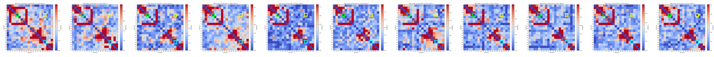


2. A subset of bins, for instance to highlight how a TAD changes (normalized by the first matrix):

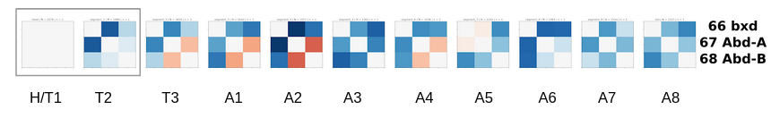

3. A line scan over all the matrices normalized by a segment

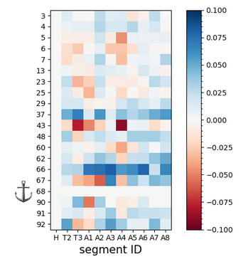


#### Displaying single cells

A thorough description of the work in displaying single cells will be maintained in the following MD file within the */doc* directory of pyHiM:

[Single Cell MD tutorial](SingleCellsAnalysis.md)


