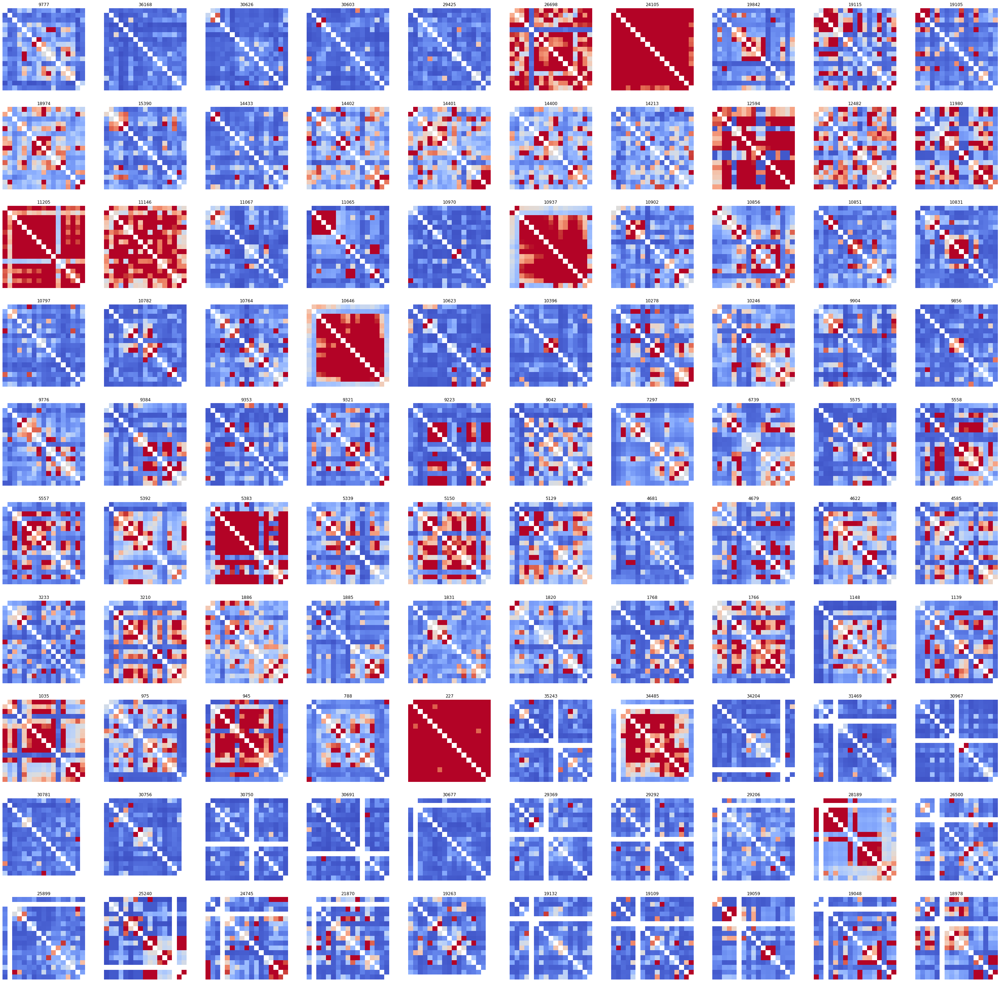
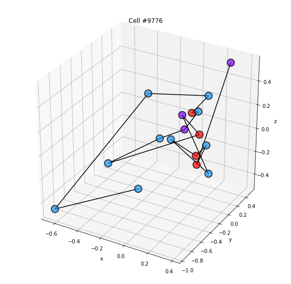
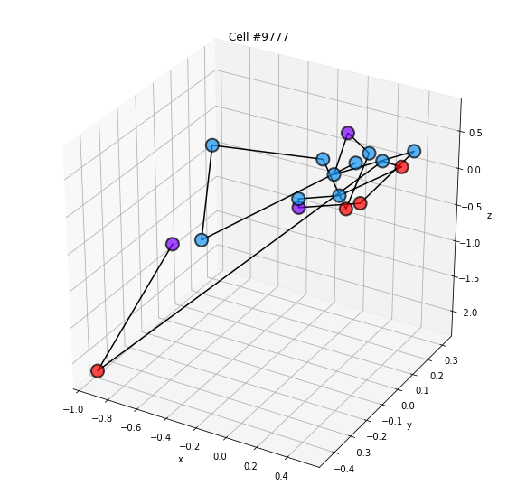
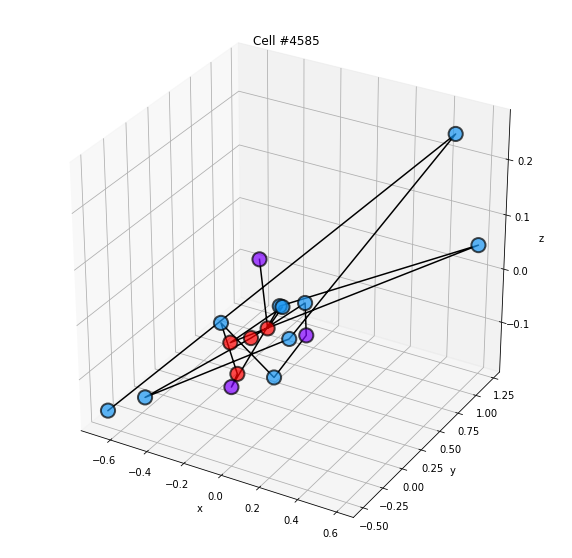
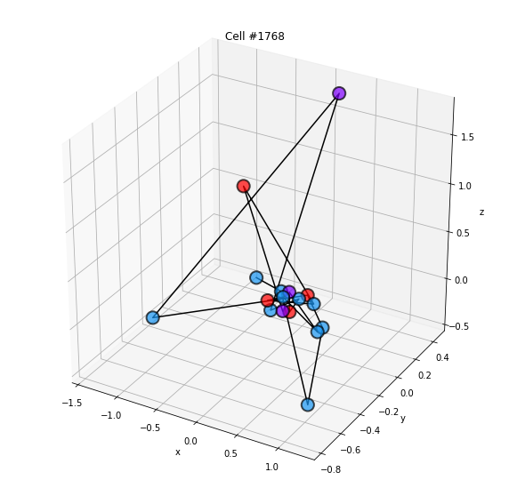
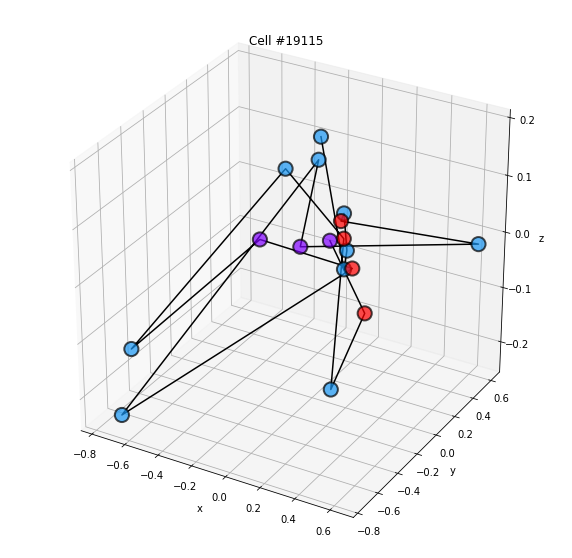
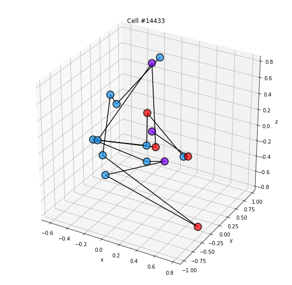
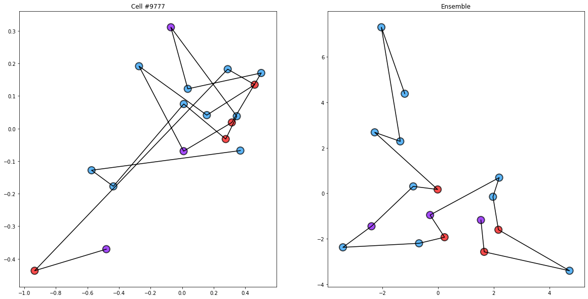
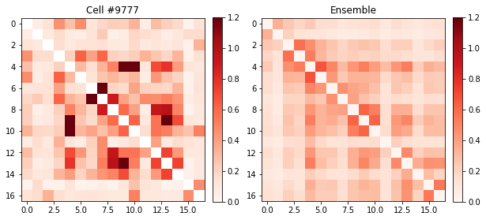

# Single cell display from HiM analysis

One issue with previous implementation of HiM has been that it displays only mean matrices.

No tools have been build to explore and display single cells.

To address this, I started drafting a new script ```FigureSingleCell.py```.


At the moment, the script can display the following

## Subplots with sc PWD matrices

To do this,

- I load the matrix of SC PWD distances using the analysisHiMmatrix class and loading parameters from folders2Load.json

- I count the number of unique PWD in each cell

- sort sc PWD Matrix by increasing number of PWD detected

- Take the top ``Ncells2Process`` cells from the bottom (with highest number of PWD). This is achieved by setting the number of rows in the subplot: 

      nRows=10
      Ncells2Process = nRows**2

- Makes subplots where the inverse of the PWD is displayed. The cell number is displayed on top of each subplot.

Example:




## Single cell structures

For this, I co-opted a routine that Markus has already written in HiMmatrixOperations.py.

```python
def getsCoordinatesFromPWDmatrix(matrix):
    ## multi-dimensional scaling to get coordinates from PWDs
    # make sure meanSCmatrix is symmetric
    matrix = 0.5 * (matrix + np.transpose(matrix))
    # run metric mds
    verbosity = 0  # default: 0, quite verbose: 2
    mds = manifold.MDS(
        n_components=3,
        metric=True,
        n_init=20,
        max_iter=3000,
        verbose=verbosity,
        eps=1e-9,
        n_jobs=1,
        random_state=1,
        dissimilarity="precomputed",  # euclidean | precomputed
    )
    
    XYZ = mds.fit(matrix).embedding_

    return XYZ
```


The script then takes a number of single cell PWD matrices and uses it to restore the XYZ coordinates. These are used then to display the single-cell structures in 3D or in 2D. Examples follow:

| image i | image j |
| ---| ---|
|  |  |
| | |
| ||

In 2D, the images are super-imposed with the structure derived from the ensemble matrix:




## Display single cell PWD matrices

This is done by just showing the inverse of the PWD of a specific cell and that of the ensemble for reference.

