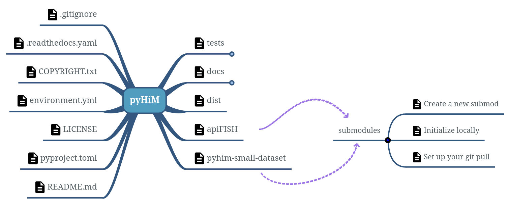

# No-python files

*Find below a description of no-python files and  folders inside pyHiM repository.*



## Left side - Files
* **.gitignore**: Basic text file used by the `Git` versioning tool to identify files that should not be shared.
* **.readthedocs.yaml**: Read the Docs configuration file, used when RTD build online the documentation.
* **COPYRIGHT.txt**: File containing the information of each contributor to this software.
* **environment.yml**: Instructions to create a conda environment
* *LICENSE*: Legal information on the code usage
* **pyproject.toml**: Used for PyPI
* **README.md**: Short description of pyHiM repository.

## Center - Folders
* **tests**: Directory containing files that test the functions in the `src` folder.
* **docs**: Main directory containing the files describing the software and those configuring compilation with the `Sphinx` tool for reading the documentation in the form of HTML web pages.
* **dist** (local file): Generate by `build` to publish on PyPI with `twine`.
    1. Install these 2 tools usefull for pip
    ```bash
    pip install build twine
    ```
    2. Move to the root of your source code and create the files for pip
    ```bash
    python -m build
    ```
    3. Check locally the consistency of files created inside `dist` folder
    ```bash
    twine check dist/*
    ```
    4. Upload your package on `test.pypi`
    ```bash
    twine upload -r testpypi dist/*
    ```
    5. Test installation from `test.pypi`
    ```bash
    python -m pip install -i https://test.pypi.org/simple <your_package_name>
    ```
    6. If everything seems good, upload on pypi server:
    ```bash
    twine upload dist/*
    ```
    7. To install your package:
    ```bash
    pip install <your_package_name>
    ```

* **apiFISH** (submodule): Use to help developer for the pyHiM function migration inside apiFISH library.
* **pyhim-small-dataset** (submodule): Use to run pyHiM tests because of the github memory size limit (~500Mo).

## Right side - Submodule instructions
### Create a new submodule
1. `git submodule add <HTTPS_or_SSH_repo>`
2. `git commit -m "add submodule <repo_name>`
3. `git push`

### Initialize locally
* `git submodule update --init --recursive`

OR
* `git clone --recurse-submodules <HTTPS/SSH>`

### Set up your git pull
*This command will make automatically `git submodule update --recursive` after your `git pull`.*
* `git config --global submodule.recurse true`

