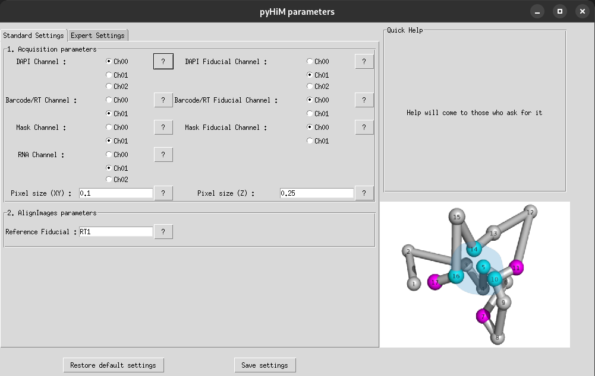

# Configuration file `(infoList.json)`

All configuration parameters for running `pyHiM` are provided in a single configuration file called `infoList.json`. This file is editable [manually](#manually) or with a [graphical user interface](#graphical-user-interface).

You can find a global description of each parameter in the [reference guide](../../reference/infoList_comprehension.md).

## Manually

Copy an `infoList.json` file in the folder where you want to run `pyHiM`. 

```{note}
A file model can be find on [GitHub](https://github.com/marcnol/pyHiM/blob/master/modelParameterFiles_JSON/infoList.json).
```

Modify with a text editor your parameters like the `referenceFiducial` number of your experience. 

The `common` section is to set the default values for each label and you can personalize a different value just for one label by overwiting in the label section.

```{note}
On the example below, the Z projection will be realized by Maximum Intensity Projection (`MIP`) for all labels exept for barcode images, it will be by `sum`:

```json
{
    "common": {
        "zProject": {
            "zProjectOption": "MIP",
            "..."
        },
        "..."
    },
    "labels": {
        "barcode": {
            "order": 2,
            "zProject": {
                "zProjectOption": "sum",
            }
        },
        "..."
    }
}
```

## Graphical user interface


You can also create and modify `infoList.json` with an interface. In the folder where you want to run `pyHiM`, execute this script:
```sh
pyhim_parameters
```

A window will open up, modify your parameters and when you click on `Save settings`, an `infoList.json` file will be created inside your folder with your modified parameters.

If you have modified an existing `infoList.json`, a copy of the previous version will be saved in the file named `infoList_preVersion.json`.

