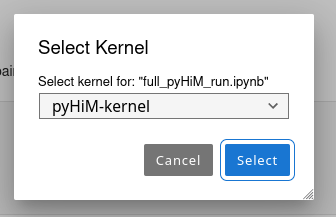

# Tutorial for pyHiM notebook

*A jupyter notebook is an interactive file where you can find both markdown text and executable code with its outputs dispayed.*

To run by yourself the pyHiM tutorial, follow these steps:

1. Activate your [conda environment](../quick_install.md#create-conda-enviroment) for pyHiM
```sh
conda activate <environment_name>
```

2. Install a tool to manage jupyter notebook like [JupyterLab](https://jupyter.org/install#jupyterlab)
```sh
conda install jupyterlab
```

3. We recommend to create a specific kernel to run pyHiM on JupyterLab with the good environment:

```
conda install ipykernel matplotlib
ipython kernel install --user --name=pyHiM-kernel
```

4. Open pyHiM tutorial with JupiterLab (or jupyter notebook):
```sh
jupyter-lab
```

5. Once you spin up a jupyter lab from the `base` environment, select the `pyHiM-kernel` to be able to run *pyHiM* functions.

