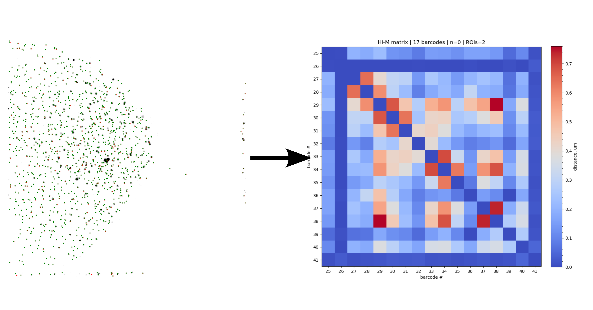

# Quickstart

**Welcome to pyhiM !**

pyHiM is a software package designed to pre-process and analyze **multiplexed DNA-FISH data** (e.g. Hi-M), as well as to visualize the results. For more information about Hi-M please see the references below.

A minimal Hi-M dataset contains:

- images of nuclei for a given region of interest (ROI)
- images of DNA-FISH barcodes acquired in different hybridization cycles for the same ROI as for the nuclei.
- fiducial images for both nuclei and barcodes acquired simultaneously with the images above (typically in a different color).


pyHiM has specific modules (called features) that allow the user to:

- register nuclei and barcode images to remove or minimize drift.
- segment nuclei
- segment and localize barcodes
- construct chromatin traces
- build single-trace and ensemble pair-wise distance maps


To get started with pyHiM, follow the following steps:

```{toctree}
:maxdepth: 1

quick_install
typical_run
configuration_file
personalised_run
```



**References**

For more information on Hi-M, please see the following resources:

- [Hi-M protocol](https://github.com/NollmannLab/HiM_protocol)
- [Hi-M method](https://www.cell.com/molecular-cell/fulltext/S1097-2765(19)30011-5)
- [A recent Hi-M application of Hi-M](https://www.nature.com/articles/s41588-021-00816-z)
