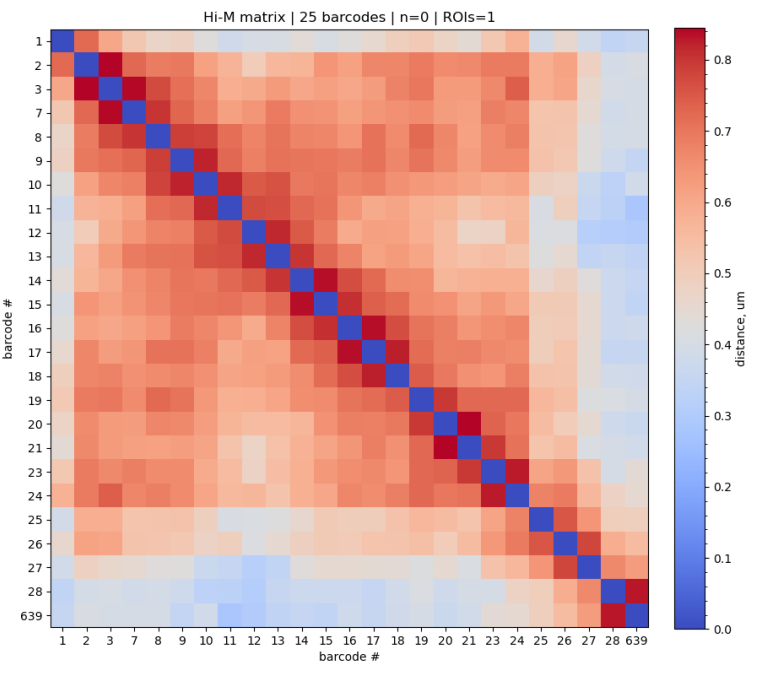
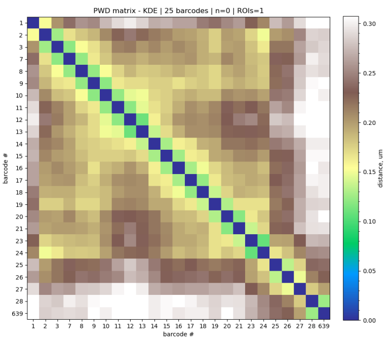
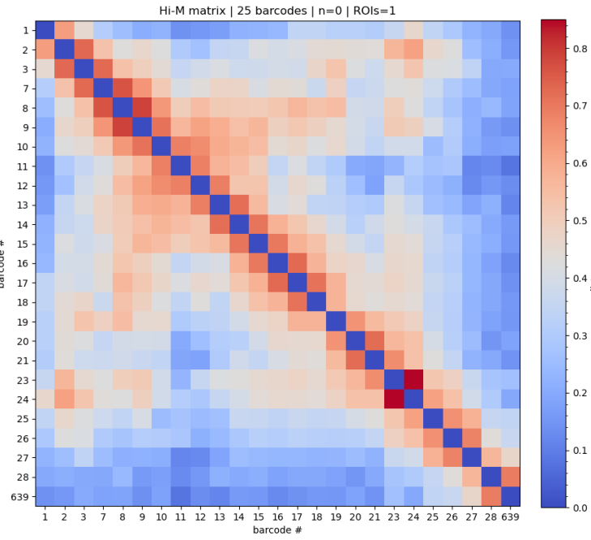
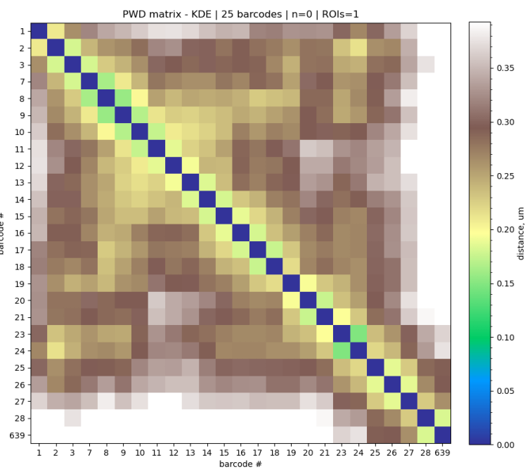
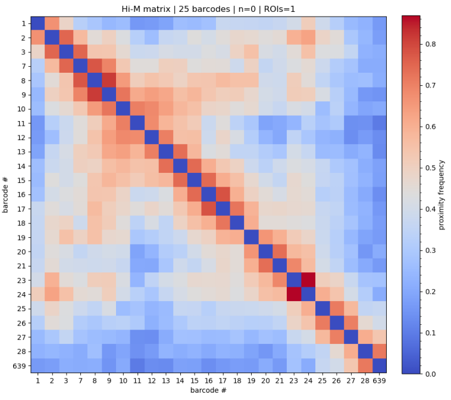
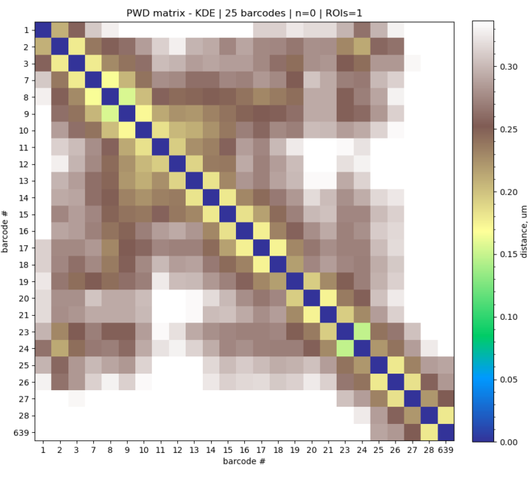
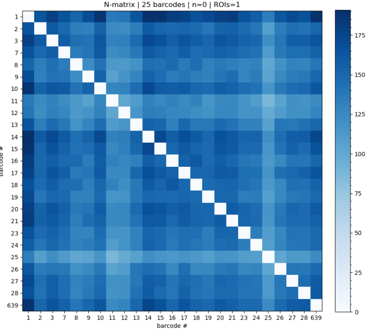
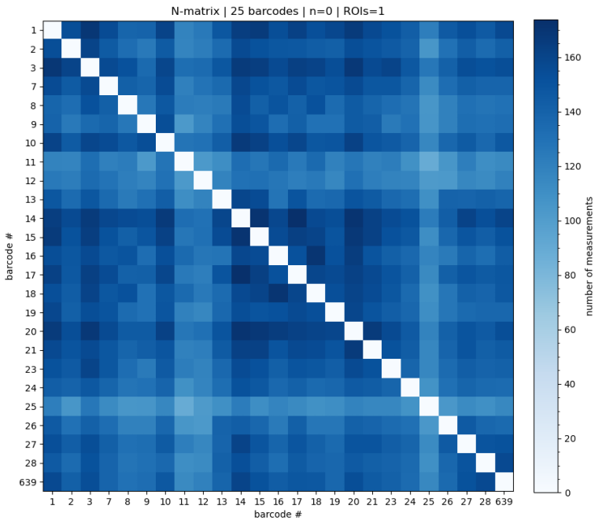

# build_matrices

*This script will build single-cell pair-wise distance (PWD) matrices, proximity frequency maps, and N-matrices from each `Trace_` file in the `buildsPWDmatrix` folder. *

## Invoke
Inside the folder with your input data, run:
```shell
pyhim -C build_matrix
```

## Inputs

|Name shape|Quantity|Mandatory|Description|
|---|---|---|---|
|infoList.json|1|Yes|Parameter file.|

## Outputs
|Name shape|Quantity|Description|
|---|---|---|
||||

## Relevant options

Parameters to run this script will be read from the ```buildsPWDmatrix``` field of ```infoList.json```.

```
"colormaps":{"PWD_KDE":"terrain","PWD_median":"terrain","contact":"coolwarm","Nmatrix":"Blues"},    
```


## (Invoke)

To run this function exclusively, run *pyHiM* using the ```-C build_matrix``` argument. This function will find and process all the `Trace_` files in the `buildsPWDmatrix` folder. The outputs of `build_matrix` will be saved in the `buildsPWDmatrix` folder. Output files will be created with the root filename of `Trace_`files. They will contain Numpy arrays with single cell PWD matrices  (`_PWDscMatrix.npy`) and N-matrices (`_Nmatrix.npy`), and an `.ecsv` list of barcode names (`_unique_barcodes.ecsv`).


Output images:

- `_PWDhistograms.png`
- `_Nmatrix.png`
- `HiMmatrix.png`
- `_PWDmatrixMedian.png`
- `_PWDmatrixKDE.png`

*example uses fiducial mask*

| method    | contact matrices                                             | **PWD matrix**                                               |
| --------- | ------------------------------------------------------------ | ------------------------------------------------------------ |
| 2D - mask |  |  |
| 3D - mask |  |  |
| KDtree 3D |  |  |
| Nmatrices | Masking | KDTREE |

