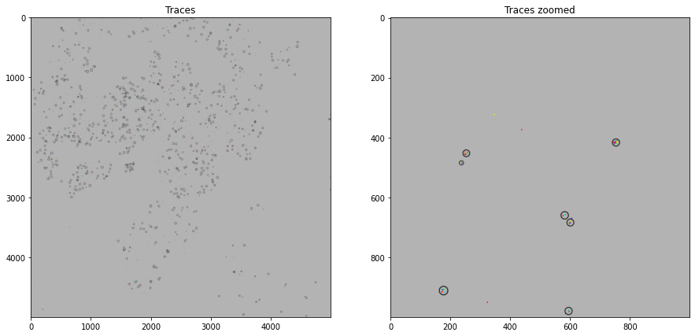
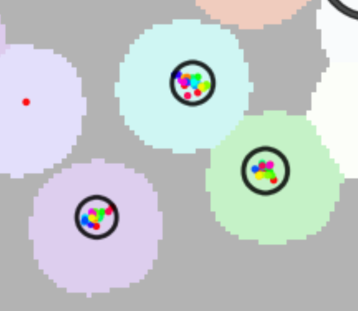

# build_traces

## Invoke
Inside the folder with your input data, run:
```shell
pyhim -C build_traces
```



## Inputs

|Name shape|Quantity|Mandatory|Description|
|---|---|---|---|
|parameters.json|1|Yes|Parameter file.|

## Outputs
|Name shape|Quantity|Description|
|---|---|---|
||||


## Relevant options

Parameters to run this script will be read from the ```buildsPWDmatrix``` field of ```parameters.json```.

```
"tracing_method": ["masking","clustering"], # list of methods it will use
"mask_expansion": 8,# number of pixels masks will be expanded to assign localizations
"masks2process":{"nuclei":"DAPI","mask1":"mask0"}, # masks identities to process
"KDtree_distance_threshold_mum": 1, # threshold distance used for KDtree clustering
```

Output images:

- `_XYZ_ROI*.png`

|  | full image | zoomed images |
| --- |   ---- | --- |
| 3D **mask** |  ||
| 3D **mask** |  ||
| 3D **KDtree** |  ||
