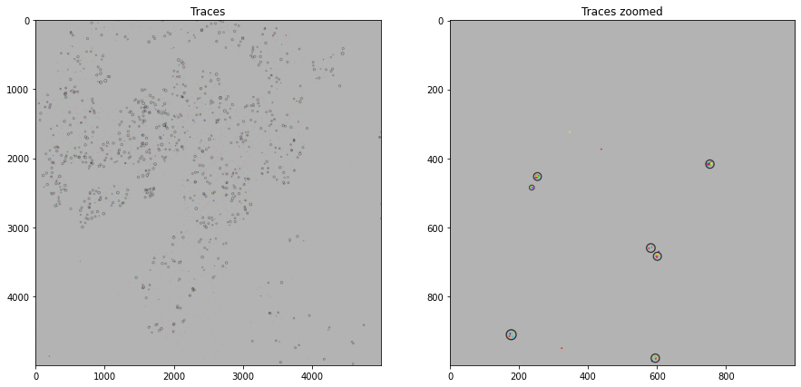
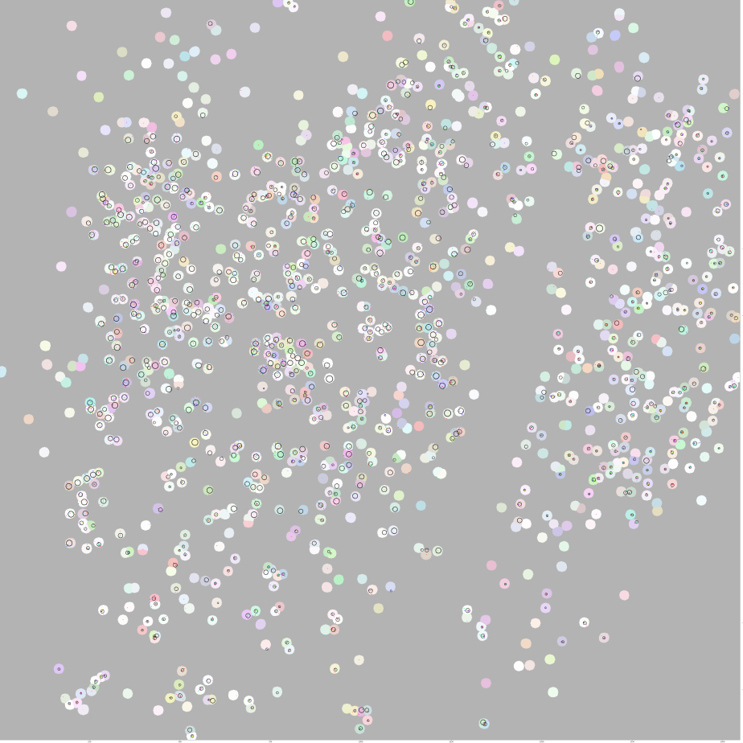
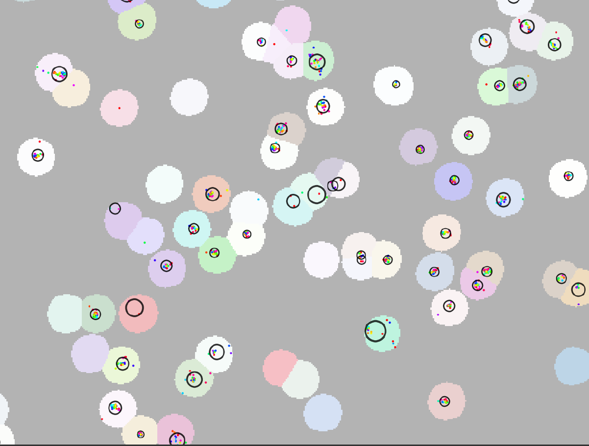
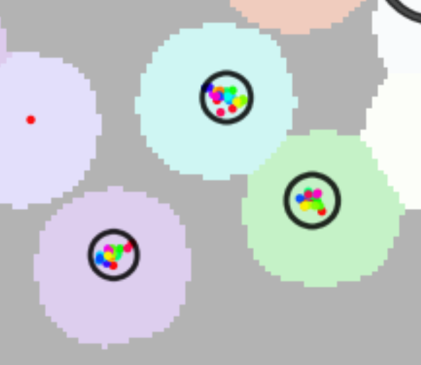

# build_traces

## Invoke
Inside the folder with your input data, run:
```shell
pyhim -C build_traces
```



## Inputs

|Name shape|Quantity|Mandatory|Description|
|---|---|---|---|
|parameters.json|1|Yes|Parameter file.|

## Outputs
|Name shape|Quantity|Description|
|---|---|---|
||||


## Relevant options

Parameters to run this script will be read from the ```buildsPWDmatrix``` field of ```parameters.json```.

```
"tracing_method": ["masking","clustering"], # list of methods it will use
"mask_expansion": 8,# number of pixels masks will be expanded to assign localizations
"masks2process":{"nuclei":"DAPI","mask1":"mask0"}, # masks identities to process
"mask_pixel_size_xy": 0.1, # XY pixel size, in um, of the mask image
"mask_pixel_size_z": 0.25, # Z pixel size, in um, of the mask image
"KDtree_distance_threshold_mum": 1, # threshold distance used for KDtree clustering
"barcode_coordinates_BEDfile": "", # optional BED file used to annotate barcodes with genomic coordinates
```


### Mask pixel size options

Set `mask_pixel_size_xy` and `mask_pixel_size_z` to the pixel size, in micrometers, of the mask image used for assigning localizations to masks. These values can differ from the localization image pixel size when masks are imported from an external segmentation workflow or from images that were not binned in the same way as the localization stack.

`build_traces` converts localization coordinates from micrometers to mask pixel coordinates using the ratio between the localization image pixel size and the mask image pixel size. In Z, the localization pixel size is computed from the acquisition settings as `pixelSizeZ * zBinning`. Therefore, if the mask was generated from an unbinned external image, for example a Cellpose mask with `pixelSizeZ = 0.25` µm while localizations use `zBinning = 2`, set `mask_pixel_size_z` to `0.25` rather than the binned value `0.5`. Otherwise, Z coordinates in the trace table can be assigned to the wrong mask plane.

### Optional BED-driven barcode annotation

If `barcode_coordinates_BEDfile` is set to a valid BED file path, `build_traces` will load that file and use it to enrich each saved trace entry with genomic metadata.

Example in `parameters.json` (`buildsPWDmatrix` section):

```json
"buildsPWDmatrix": {
  "tracing_method": ["masking", "clustering"],
  "mask_expansion": 8,
  "masks2process": {"nuclei": "DAPI"},
  "mask_pixel_size_xy": 0.1,
  "mask_pixel_size_z": 0.25,
  "KDtree_distance_threshold_mum": 1,
  "barcode_coordinates_BEDfile": "resources/barcode_coordinates.bed"
}
```

When a BED file is provided:

- Barcode identities are validated against the BED mapping.
- If a 5th BED column is present, barcode IDs can be remapped before writing the trace table.
- `Chrom`, `Chrom_Start`, and `Chrom_End` columns in the output trace table are populated from BED coordinates.

### BED file format expected by `build_traces`

Use a tab-separated BED-like file (no header), with at least 4 columns:

1. `chrom` (e.g. `chr2L`, `chrX`)
2. `start` (genomic start, basepairs)
3. `end` (genomic end, basepairs)
4. `barcode` (barcode ID expected in localizations)
5. *(optional)* `barcode_remap` (barcode ID written to output table after remapping)

Example:

```text
chr2L	150000	151000	1
chr2L	220000	221000	2	102
chr2L	300000	301000	3
```

In this example, barcode `2` is remapped to `102` when traces are saved, while all entries receive genomic coordinates from columns 1 to 3.

Output images:

- `_XYZ_ROI*.png`

|  | full image | zoomed images |
| --- |   ---- | --- |
| 3D **mask** |  ||
| 3D **mask** |  ||
| 3D **KDtree** |  ||
