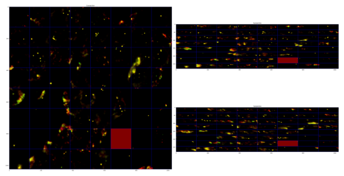

# alignImages3D

*Aligns fiducials in 3D.*

## Invoke

Inside the folder with your input data, run:
```shell
pyhim -C alignImages3D
```



## Inputs

|Name shape|Quantity|Mandatory|Description|
|---|---|---|---|
|parameters.json|1|Yes|Parameter file.|
|<image_name>.tif|2..n|Yes|Images to align in 3D containing a fiducial signal.|
|alignImages.ecsv|1|No|XY alignment resulting from running `alignImages`.|

## Outputs

|Name shape|Quantity|Description|
|---|---|---|
|alignImages_block3D.ecsv|1|Shift block maps for X, Y and Z and quality matrices.|

## Relevant options

To run, the value for ```localAlignment``` key should be ```block3D```. The other parameters are shared with ```alignImages```.

## Description

None of the methods above take into account the drift of the sample in the z-plane. While this is typically very small given the good performance of autofocus, it could be an issue in some instances. This is the slowest but most performant alignment method in the stack.

**Step by step**

The following steps are implemented:
- Iterates over reference fiducials available for each ROI
- Iterates over all cycles for a given ROI
- Loads 3D reference fiducial image on the current imaging cycle  
- Re-aligns 3D fiducial image using XY alignment resulting from running `alignImages`. If this is not available, it will XY project the 3D stack of reference and cycle fiducial to get an XY realignment. Beware, this will be global and will not use blockAlignment.
- Breaks 3D images for both reference and cycle _fiducials in blocks (defined by `blockSizeXY`)
- Cross-correlates each block to get an XYZ shift. This provides a 3D local drift correction for each block
- Stores shifts in output Table that contains values for each block (columns shift_z, shift_x and shift_y).
- Stores quality of image superposition based on the normalized root mean square matrix for each block in output Table (columns quality_xy, quality_zy, quality_zx).
