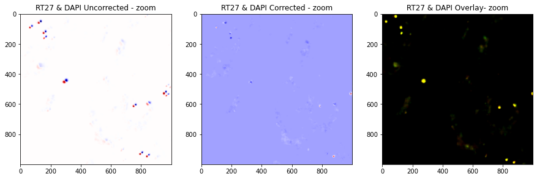

# Apply registration
*Applies registration to DAPI and barcodes*

## Invoke
Inside the folder with your input data, run:
```shell
pyhim -C register_global
```



## Inputs

|Name shape|Quantity|Mandatory|Description|
|---|---|---|---|
|parameters.json|1|Yes|Parameter file.|
|register_global.ecsv|1|Yes|XY alignment resulting from the XY alignment produced while running `register_global`.|

## Outputs
|Name shape|Quantity|Description|
|---|---|---|
|2D_registered.npy|2..n|2D registered images|

## Relevant options

## Description
To run this function exclusively, run *pyHiM* using the ``` -C register_global ``` argument. It loads masks, RNA, and barcodes 2D projected images, and applies registrations to them. The resulting images are saved as npy arrays in the ```alignImages``` folder.  
