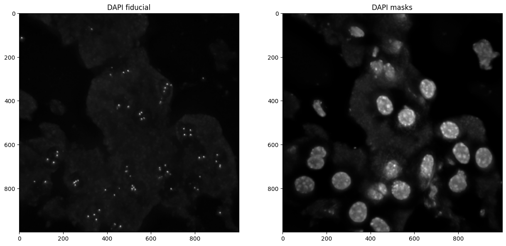

# project

*Projects 3D images in 2D*

## Invoke

Inside the folder with your input data, run:
```shell
pyhim -C project
```



## Inputs

|Name shape|Quantity|Mandatory|Description|
|---|---|---|---|
|parameters.json|1|Yes|Parameter file.|
|<image_name>.tif|2..n|Yes|3D images to project in 2D.|

## Outputs
|Name shape|Quantity|Description|
|---|---|---|
|<image_name>.tif|2..n|2D images|

## Relevant options
Parameters to run this script will be read from the ```zProject``` field of ```parameters.json```


|Name|Option|Description|
|:-:|:-:|:-:|
|mode|manual|Assigns plans between *zmin* and *zmax* to "zRange"|
||automatic|Estimates the focal plane using the maximum standard deviation plane by plane. Uses *zwindows* to set "zRange" arround this focal plane.|
||full|Assigns all plans to "zRange"|
||laplacian|Splits 3D image into blocks of the size given by *blockSize*. Finds Laplacian Variance maximum (blur estimation) for each block in order to estimate the focal plane. Rebuilds block-by-block 2D image with optimal focal plane of each block. if *zwindows* option is activated, projects each block with MIP option.|
|windowSecurity||Used for *automatic* mode, removes the lowest and highest Z-plans.|
|zwindows| | In automatic mode, selects the number of planes below and above the focal plane to be used for making the projection.|
|display| | Saves output 2D projections as png files|
|zProjectOption|sum|Sums plans in "zRange"|
||MIP|Maximum Intensity Projection of plans in "zRange"|    
|zmax| | Selects ending plane to use for projection|
|zmin| | Selects starting plane to use for projection|

## Description


This function will project 3D stacks in 2D.

Options to do this:

-   **`manual`**: indicates the planes in `zmin` and `zmax` and sets to manual.
    
-   **`automatic`**: estimates focal plane using the maximum of the std deviation from plane to plane, then projects around `zwindows` of the focal plane. Sets to automatic.
    
-   **`full`**: projects all planes into a 2D image. Sets to full.
    
-   **`laplacian`**: breaks the image into blocks of size `blockSize`. Then calculates the laplacian variance in each block, and estimates the focal position per block by maximizing the laplacian variance. The overall focal plane for the image will be outputed to the terminal and to the block image (see title in image below). The 2D image is reconstructed block by block by using the optimal focal plane for each block. If the parameter `zwindows` is set to zero, then only the image at the focal point will be used. Otherwise a MIP in the subvolume is done: `focalPlane-zwindows/2:focalPlane+zwindows/2`. Sets  to laplacian.
    
There are some additional options that can be provided to indicate how projections are made:
    
-   **`windowSecurity`**: during automatic focal plane search, it will discard maxima located this number of planes away from the border.
    
-   **`zProjectOption`**: how it converts a 3D stack into a 2D projection:
    
    -   `sum`: sums all planes
    -   `MIP`: maximum intensity projection

## Step by step

This routine takes all 3D images and projects them in 2D. Depending on the chosen `mode`, this module finds the good set of Z-plans, where there is the least noise. This step gives a range centered on a focal plan, named `zRange`. Projection is then done on this range either by sum or by maximum intensity projection.