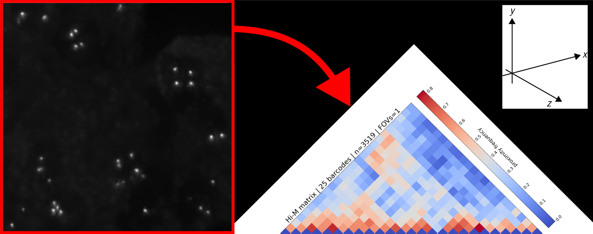

# Introduction



In the context of structural biochemistry, *pyHiM* software provides tools to process **multiplexed DNA-FISH data** produced **by Hi-M experiments** as well as **visualization** tools to explore the results.

```{note}
For more information on Hi-M, please see the following resources:

- [Hi-M protocol](https://www.nature.com/articles/s41596-019-0269-9)
- [Hi-M method](https://www.cell.com/molecular-cell/fulltext/S1097-2765(19)30011-5)
- [Hi-M application](https://www.nature.com/articles/s41588-021-00816-z)
```

## Concept

This software **calculates the 3D positions** of a set of DNA-loci, referred to as barcodes.

Data acquisition is performed sequentially, in a series of **cycles** combining the acquisition of a single barcode with a **fiducial marker** common to all cycles and later used for drift correction.

Each set of barcode coordinates will be associated with its corresponding cell by using masks (segmented nuclei stained with DAPI for instance). 

At the end of the analysis, *pyHiM* will output several files describing the composition (barcodes), localization and 3D-coordinates of all individual traces detected.

```{note}
Optionally, pyHiM also provides a basic tool to detect **single RNA types** but does not support processing of multiple RNA species or proteins-FISH data.
```

## Type of data

For a given region of interest (ROI), a minimal Hi-M set of data contains:
- Images of **nuclei** 
- Images of **DNA-FISH barcodes** acquired during successive hybridization cycles 
- **Fiducial** images for both nuclei and barcodes.

